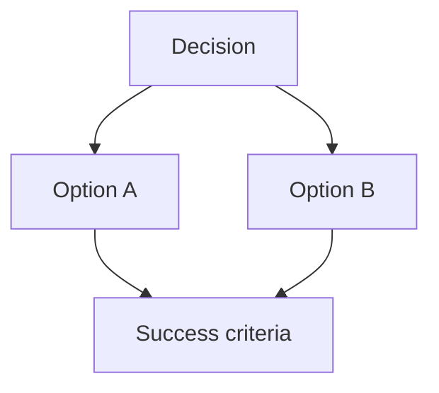

# Plan-Mode Theory Patterns

Use this reference only when `plan-grill` is running in `theory-rich` mode or
when the user asks for the lighter `elaborate` modifier.

## Activation

- Default `plan-grill`: concise planning, source-order grounding, one material
  question at a time.
- `elaborate`: explain options before asking. Use local context and practical
  tradeoffs, but keep the answer short.
- `theory-rich`: provide comprehensive theory, source-backed context,
  equations, diagrams, and option analysis when they materially improve the
  decision.

## Source Ladder

Prefer sources in this order, and state when a conclusion is an inference:

1. ARIA-NBV source order owner:
   `.agents/references/source_order.md`, thesis roadmap/questions, canonical
   memory, shared glossary/notation, and nearest `AGENTS.md`.
2. Repo-local theory and literature: `docs/contents/theory/`,
   `docs/contents/literature/`, `docs/references.bib`, local paper notes, and
   `literature/tex-src/` when present.
3. Implementation evidence: current code, generated API docs, tests, configs,
   and existing artifacts.
4. External primary sources: papers, arXiv, DOI pages, official dataset/tool
   docs, official API docs, and Context7-resolved library docs when current API
   behavior matters.
5. Wikipedia or broad web summaries: orientation only. Never use these as
   proposal-critical or advisor-facing evidence for core technical claims.

For advisor-facing proposal, roadmap, research-question, or literature
synthesis claims, run or request `make kg-claim-check KG_CLAIM="..."` through
the `aria-litkg-memory` workflow before treating the claim as supported.

## Claim Strength

Label claim strength in theory-rich answers when ambiguity matters:

- `definition`: follows from a stated definition or glossary entry.
- `implementation fact`: verified from current code, config, docs, tests, or
  artifacts.
- `literature claim`: backed by a cited paper or official external source.
- `project decision`: backed by canonical memory, roadmap/questions, or source
  order.
- `hypothesis`: plausible but not yet supported by ARIA-NBV evidence.
- `inference`: derived from sources, but not directly stated by them.

Do not present planned work as implemented evidence. Do not let historical
seminar-paper evidence override current thesis direction.

## Option Answer Template

For `elaborate`, use a compact version of this template. For `theory-rich`, use
the full template when it fits:

1. State the decision and why it matters.
2. Give the minimum theory needed to understand the choice.
3. Define symbols or terms before using equations.
4. For each option, state:
   - what it means operationally;
   - pros;
   - cons and failure modes;
   - evidence strength;
   - expected impact on success criteria.
5. Name the recommended option and the tradeoff.
6. Ask exactly one material follow-up question with meaningful choices.

## Equation Hygiene

- Use Markdown math: `$...$` for inline math and `$$...$$` for display math.
- Use KaTeX-compatible LaTeX. Avoid Typst syntax in chat answers.
- Define every non-obvious symbol before using it.
- Prefer shared ARIA-NBV notation from `docs/typst/shared` for project terms.
- Keep code names outside math using backticks, for example `VinModelV3`, not
  `\texttt{VinModelV3}` inside a displayed equation.
- Avoid unsupported local macros and fragile TeX shortcuts. Write
  `\mathcal{Q}_t`, `\mathrm{RRI}`, and `Q_{H,\theta}` explicitly.
- Use equations to clarify tradeoffs, not to decorate answers.

Past positive pattern: the glossary render fix showed that `$...$` math in
Markdown/QMD survived where raw HTML spans with `\(...\)` were mangled before
MathJax. Past Typst fixes also showed that attachment parsing is fragile in
Typst; do not copy Typst-specific math syntax into chat Markdown.

## Mermaid Hygiene

For chat-only diagrams, prefer conservative fenced Mermaid:

Rules:

- Use simple `flowchart TD` or `flowchart LR` unless another grammar is clearly
  needed.
- Quote labels and keep them short.
- Avoid raw TeX in node labels unless it has been locally proven to render in
  the target renderer.
- Do not rely on `\n` for line breaks. If line breaks or math-heavy labels are
  required, use the `aria-nbv-mermaid` skill, the symbol map, local lint, and a
  local render.
- Do not put HTML labels in Mermaid Gantt labels; past renders printed HTML
  tags literally there.
- Split code/class names from symbols rather than mixing them in one line.
- Use distinct styles or classes for compute nodes, data nodes, and result
  nodes when the diagram is more than a throwaway chat sketch.
- For `.mmd` files, keep source in the repo, run
  `python tools/mermaid/scripts/aria_mermaid_lint.py <file.mmd>`, and render
  locally with `mmdc` when available.

## Past Pattern Audit

Positive patterns to reuse:

- `.agents/memory/history/2026/05/2026-05-07_proposal_mermaid_symbol_render_fix.md`:
  HTML labels solved symbol rendering in a flowchart, while Gantt labels needed
  simpler text because HTML printed literally.
- `.agents/memory/history/2026/05/2026-05-08_aria_nbv_mermaid_skill.md`:
  durable Mermaid work belongs in templates, style references, symbol maps,
  lint, and local render checks.
- `.agents/memory/history/2026/05/2026-05-06_core_math_lookup_render_fix.md`:
  Markdown `$...$` math rendered correctly where earlier delimiter placement
  failed.
- `.agents/memory/history/2026/05/2026-05-09_typst_attachment_shared_equation_fix.md`:
  rendered-page inspection caught math attachment issues that static checks
  alone would not make obvious.
- `.agents/memory/history/2026/05/2026-05-07_proposal_notation_distillation.md`:
  shared notation and compact equations are easier to verify than local,
  overloaded symbols.

Anti-patterns to avoid:

- Raw Mermaid labels such as `Q_H` or TeX-like underscore/caret text without
  renderer validation.
- Assuming `\n` creates Mermaid line breaks.
- Mixing long function/class names and symbols in the same diagram label.
- Treating a diagram as correct without lint/render or visual inspection when
  it will be used in docs.
- Using Wikipedia entries as bibliography support for core advisor-facing
  technical claims.
- Pasting Typst math syntax into Markdown answers.

Distilled transcript evidence in
`.agents/memory/transcripts/distilled/2026-05-11/candidate_decisions.jsonl`
also records recurring user feedback: line breaks did not render as expected,
symbols should follow shared Typst notation, code names and symbols should be
visually separated, edges should be meaningful, and compute/data/result nodes
need distinct visual treatment.
