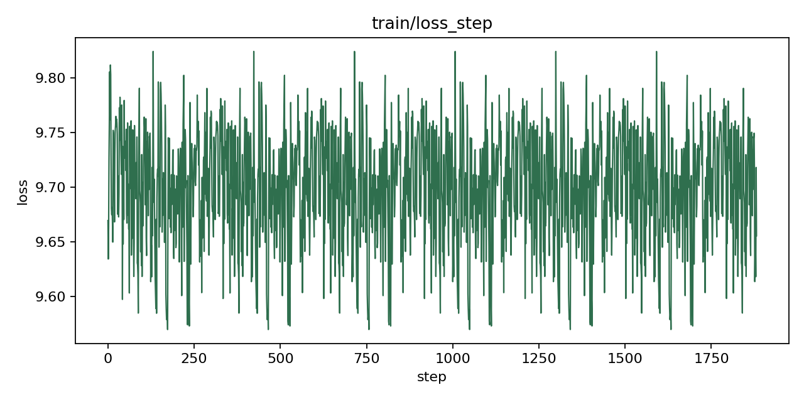
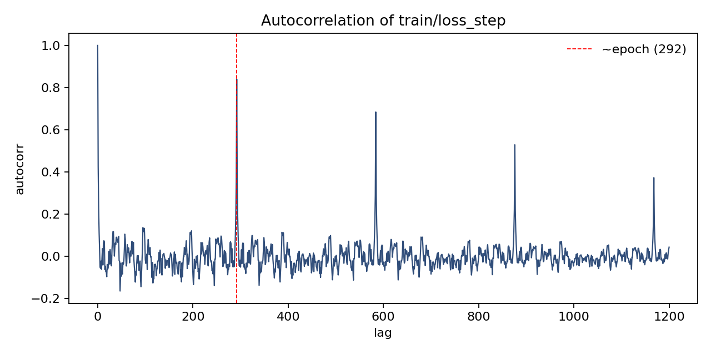
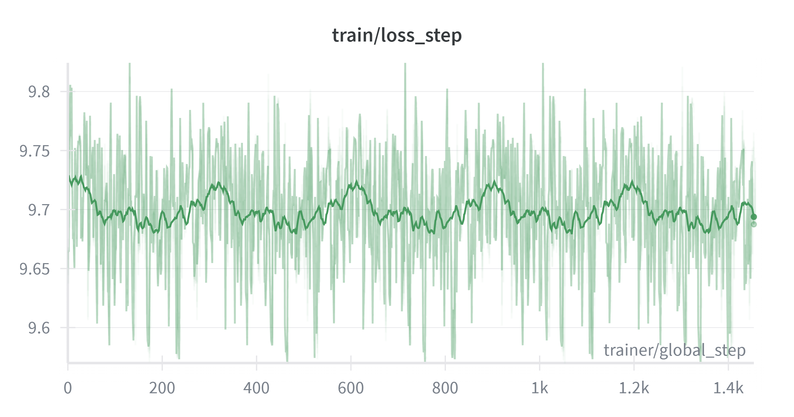
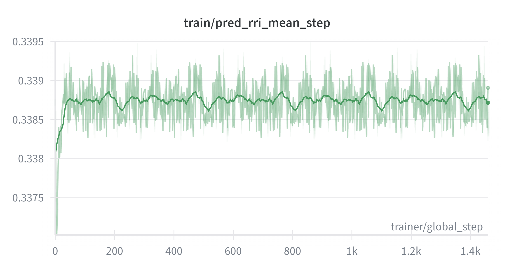
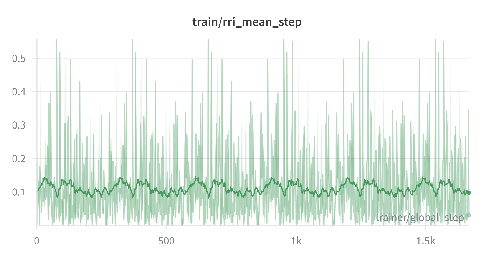
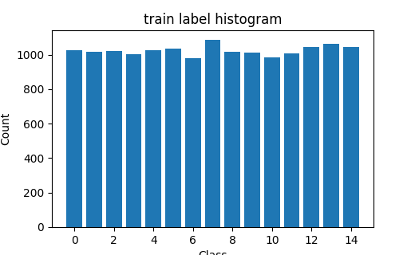
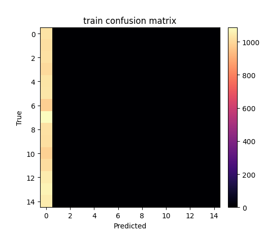

# VIN training diagnostics (2026-01-01)

This note summarizes findings and suggestions from the analysis of the training run logs and current code path. It also includes plots generated from the exported W&B history for `train/loss_step`, plus figures from run `76cal7ca`.

## Observed issues

- **Loss stays at random-guess baseline:** `train/loss_step` hovers around ~9.7, which is the CORAL random-guess baseline for K=15 (≈ 14·log(2) = 9.70).
- **Strong periodicity in loss:** autocorrelation shows a dominant period at **~292 steps**, matching the epoch length. This indicates a repeating data order across epochs.
- **Confusion matrix collapse:** predictions concentrate in a single column (all predicted class 0 when CORAL biases are zero or slightly negative; or class K-1 when biases are positive). This is consistent with logits staying near zero.
- **Predicted RRI mean offset persists:** with `coral_preinit_bias=False`, logits ≈ 0 yield CORAL probabilities that place ~50% mass on class 0 and ~50% on class K-1; expected RRI from midpoints is then `(mid_0 + mid_{K-1}) / 2`, which is ~0.34 with current edges. This explains the apparent overestimate relative to raw `rri_mean` (~0.1).

## Status of `train/pred_rri_mean_step` computation

- **Current code path:** `pred_rri_mean_step` is computed from **CORAL probabilities**, not logits, via:
  - `probs = coral_logits_to_prob(logits)`
  - `pred_rri_proxy = binner.expected_from_probs(probs)`
- This is *already* the correct form **if** bin centers (midpoints or empirical class means) are a good proxy for the expected RRI inside each class.
- If the binner midpoints are biased relative to the *true per-class mean RRI* (e.g., skewed within-bin distribution), a systematic offset remains even with correct probabilities.

## Theoretical formula for `pred_rri_mean_step`

Let the CORAL layer produce logits $z_k$ for thresholds $k = 0, \dots, K-2$. Define

$$
\; p_k = \sigma(z_k) = P(y > k) \;.
$$

Then the class probabilities are:

$$
\begin{aligned}
P(y=0) &= 1 - p_0 \\
P(y=c) &= p_{c-1} - p_c \quad \text{for } c = 1, \dots, K-2 \\
P(y=K-1) &= p_{K-2}
\end{aligned}
$$

Let $m_c$ be the **class center** (midpoint or empirical per-bin mean RRI). The per-candidate expected RRI is

$$
\widehat{\mathrm{RRI}} = \sum_{c=0}^{K-1} P(y=c)\, m_c.
$$

The logged metric `train/pred_rri_mean_step` is the mean of $\widehat{\mathrm{RRI}}$ across all candidates in the batch.

## Results from log analysis

- Autocorrelation peaks (from W&B history, run 76cal7ca):
  - lag ≈ 292, 584, 876, … (epoch repeats)
- Mean and std of `train/loss_step` (from export CSV):
  - mean ≈ 9.699
  - std ≈ 0.0505

## Plots (from export CSV)

- Loss time series: `.codex/loss_step_series.png`
- Autocorrelation: `.codex/loss_step_autocorr.png`

## Plots (run 76cal7ca)

## Likely causes (ranked)

1. **Data order repeats each epoch** (insufficient shuffling in offline cache or dataset iterator), producing the strong periodic loss pattern.
2. **Logits remain near zero** (no learning signal), causing CORAL to emit ~0.5 threshold probabilities → extreme class mass and biased expected RRI.
3. **Weak feature signal** from a minimal scene field (only `occ_pr`) and frozen backbone; pose encoder alone may not correlate with RRI labels.
4. **Invalid candidates not fully masked**: loss currently masks only on finite RRI; candidates outside voxel bounds may still dominate.
5. **CORAL monotonicity not enforced**: unconstrained logits can yield degenerate probability mass at extremes.

## Suggestions

### Immediate checks (to verify backprop works)

- **Log gradient norms** (pose encoder, head MLP, CORAL layer). If ~0, gradients are not flowing.
- **Parameter delta check**: compare weights before and after `optimizer.step()` on one batch.
- **Overfit a single batch** (`limit_train_batches=1` or `overfit_batches=1`), and verify loss drops below 9.7.

### Data/loader fixes

- Ensure **shuffle is enabled** for offline cache / webdataset.
- **Disable fixed seeds** in candidate generation or make seeds epoch-dependent.
- Confirm dataset sampling doesn’t repeat in a fixed order across epochs.

### Modeling fixes

- Increase **scene field channels** (e.g., `occ_pr + counts_norm + unknown + new_surface_prior`).
- Add **candidate_valid masking** in the loss (mask by `candidate_valid` in addition to finite RRI).
- Initialize CORAL biases from the **empirical label CDF** rather than zeros.
- Replace midpoint mapping with **per-bin empirical mean RRI** to reduce bias.

### Metrics/diagnostics

- Log both `pred_rri_mean_raw` and `pred_rri_mean_norm` (explicit names to avoid confusion).
- Log **mean and std of logits** and **p_gt** per batch to monitor if the model is stuck at 0.

## Proposed auxiliary regression loss (L2 on expected RRI)

**Idea:** add a second loss term that directly penalizes the gap between the continuous oracle RRI and the expected RRI from CORAL probabilities:

$$
\mathcal{L}_{\text{reg}} = \lVert \widehat{\mathrm{RRI}} - \mathrm{RRI} \rVert_2^2
$$

- Use **probabilities** (not logits) to compute $\widehat{\mathrm{RRI}}$ so the regression target stays in the **same units** as the oracle RRI.
- Use **class centers** $m_c$ (midpoints or empirical class means). The empirical means are usually better when the distribution is skewed inside bins.
- Keep CORAL loss as the primary term, and use a small weight for the regression term (e.g., 0.1) to avoid overpowering ordinal calibration.

**Should we use logits instead of probabilities?**
- Using logits directly is **not recommended**: logits live in an unconstrained space and do not correspond to RRI units. Without a calibrated mapping, the L2 term becomes unstable and scale-dependent.
- If you want a pure regression head, add a **separate linear head** (or a scalar projection on features) and train it with L2. This avoids mixing ordinal logits with metric regression.

---

Generated files:
- `.codex/loss_step_series.png`
- `.codex/loss_step_autocorr.png`
