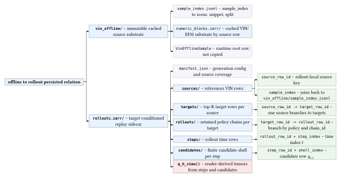
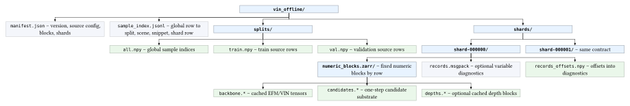
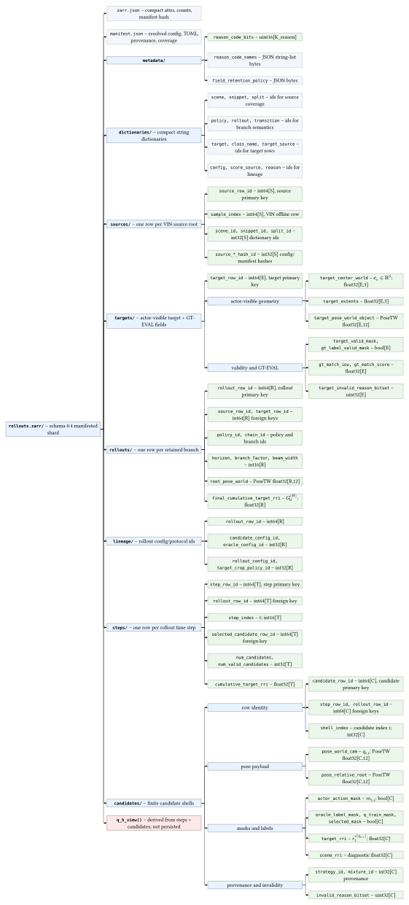
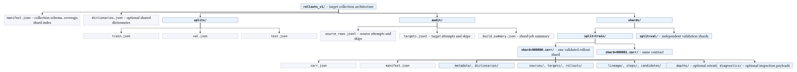
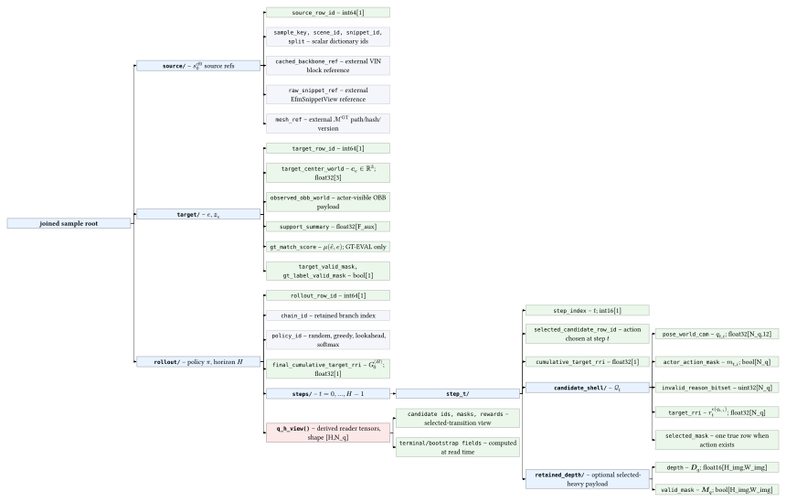
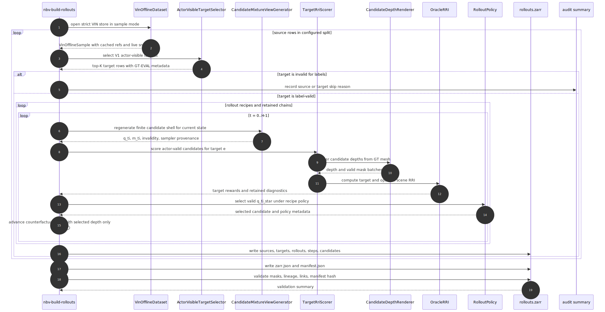

# Data Handling

`aria_nbv.data_handling` owns the typed boundary between upstream ASE/ATEK/EFM
assets and the training or evaluation objects consumed by ARIA-NBV. It owns raw
snippet access, VIN oracle batches, immutable VIN offline stores, target
selection DTOs, and diagnostics. Multi-step rollout generation and rollout
replay stores are owned by `aria_nbv.rollouts`, but they depend on
`VinOfflineSample` roots and are documented here because the stores are designed
to join cleanly.

The central invariant is actor/oracle separation. Actor-visible data comes from
observed snippets, MPS/EVL evidence, detected or tracked OBBs, finite candidate
poses, and logged history. ASE meshes, GT OBBs, target crops, rendered oracle
depths, and target-RRI labels are supervision/evaluation assets. Invalid
samples, targets, and candidates are represented as masks and reason codes,
never as low RRI.

## Public Surface

- Raw snippets: `AseEfmDatasetConfig`, `AseEfmDataset`, `EfmSnippetView`,
  `VinSnippetView`, and snippet-loader helpers.
- One-step VIN/oracle batches: `VinOracleBatch`,
  `VinOracleOnlineDatasetConfig`, `VinDatasetSourceConfig`, and
  `VinOfflineSourceConfig`.
- Immutable one-step cache: `VinOfflineWriterConfig`, `VinOfflineWriter`,
  `VinOfflineDatasetConfig`, `VinOfflineStoreConfig`, `VinOfflineManifest`, and
  `VinOfflineIndexRecord`.
- Target selection: `ActorVisibleTargetSelector`, `TargetSelectorConfig`, and
  target-candidate DTOs.
- Diagnostics: `collect_vin_offline_dataset_stats`,
  `collect_vin_offline_dataset_coverage`, and
  `collect_offline_visual_inventory`.

The removed oracle-cache, VIN-snippet-cache, compatibility wrapper, and legacy
migration modules must not be reintroduced. Runtime imports should use root
package exports, or private modules only from inside this package.

## Two-Store Architecture

The architecture is logical unification over physically separated stores.
`vin_offline` remains immutable and stores expensive one-step substrate outputs.
Target-conditioned multi-step replay lives in a rollout sidecar that references
VIN rows and raw ASE assets by stable lineage. Joined readers should present a
single training/inspection view without copying backbone tensors, full meshes,
or raw camera streams into every rollout sample.





The current implementation writes one standalone shard-like `rollouts.zarr`
store. The target state is the same contract generalized into a sharded
`rollouts_v1/` collection with collection-level manifests, per-shard
validation, source-row audit tables, and configurable depth-retention profiles.

The no-redundancy rule is strict:

- Expensive EFM/backbone/VIN blocks stay in `vin_offline`.
- Full meshes and raw snippets stay in ASE/ATEK/EFM source locations.
- Rollout shards store compact factual replay tables plus lineage hashes.
- `q_h/` is a derived, persisted training-hot view validated from `steps/`,
  `candidates/`, `rollouts/`, and `targets/`; the factual tables remain
  canonical.
- Rich generation metadata lives in top-level `manifest.json`, not duplicated
  into Zarr arrays.

## Physical Layout

The two stores have different responsibilities. `vin_offline/` is the immutable
source substrate. `rollouts.zarr/` is the generated target-conditioned replay
sidecar.



### Immutable VIN Offline Store

The canonical one-step offline format is a strict indexed-shard store:



```text
vin_offline/
  manifest.json                         # version, source config, materialized blocks, shards
  sample_index.jsonl                    # global sample row -> split, scene, snippet, shard row
  splits/
    all.npy                             # global sample indices
    train.npy
    val.npy
  shards/
    shard-000000/
      numeric_blocks.zarr/              # fixed numeric blocks batched by row
        backbone.*                      # cached EFM/VIN features when enabled
        candidates.*                    # one-step candidate substrate when enabled
        depths.*                        # cached depth blocks when enabled
      records.msgpack                   # optional variable diagnostics
      records_offsets.npy
    shard-000001/
      ...
```

`OFFLINE_DATASET_VERSION` is the runtime compatibility gate. When this format
changes, bump the version and rebuild stores with `VinOfflineWriter`; strict
readers should fail fast on older manifests with rebuild guidance.

By default, `VinOfflineStoreConfig.store_dir` resolves to
`PathConfig().offline_cache_dir / "vin_offline"`. Relative store names such as
`"vin_offline"` are resolved under `offline_cache_dir`.

Build immutable stores through the writer CLI:

```sh
cd aria_nbv
uv run nbv-build-offline --config-path ../.configs/build_vin_offline_81286.toml
```

Use `--dry-run` to validate a writer TOML and inspect the resolved store path
without loading snippets, EVL, or writing shards.

This README owns both the storage contracts and the human/operator data
generation workflow. The canonical CLI names are `nbv-downloader`,
`nbv-build-offline`, `nbv-build-rollouts`, `nbv-plan-rollout-shards`,
`nbv-status-rollout-shards`, `nbv-rollouts-info`, and `nbv-rerun-inspect`.

### Manifest-Backed Rollout Store

The implemented rollout writer currently writes one standalone shard-like
`rollouts.zarr` store:



```text
rollouts.zarr/
  zarr.json                             # compact Zarr attrs and manifest hash
  manifest.json                         # resolved config, raw TOML, provenance, coverage
  metadata/
    reason_code_bits                    # uint16[K_reason]
    reason_code_names                   # JSON string-list bytes
    field_retention_policy              # JSON string bytes
  dictionaries/
    scene, snippet, split               # JSON string-list bytes
    policy, rollout                     # JSON string-list bytes
    target, class_name, target_source   # JSON string-list bytes
    config, score_source, ...           # JSON string-list bytes
  sources/
    source_row_id                       # int64[S]
    sample_index                        # int64[S]
    sample_key_id                       # int32[S] -> dictionaries/source_key
    scene_id, snippet_id, split_id      # int32[S] -> dictionaries/*
    source_*_hash_id                    # int32[S] -> dictionaries/config
  targets/
    target_row_id                       # int64[E]
    target_id, target_source_id         # int32[E] -> dictionaries/*
    target_center_world                 # float32[E, 3]
    target_extents                      # float32[E, 3]
    target_pose_world_object            # float32[E, 12]
    target_valid_mask                   # bool[E]
    gt_label_valid_mask                 # bool[E]
    gt_match_iou, gt_match_score        # float32[E]
    target_invalid_reason_bitset        # uint32[E]
  rollouts/
    rollout_row_id                      # int64[R]
    chain_id                            # int32[R]
    source_row_id                       # int64[R] -> sources/source_row_id
    target_row_id                       # int64[R] -> targets/target_row_id
    policy_id                           # int32[R] -> dictionaries/policy
    horizon                             # int16[R]
    branch_factor, beam_width           # int16[R]
    root_pose_world                     # float32[R, 12]
    root_time_ns                        # int64[R], -1 if unavailable
    root_trajectory_index, root_frame_index # int32[R], -1 if unavailable
    final_cumulative_target_rri         # float32[R]
    final_cumulative_target_root_gain   # float32[R], default Q_H return
  lineage/
    rollout_row_id                      # int64[R]
    candidate_config_id                 # int32[R] -> dictionaries/config
    oracle_config_id                    # int32[R] -> dictionaries/config
    rollout_config_id                   # int32[R] -> dictionaries/config
    target_crop_policy_id               # int32[R] -> dictionaries/config
  steps/
    step_row_id                         # int64[T]
    rollout_row_id                      # int64[T] -> rollouts/rollout_row_id
    step_index                          # int16[T], rollout time t
    selected_candidate_row_id           # int64[T] -> candidates/candidate_row_id
    selected_shell_index                # int32[T]
    num_candidates                      # int32[T]
    num_valid_candidates                # int32[T]
    cumulative_target_rri               # float32[T]
    cumulative_target_root_gain         # float32[T]
  candidates/
    candidate_row_id                    # int64[C]
    step_row_id                         # int64[C] -> steps/step_row_id
    rollout_row_id                      # int64[C] -> rollouts/rollout_row_id
    step_index                          # int16[C], repeated for scans
    shell_index                         # int32[C], candidate index i
    pose_world_cam                      # float32[C, 12]
    pose_relative_root                  # float32[C, 12]
    actor_action_mask                   # bool[C]
    oracle_label_mask                   # bool[C]
    q_train_mask                        # bool[C]
    selected_mask                       # bool[C]
    target_rri                          # float32[C]
    scene_rri                           # float32[C]
    target_root_gain, scene_root_gain   # float32[C], root-normalized rewards
    target_log_error_gain               # float32[C], diagnostic
    target_pm_dist_before/after         # float32[C], diagnostic
    strategy_id, mixture_id             # int32[C]
    invalid_reason_bitset               # uint32[C]
  selected_depth/
    step_row_id                         # int64[T] -> steps/step_row_id
    candidate_row_id                    # int64[T] -> candidates/candidate_row_id
    depth_m                             # compressed float16[T, 240, 240], metres
    valid_mask                          # compressed bool[T, 240, 240]
    focal_px, principal_point_px        # float32[T, 2]
    image_size_hw                       # int32[T, 2]
  target_eval_crops/
    crop_row_id                         # int64[K]
    step_row_id                         # int64[K] -> steps/step_row_id
    candidate_row_id                    # int64[K], -1 for current eval crop
    source_role_id                      # int32[K], current_eval/candidate_eval
    points_world                        # float32[K, 50000, 3], oracle/eval-only
    lengths, mask                       # int32[K], bool[K, 50000]
  q_h/
    state_step_row_id                   # int64[T]
    source_row_id                       # int64[T]
    candidate_row_id                    # int64[T, N_q]
    valid_action_mask                   # bool[T, N_q]
    q_train_mask                        # bool[T, N_q]
    target_row_id                       # int64[T]
    selected_candidate_index            # int32[T]
    one_step_target_rri                 # float32[T, N_q]
    one_step_target_root_gain           # float32[T, N_q], training reward field
    invalid_reason_bitset               # uint32[T, N_q]
    td_selected_candidate_row_id        # int64[T]
    td_reward                           # float32[T], selected target_root_gain
    td_reward_target_rri                # float32[T], diagnostic state-relative RRI
    td_next_step_row_id                 # int64[T]
    td_terminal_mask                    # bool[T]
    td_discount                         # float32[T], selected-transition discount
```

`zarr.json` stays compact for Zarr tooling: schema id/version, manifest
path/hash, source split, row counts, target protocol, return semantics, and
retention policy, plus the selected-depth and `q_h/` role, resolution, chunk,
and codec contracts. `manifest.json` is the human-readable generation record:
resolved writer config, raw TOML hash/text for CLI runs, git/env summary,
source scene/snippet coverage, config hashes, and aggregate counts. Users can
inspect it without loading candidate, step, target, or depth arrays.

### Target Sharded Layout

The target collection layout generalizes the standalone store to independently
valid shards:



<!-- TODO: use the edges from tree .data/offline_cache/rollouts_v1_microset.zarr -L 2
├── candidates
│   ├── actor_action_mask
│   ├── candidate_row_id
│   ├── compact_valid_index
│   ├── invalid_reason_bitset
│   ├── mixture_id
│   ├── oracle_label_mask
│   ├── pose_relative_root
│   ├── pose_world_cam
│   ├── primary_invalid_reason
│   ├── q_train_mask
│   ├── rollout_row_id
│   ├── sampler_probability
│   ├── scene_rri
│   ├── score_source_id
│   ├── selected_mask
│   ├── selection_logits
│   ├── selection_log_probabilities
│   ├── selection_probabilities
│   ├── shell_index
│   ├── step_index
│   ├── step_row_id
│   ├── strategy_id
│   ├── target_rri
│   └── zarr.json
├── dictionaries
│   ├── class_name
│   ├── config
│   ├── policy
│   ├── rollout
│   ├── scene
│   ├── score_source
│   ├── snippet
│   ├── source_key
│   ├── source_shard
│   ├── split
│   ├── target
│   ├── target_match_status
│   ├── target_source
│   ├── termination_reason
│   ├── transition
│   └── zarr.json
├── lineage
│   ├── branch_schedule_id
│   ├── candidate_config_id
│   ├── mesh_version_id
│   ├── model_checkpoint_id
│   ├── oracle_config_id
│   ├── reason_code_version_id
│   ├── rollout_config_id
│   ├── rollout_row_id
│   ├── selection_rng_state_hash_id
│   ├── target_crop_policy_id
│   ├── target_protocol_version_id
│   └── zarr.json
├── metadata
│   ├── field_retention_policy
│   ├── generation_manifest_json
│   ├── reason_code_bits
│   ├── reason_code_names
│   └── zarr.json
├── rollouts
│   ├── beam_width
│   ├── branch_factor
│   ├── chain_id
│   ├── final_cumulative_scene_rri
│   ├── final_cumulative_target_rri
│   ├── horizon
│   ├── policy_id
│   ├── random_seed
│   ├── rollout_id
│   ├── rollout_row_id
│   ├── root_pose_world
│   ├── scene_id
│   ├── snippet_id
│   ├── source_row_id
│   ├── split_id
│   ├── target_row_id
│   ├── temperature
│   ├── termination_reason
│   └── zarr.json
├── sources
│   ├── sample_index
│   ├── sample_key_id
│   ├── scene_id
│   ├── snippet_id
│   ├── source_cache_version_id
│   ├── source_offline_store_manifest_hash_id
│   ├── source_row_id
│   ├── source_shard_id
│   ├── source_shard_row
│   ├── split_id
│   ├── split_manifest_hash_id
│   └── zarr.json
├── steps
│   ├── cumulative_scene_rri
│   ├── cumulative_target_rri
│   ├── num_candidates
│   ├── num_valid_candidates
│   ├── rollout_row_id
│   ├── selected_candidate_row_id
│   ├── selected_compact_valid_index
│   ├── selected_shell_index
│   ├── step_index
│   ├── step_row_id
│   └── zarr.json
├── targets
│   ├── gt_label_valid_mask
│   ├── gt_match_iou
│   ├── gt_match_score
│   ├── gt_match_status_id
│   ├── matched_gt_target_id
│   ├── matched_gt_target_row_id
│   ├── target_center_world
│   ├── target_class_name_id
│   ├── target_confidence
│   ├── target_crop_policy_id
│   ├── target_extents
│   ├── target_id
│   ├── target_inst_id
│   ├── target_invalid_reason_bitset
│   ├── target_pose_world_object
│   ├── target_primary_invalid_reason
│   ├── target_protocol_version
│   ├── target_reason_code_version_id
│   ├── target_relative_pose_reference_object
│   ├── target_row_id
│   ├── target_selection_policy_id
│   ├── target_selection_probability
│   ├── target_selection_rank
│   ├── target_selection_score
│   ├── target_selection_temperature
│   ├── target_sem_id
│   ├── target_source_id
│   ├── target_source_index
│   ├── target_valid_mask
│   └── zarr.json
└── zarr.json -->
```text
rollouts_v1/
  manifest.json                         # collection-level schema and coverage
  dictionaries.json                     # optional shared dictionaries
  splits/
    train.json
    val.json
    test.json
  audit/
    source_rows.jsonl                   # source attempts and skips
    targets.jsonl                       # target attempts and skips
    build_summary.json                  # shard/job summary
  shards/
    split=train/
      shard=000000.zarr/
        zarr.json
        manifest.json
        metadata/
        dictionaries/
        sources/
        targets/
        rollouts/
        lineage/
        steps/
        candidates/
        selected_depth/                 # required selected-action depth profile
        q_h/                            # persisted derived training-hot view
        diagnostics/                    # optional inspection payloads
      shard=000001.zarr/
    split=val/
      shard=000000.zarr/
```

Shards should be assigned by split plus bounded VIN source-row chunks. A shard
stores its split as `rollouts/split_id`; it should not contain a shard-local
`splits/` mirror because that duplicates rollout rows. Scene-level split
boundaries remain owned by the source split manifest; a shard must not mix
train/val/test.

## Table Ownership And Branching

The rollout store is intentionally normalized. Branches are represented by row
relationships, not by nested directories:



| Group           | Owns                                                                | Does not own                                                   |
| --------------- | ------------------------------------------------------------------- | -------------------------------------------------------------- |
| `manifest.json` | Resolved config, invocation, git/env summary, source coverage.      | Candidate, step, target, or rollout payload arrays.            |
| `metadata/`     | Reason-code dictionaries and compact retention metadata.            | Full generation config.                                        |
| `dictionaries/` | String dictionaries for compact integer ids.                        | Row ownership or numeric payload semantics.                    |
| `sources/`      | VIN offline source rows shared by many target/rollout chains.       | Backbones, meshes, or raw snippets.                            |
| `targets/`      | Actor-visible selected targets plus GT-match evaluation fields.     | Rollout policy, step, or candidate facts.                      |
| `rollouts/`     | One row per retained branch/chain and policy recipe.                | Per-step candidate rows.                                       |
| `lineage/`      | Rollout-row id plus config/protocol hashes.                         | Source, target, step, or candidate mirrors.                    |
| `steps/`        | One row per time step in a rollout chain.                           | Full candidate shell payloads.                                 |
| `candidates/`   | Full-shell candidate rows, masks, provenance, and RRI labels.       | Materialized training batches or selected-action rasters.      |
| `selected_depth/` | Required selected-action depth maps for actor-history/Q_H inputs. | All-candidate depth renders or source depth streams.           |
| `q_h/`          | Derived, chunked training-hot candidate-query tensors.              | Canonical facts that are not reconstructable from row tables.  |
| `diagnostics/`  | Optional retained heavy debug payloads.                             | Any training-required field.                                   |

Branch points are explicit:

- One `sources/source_row_id` can produce top-K `targets/target_row_id` rows.
- One target can be evaluated under multiple rollout policies.
- One policy can retain multiple rollout branches, stored as
  `rollouts/chain_id`.
- One rollout has time rows in `steps/step_index`.
- One step has a finite candidate shell indexed by `candidates/shell_index`.
- One candidate per step has `selected_mask == true`; that candidate advances
  the stored branch to the next step.

## Individual Multi-Step Sample

One trainable multi-step sample is a joined view over one source row, one
selected target, one rollout chain, its step rows, and the candidate rows at
those steps.





Shape notation follows thesis notation: `H` is the rollout horizon, `N_q` is
the padded candidate width, `N_t <= N_q` is the valid row count at step `t`,
and `H_img x W_img` is the stored ML depth resolution. `PoseTW[12]` means the
12-value `PoseTW.tensor()` representation used by the implementation.

```text
multi_step_sample/
  source/                               # s_0^cf0 source refs; 1 source row
    source_row_id                       # int64[1]
    sample_key                          # scalar string/dict id
    scene_id, snippet_id                # scalar dict ids
    split                               # scalar dict id
    vin_offline_manifest_hash           # scalar string/dict id
    cached_backbone_ref                 # external VIN block reference
    raw_snippet_ref                     # external EfmSnippetView reference
    mesh_ref                            # external path/hash/version for M_GT
  target/                               # e, z_e; 1 target row
    target_row_id                       # int64[1]
    actor_visible_descriptor            # z_e; struct or float[F_tok]
    observed_obb_world                  # float[10 or 34], depending on OBB representation
    support_summary                     # float[F_aux]
    gt_match_status                     # enum[1], GT-EVAL only
    gt_match_score                      # mu(hat(e), e); float32[1]
    target_valid_mask                   # bool[1]
    gt_label_valid_mask                 # bool[1]
    target_invalid_reason_bitset        # uint32[1]
  rollout/                              # pi, H; 1 retained chain
    rollout_row_id                      # int64[1]
    chain_id                            # int32[1], retained branch index
    policy_id                           # enum[1]
    horizon                             # H; int16[1]
    branch_factor, beam_width           # int16[1]
    random_seed                         # int64[1]
    final_cumulative_target_root_gain   # G_0^(H); float32[1], default return
    final_cumulative_target_rri         # state-relative diagnostic; float32[1]
    final_cumulative_scene_rri          # scene diagnostic; float32[1]
  steps/                                # t = 0..H-1; up to H rows
    step_000/
      step_row_id                       # int64[1]
      step_index                        # int16[1], t
      selected_candidate_row_id         # int64[1], q_(t,i*)
      selected_shell_index              # int32[1], i*
      cumulative_target_root_gain       # selected root-normalized gain so far; float32[1]
      cumulative_target_rri             # diagnostic sum; float32[1]
      candidates/                       # cal(Q)_t; padded N_q rows
        candidate_row_id                # int64[N_q]
        shell_index                     # int32[N_q], i
        pose_world_cam                  # q_(t,i); PoseTW[N_q, 12]
        pose_relative_root              # float32[N_q, 12]
        strategy_id, mixture_id         # enum/int32[N_q]
        sampler_probability             # float32[N_q]
        actor_action_mask               # m_(t,i); bool[N_q]
        oracle_label_mask               # bool[N_q]
        q_train_mask                    # bool[N_q]
        selected_mask                   # bool[N_q]
        invalid_reason_bitset           # rho_(t,i); uint32[N_q]
        target_root_gain                # default reward; float32[N_q]
        target_rri                      # state-relative diagnostic; float32[N_q]
        scene_rri                       # scene diagnostic; float32[N_q]
      selected_action_depth             # backlink to selected_depth/ row
    step_001/
      ...
  q_h/ or q_h_view()                    # persisted derived view validated from factual tables
    source_row_id                       # int64[H]
    candidate_row_id                    # int64[H, N_q]
    valid_action_mask                   # m_(t,i); bool[H, N_q]
    q_train_mask                        # bool[H, N_q]
    one_step_target_root_gain           # default reward; float32[H, N_q]
    one_step_target_rri                 # diagnostic r_t^e; float32[H, N_q]
    selected_candidate_index            # int32[H]
    td_reward                           # selected target_root_gain; float32[H]
    td_reward_target_rri                # diagnostic selected r_t^e; float32[H]
    td_next_step_row_id                 # selected transition link; int64[H]
    td_terminal_mask                    # selected-transition terminal flag; bool[H]
    td_discount                         # selected-transition discount; float32[H]
    invalid_reason_bitset               # uint32[H, N_q]
```

In thesis notation, `cal(Q)_t` is the finite candidate set at step `t`, and
`q_(t,i)` is one candidate pose/view. The default required depth modality is
the selected-action depth render for `q_(t,i*)`, because it is the durable
actor-history observation used by future Q_H/history encoders. The current
transition/RRI semantics still advance from the low-resolution selected point
cloud emitted by the oracle path. A heavier retention profile may also store
depth renders for every actor-valid `q_(t,i)`.

## Multi-Step Oracle Generation

The rollout generator reuses immutable VIN rows for cached substrate features
and raw snippet/mesh references for counterfactual rendering. It renders all
valid candidates at the low resolution configured under `target_scorer.depth`
for oracle RRI scoring, then re-renders only selected actions at the
high-resolution `selected_depth` setting for durable actor-history/Q_H inputs.
The initial writer keeps the high-resolution selected-depth rasters as
Q_H/history evidence only; it does not change low-resolution RRI scoring or the
current transition point-cloud semantics.



Expected invalidity handling:

- Source-level or target-level invalidity is recorded as a skip or audit fact;
  it is not fabricated into a low-RRI target sample.
- Candidate-level invalidity stays inside `candidates/` because invalid actions
  are part of the finite action set and future invalidity learning.
- `q_train_mask` requires an actor-selectable candidate, a valid target record,
  a valid GT label, a finite target-root-gain reward, finite diagnostic
  target-RRI, and a non-padded row.

## Depth Retention Profiles

Depth storage should be explicit because it dominates rollout-store size.

| Profile                         | Stored depths                                                             | Intended use                                                                   |
| ------------------------------- | ------------------------------------------------------------------------- | ------------------------------------------------------------------------------ |
| `selected_action_depth`         | One ML-ready depth map per rollout step for the selected valid candidate. | Required default; advances counterfactual state and supports Rerun inspection. |
| `selected_action_plus_retained` | Selected-action depths plus retained oracle-lookahead beam actions.       | Debugging headroom and beam-chain evidence.                                    |
| `all_valid_candidate_depth`     | Depth map for every actor-valid candidate row in materialized `cal(Q)_t`. | Optional heavier profile for dense candidate-depth ablations.                  |

The default selected-depth profile stores metric metres as compressed
`float16[T, 240, 240]` with invalid pixels filled by `0.0`, plus a separate
compressed boolean valid mask. The lossless Zarr v3 codec contract is
Blosc/Zstd level 5 with bitshuffle and `(16, 240, 240)` step chunks. The
persisted artifact stays at the configured selected-depth resolution; `224x224`
or other model-specific sizes are reader transforms for training, not stored
dataset resolution. Shard metadata records resolution, renderer, `znear`, `zfar`,
invalid-fill policy, and normalization used by ML readers. Resolution is fixed
per shard/profile; mixed depth shapes are a validation error. Full RGB, source
depth streams, full meshes, and backbone tensors stay in their source stores
and are referenced by path/hash/version.

## Operational Data Generation Runbook

Use this runbook for raw ASE/ATEK-EFM input discovery and download, immutable
VIN offline-store builds, local rollout smoke generation, shard-manifest
planning, resumable LRZ rollout campaigns, validation, inspection, and common
failure handling. It is intentionally operator-facing: schema definitions stay
in the storage sections above, while command recipes and retry rules live here.

### Quick Status

Check the local immutable VIN store before training or rollout generation:

```sh
cd aria_nbv
uv run nbv-summary --config-path offline_only.toml
```

Current compatibility gates:

- VIN offline stores must match `OFFLINE_DATASET_VERSION`, currently `7`.
- Rollout stores must match `ROLLOUT_ZARR_SCHEMA_VERSION`, currently
  `0.7-root-gain-target-crops`.
- A rollout store with the current schema can still be untrusted if validation
  reports missing `manifest.json`, empty `sources/source_shard_id`, negative
  `sources/source_shard_row`, or another lineage error.

Inspect rollout stores with:

```sh
cd aria_nbv
uv run nbv-rollouts-info --store ../.data/offline_cache/rollouts_v1_smoke.zarr --json
uv run nbv-rollouts-info --store ../.data/offline_cache/rollouts_v1_smoke.zarr --validate
```

### Raw ASE/ATEK-EFM Inputs

The downloader consumes the Project Aria download URL JSON files under
`.data/aria_download_urls/`. List available scenes before downloading:

```sh
cd aria_nbv
uv run nbv-downloader -m list -c efm -n 10
```

Download a small local subset with meshes and EFM shards:

```sh
cd aria_nbv
uv run nbv-downloader -m download -c efm --ns 1 --max-shards 1
```

For larger local expansion, increase `--ns` and `--max-shards` deliberately.
For LRZ, place large raw assets under `$ARIA_DSS/data/raw/`, not `$HOME`.

### VIN Offline Generation

Build immutable one-step stores through `nbv-build-offline`. Use `--dry-run`
first because it validates the TOML and resolved output path without loading
snippets, EVL, or writing shards.

```sh
cd aria_nbv
uv run nbv-build-offline --config-path ../.configs/build_vin_offline_81286.toml --dry-run
uv run nbv-build-offline --config-path ../.configs/build_vin_offline_81286.toml
```

The default config writes `store_dir = "vin_offline"` under
`PathConfig().offline_cache_dir`, normally `.data/offline_cache/vin_offline`.
The writer is immutable: if the destination exists and `overwrite = false`, the
build fails. To generate more samples without destroying the current store, copy
the TOML and give `[store].store_dir` a new name. Use `overwrite = true` only
for deliberate smoke-store rebuilds.

Small Rerun smoke store:

```sh
cd aria_nbv
uv run nbv-build-offline --config-path ../.configs/build_vin_offline_rerun_smoke_v7.toml --dry-run
uv run nbv-build-offline --config-path ../.configs/build_vin_offline_rerun_smoke_v7.toml
```

Validate with `nbv-summary` and, when visual trust matters, save a Rerun
recording:

```sh
cd aria_nbv
uv run nbv-rerun-inspect \
  --config-path ../.configs/rerun_offline.toml \
  --split val \
  --index 0 \
  --save ../.artifacts/rerun/offline_sample.rrd
```

### Local Rollout Smoke

Rollout generation consumes VIN offline rows and writes standalone rollout Zarr
artifacts. First run a config-only smoke:

```sh
cd aria_nbv
uv run nbv-build-rollouts --config-path ../.configs/build_rollouts_v1_smoke.toml --dry-run
```

Then build the local smoke store:

```sh
cd aria_nbv
uv run nbv-build-rollouts --config-path ../.configs/build_rollouts_v1_smoke.toml
uv run nbv-rollouts-info --store ../.data/offline_cache/rollouts_v1_smoke.zarr --validate
```

If validation fails, treat the store as stale or partial and regenerate it. Do
not patch rollout Zarr arrays or manifests by hand to silence validation.

### Sharded Rollout Generation

Plan source-row shards from the same rollout writer TOML:

```sh
cd aria_nbv
uv run nbv-plan-rollout-shards \
  --config-path ../.configs/build_rollouts_v1_smoke.toml \
  --rows-per-shard 1 \
  --output-manifest /tmp/rollout_shards.jsonl
```

Run one local shard through temp-to-final promotion:

```sh
cd aria_nbv
uv run nbv-build-rollouts \
  --config-path ../.configs/build_rollouts_v1_smoke.toml \
  --shard-manifest /tmp/rollout_shards.jsonl \
  --shard-id shard-000000 \
  --output-tmp /tmp/aria-rollouts/shard-000000.tmp \
  --output-final /tmp/aria-rollouts/shard-000000
```

Check campaign status:

```sh
cd aria_nbv
uv run nbv-status-rollout-shards \
  --shard-manifest /tmp/rollout_shards.jsonl \
  --final-root /tmp/aria-rollouts \
  --require-complete
```

Completed shards are skipped only when the final directory validates and has
current `_owner.json` and `_SUCCESS.json` sidecars. Stale temp directories and
incomplete final directories require operator review before retry.

### LRZ Rollout Campaign

Use LRZ only after the local one-row smoke succeeds.

1. SSH to LRZ and confirm storage:

   ```sh
   ssh login.ai.lrz.de
   dssusrinfo all
   export ARIA_DSS=/dss/.../aria-nbv
   export ARIA_REPO=$HOME/src/ARIA-NBV
   export LRZ_CONTAINER_IMAGE='nvcr.io#nvidia/pytorch:24.10-py3'
   ```

2. Initialize DSS layout when needed:

   ```sh
   cd "$ARIA_REPO"
   .agents/skills/lrz-ai-systems/scripts/lrz-dss-init.sh "$ARIA_DSS"
   ```

3. Copy the rollout writer TOML and replace every placeholder with concrete
   DSS paths:

   ```sh
   cd "$ARIA_REPO"
   cp .configs/build_rollouts_v1_lrz.template.toml "$ARIA_DSS/data/staging/rollouts/build_rollouts_${RUN_ID}.toml"
   ```

   The copied config should point `[source.store].store_dir` at a VIN offline
   store under `$ARIA_DSS/caches/vin/` and `[store].store_dir` at a nonsharded
   preview or campaign path under `$ARIA_DSS/data/staging/rollouts/$RUN_ID/`.

4. Plan shards:

   ```sh
   cd "$ARIA_REPO/aria_nbv"
   uv run nbv-plan-rollout-shards \
     --config-path "$CONFIG_PATH" \
     --rows-per-shard 1 \
     --output-manifest "$ARIA_DSS/data/staging/manifests/rollout_shards_${RUN_ID}.jsonl"
   ```

5. Copy and edit the Slurm template:

   ```sh
   cd "$ARIA_REPO"
   cp scripts/templates/lrz/rollout_generation.sbatch "$ARIA_DSS/data/staging/rollouts/rollout_generation_${RUN_ID}.sbatch"
   ```

   Replace `/ABS/PATH/TO/ARIA_DSS` in `#SBATCH --output` and
   `#SBATCH --error` with the concrete DSS log directory. Slurm parses
   `#SBATCH` directives before the shell starts, so those lines do not expand
   `$ARIA_DSS`.

6. Submit the array with exported variables:

   ```sh
   export RUN_ID=rollouts-v1-smoke-YYYYMMDD
   export CONFIG_PATH="$ARIA_DSS/data/staging/rollouts/build_rollouts_${RUN_ID}.toml"
   export SHARD_MANIFEST="$ARIA_DSS/data/staging/manifests/rollout_shards_${RUN_ID}.jsonl"
   sbatch "$ARIA_DSS/data/staging/rollouts/rollout_generation_${RUN_ID}.sbatch"
   ```

7. Summarize the campaign:

   ```sh
   cd "$ARIA_REPO/aria_nbv"
   uv run nbv-status-rollout-shards \
     --shard-manifest "$SHARD_MANIFEST" \
     --final-root "$ARIA_DSS/data/staging/rollouts/$RUN_ID/shards" \
     --output-json "$ARIA_DSS/data/staging/rollouts/$RUN_ID/manifests/status.json" \
     --require-complete
   ```

### Troubleshooting

- **Strict VIN version mismatch:** rebuild with the current
  `nbv-build-offline`; do not add compatibility readers for old stores.
- **Existing VIN store blocks generation:** copy the TOML to a new store name,
  or set `overwrite = true` only when replacing a disposable smoke store.
- **Rollout schema is stale:** regenerate the rollout store with the current
  writer. Older schemas are audit artifacts, not training data.
- **Rollout `manifest.json` is missing:** regenerate; do not fabricate a
  manifest by hand.
- **Rollout source shard lineage is missing:** regenerate from a current VIN
  offline store and rollout writer. Source shard id and shard row must come from
  `sample_index.jsonl`.
- **Final rollout shard exists but `_SUCCESS.json` is absent or validation
  fails:** move or remove the partial final path only after operator review,
  then rerun that shard.
- **Temporary shard path already exists:** inspect and remove stale temp data
  only after confirming no active job owns it.
- **LRZ job writes under `$HOME`:** source
  `.agents/skills/lrz-ai-systems/scripts/lrz-aria-env.sh "$ARIA_DSS"` inside
  the container and keep configs pointed at DSS paths.

## Training And Inspection

One-step Lightning training consumes VIN offline data through:

```toml
[datamodule_config.source]
kind = "offline"
train_split = "train"
val_split = "val"

[datamodule_config.source.offline]
load_backbone = true
map_location = "cpu"

[datamodule_config.source.offline.store]
store_dir = "vin_offline"
```

`VinOfflineSourceConfig` returns `VinOracleBatch` samples and disables
diagnostic record loading for the training path. Use `VinOfflineDatasetConfig`
directly when tests or diagnostics need the richer `return_format = "sample"`
path.

The target multi-step training path should consume rollout replay through a
joined reader:

```text
RolloutCollectionReader(split="train")
  + VinOfflineDataset(return_format="sample", load_backbone=true)
  -> RolloutJoinedDataset
  -> Q_H batch with source refs, target descriptor, candidate rows, masks,
     selected-action depths, and bounded target-RRI returns
```

For local inspection:

```sh
cd aria_nbv
uv run nbv-rollouts-info --store ../.data/offline_cache/rollouts_v1_smoke.zarr --json
uv run nbv-rollouts-info --store ../.data/offline_cache/rollouts_v1_smoke.zarr --validate
uv run nbv-rerun-inspect \
  --config-path ../.configs/rerun_offline.toml \
  --rollout-store ../.data/offline_cache/rollouts_v1_smoke.zarr \
  --rollout-index 0 \
  --rollout-context required \
  --spawn
```

The Streamlit counterfactual rollout page summarizes `manifest.json`, root
metadata, table counts, target validity, and selected rollout candidates. Rerun
is the rich spatial inspector for meshes, OBBs, candidate frusta, semidense
points, EFM voxels, and rollout RRI plots.

## Verification

For data-handling changes, run the tightest relevant checks:

```sh
ruff format aria_nbv/aria_nbv/data_handling/<file>.py
ruff check aria_nbv/aria_nbv/data_handling/<file>.py
uv run pytest tests/data_handling/test_vin_offline_store.py
uv run pytest tests/data_handling/test_public_api_contract.py
```

For rollout-store work, include rollout and target-selection checks:

```sh
uv run pytest tests/data_handling/test_target_selection.py
uv run pytest tests/rollouts
uv run nbv-build-rollouts --config-path ../.configs/build_rollouts_v1_smoke.toml --dry-run
```

For diagram or README updates, validate and render Mermaid sources:

```sh
python tools/mermaid/scripts/aria_mermaid_lint.py docs/figures/diagrams/data_handling/mermaid/*.mmd
for f in docs/figures/diagrams/data_handling/mermaid/*.mmd; do
  tools/mermaid/scripts/render_mermaid.sh "$f" "${f%.mmd}.svg"
done
```

Broaden to Lightning datamodule tests when source selection or training-facing
batch assembly changes. Broaden to Rerun/Streamlit tests when inspection flows
or retained diagnostics change.
