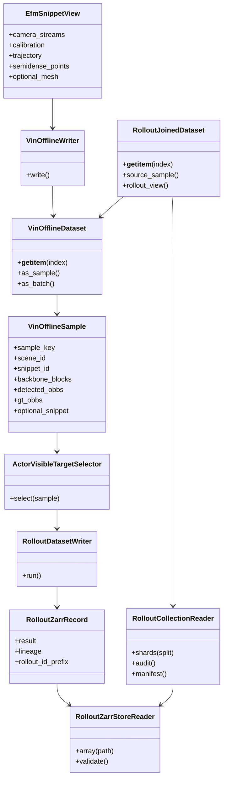
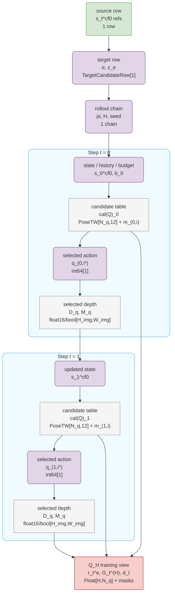
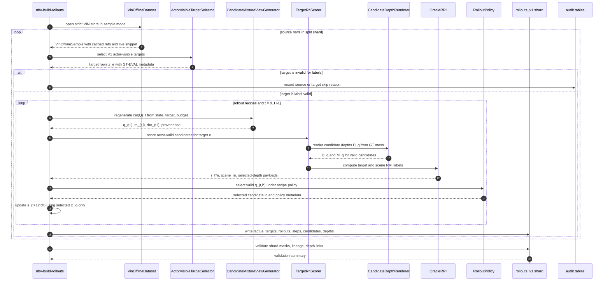

# Data Handling

`aria_nbv.data_handling` owns the typed boundary between upstream ASE/ATEK/EFM
assets and the training/evaluation objects consumed by ARIA-NBV. The package
root is the public API; private modules are implementation details unless they
are explicitly exported from `__init__.py`.

The central contract is actor/oracle separation. Actor-visible data comes from
observed snippets, MPS/EVL evidence, predicted or tracked OBBs, candidate
poses, and logged history. ASE meshes, GT OBBs, target crops, rendered oracle
depths, and RRI labels are supervision/evaluation assets. Invalid samples,
targets, or candidates are represented with masks and reason codes, never as
low RRI values.

## Current Public Surface

- Raw snippet access: `AseEfmDatasetConfig`, `AseEfmDataset`,
  `EfmSnippetView`, `VinSnippetView`, and snippet-loader helpers.
- One-step VIN/oracle batches: `VinOracleBatch`,
  `VinOracleOnlineDatasetConfig`, `VinDatasetSourceConfig`, and
  `VinOfflineSourceConfig`.
- Immutable one-step cache: `VinOfflineWriterConfig`, `VinOfflineWriter`,
  `VinOfflineDatasetConfig`, `VinOfflineStoreConfig`, `VinOfflineManifest`,
  and `VinOfflineIndexRecord`.
- Target selection: `ActorVisibleTargetSelector` and
  `TargetSelectorConfig`. Multi-step rollout generation, compact Zarr records,
  and rollout stores live in `aria_nbv.rollouts`.
- Diagnostics: `collect_vin_offline_dataset_stats`,
  `collect_vin_offline_dataset_coverage`, and
  `collect_offline_visual_inventory`.

The removed oracle-cache, VIN-snippet-cache, compatibility wrapper, and legacy
migration modules must not be reintroduced. Runtime imports should use root
package exports, or private modules only from inside this package.

## Architecture Direction

The target architecture is logical unification over physically separated
stores. `vin_offline` remains immutable and stores expensive one-step substrate
outputs. Multi-step target-conditioned samples live in a sharded rollout
sidecar that references VIN rows and raw ASE assets by stable lineage. A joined
reader gives training and inspection a single API without copying backbone
tensors, full meshes, or raw camera streams into every rollout sample.

```mermaid
flowchart LR
  subgraph Source["Source assets"]
    Raw["ASE / ATEK / EFM<br/>RGB, calibration, trajectory<br/>semidense points, GT meshes"]
  end

  subgraph OneStep["Immutable one-step substrate"]
    VinWriter["VinOfflineWriter<br/>materialize cached blocks"]
    VinStore["vin_offline<br/>strict indexed shards"]
    VinDataset["VinOfflineDataset<br/>sample or batch reader"]
  end

  subgraph Generation["Target rollout generation"]
    TargetSel["ActorVisibleTargetSelector<br/>V1 observed targets"]
    CandidateGen["Candidate mixture<br/>finite cal(Q)_t + provenance"]
    Oracle["Target RRI scorer<br/>GT-only crop and labels"]
    RolloutWriter["RolloutDatasetWriter<br/>policies, chains, masks"]
  end

  subgraph Derived["Derived multi-step data"]
    RolloutStore["rollouts_v1<br/>sharded replay collection"]
  end

  subgraph Consumers["Consumers"]
    Joined["RolloutJoinedDataset<br/>single training API"]
    Inspect["Rerun / Streamlit<br/>summary and rollout launch"]
  end

  Raw --> VinWriter --> VinStore --> VinDataset
  Raw -. "live snippet + mesh refs" .-> VinDataset
  VinDataset --> TargetSel --> CandidateGen --> RolloutWriter
  VinDataset --> Oracle --> RolloutWriter
  RolloutWriter --> RolloutStore
  VinDataset --> Joined
  RolloutStore --> Joined
  RolloutStore --> Inspect
  VinDataset --> Inspect

  classDef input fill:#D5E8D4,stroke:#82B366,stroke-width:1.5px,rx:0,ry:0;
  classDef output fill:#F8CECC,stroke:#B85450,stroke-width:1.5px,rx:0,ry:0;
  classDef compute fill:#E1D5E7,stroke:#9673A6,stroke-width:1.5px,rx:8,ry:8;
  classDef data fill:#F5F5F5,stroke:#9E9E9E,stroke-width:1.2px,rx:0,ry:0;

  class Raw input;
  class VinWriter,TargetSel,CandidateGen,Oracle,RolloutWriter compute;
  class VinStore,VinDataset,RolloutStore data;
  class Joined,Inspect output;

  style Source fill:#f1fff6,stroke:#97ddb5,stroke-width:2px,rx:12,ry:12
  style OneStep fill:#f7f3ff,stroke:#cdb2ff,stroke-width:2px,rx:12,ry:12
  style Generation fill:#f0fbff,stroke:#8fd0ff,stroke-width:2px,rx:12,ry:12
  style Derived fill:#f7f3ff,stroke:#cdb2ff,stroke-width:2px,rx:12,ry:12
  style Consumers fill:#ffffff,stroke:#cbd5e1,stroke-width:1.5px,rx:12,ry:12
```



The current implementation has a single standalone `rollouts.zarr` writer. The
target state is the same contract generalized into a sharded `rollouts_v1`
collection with collection-level manifests, per-shard validation, source-row
audit tables, and configurable depth-retention profiles.

## Interface Model

The most important interfaces are deliberately narrow: writers materialize
stores, readers validate and expose arrays, and joined datasets compose source
and rollout artifacts without mutating either one.



`RolloutCollectionReader` and `RolloutJoinedDataset` are target-state
interfaces. The current implemented reader opens one rollout Zarr store at a
time.

## Immutable VIN Offline Store

The canonical one-step offline format is a strict indexed-shard store:

```text
vin_offline/
  manifest.json
  sample_index.jsonl
  splits/
    train.npy
    val.npy
    all.npy
  shards/
    shard-000000/
      numeric_blocks.zarr/
      records.msgpack
    shard-000001/
      numeric_blocks.zarr/
      records.msgpack
```

- `manifest.json` records store version, source configuration, materialized
  block flags, aggregate stats, and shard descriptors.
- `sample_index.jsonl` maps global sample indices to scene/snippet IDs, split
  membership, shard IDs, and shard-local rows.
- `splits/*.npy` stores deterministic train/val/all membership arrays.
- `shards/shard-XXXXXX/` stores fixed numeric blocks as Zarr arrays and
  optional diagnostic payloads as indexed MessagePack record blobs.

`OFFLINE_DATASET_VERSION` is the runtime compatibility gate. When the format
changes, bump the version and rebuild stores with `VinOfflineWriter`; readers
should fail fast on older manifests.

By default `VinOfflineStoreConfig.store_dir` resolves to
`PathConfig().offline_cache_dir / "vin_offline"`. Relative store names such as
`"vin_offline"` are resolved under `offline_cache_dir`.

Build immutable stores through the writer CLI, not legacy cache commands:

```sh
cd aria_nbv
uv run nbv-build-offline --config-path ../.configs/build_vin_offline_81286.toml
```

Use `--dry-run` to validate a writer TOML and inspect the resolved store path
without loading snippets, EVL, or writing shards.

## Target Rollout Collection

The target multi-step store is a collection of independently valid shards. It
is optimized for clean joins, deterministic sharding, resume-safe generation,
and ML-friendly scans.

```text
rollouts_v1/
  manifest.json
  dictionaries.json
  splits/
    train.json
    val.json
    test.json
  audit/
    source_rows.jsonl
    targets.jsonl
    build_summary.json
  shards/
    split=train/
      shard=000000.zarr/
        metadata/
        sources/
        lineage/
        targets/
        rollouts/
        steps/
        candidates/
        depths/
          selected_action/
          candidate_valid/        # optional heavier profile
        diagnostics/
      shard=000001.zarr/
    split=val/
      shard=000000.zarr/
```

Shards should be assigned by split plus bounded VIN source-row chunks. A shard
stores its split as `rollouts/split_id`; it does not contain a separate
shard-local `splits/` mirror because that only duplicates rollout rows. This
keeps shard sizes predictable, avoids sample-level leakage across final splits,
and gives Slurm/DSS jobs a simple resume key. Scene-level split boundaries are
still owned by the source split manifest; a shard must not mix train/val/test.

### Store Responsibilities

| Group          | Responsibility                                                      | Redundancy rule                                                            |
| -------------- | ------------------------------------------------------------------- | -------------------------------------------------------------------------- |
| `metadata/`    | Schema, field-retention profile, depth profile, build stats.        | One copy per shard.                                                        |
| `sources/`     | VIN offline source rows shared by many target/rollout chains.       | Owns sample key/index, split, and source manifest hashes.                   |
| `lineage/`     | Rollout-row id plus config/protocol hashes.                         | Does not mirror source, rollout, target, step, or candidate fields.         |
| `targets/`     | Actor-visible selected targets plus GT-match evaluation fields.     | Target crops may be embedded once per target.                              |
| `rollouts/`    | One row per rollout chain and policy recipe.                        | Owns split id, root pose, policy, horizon, and target-row links only.       |
| `steps/`       | One row per time step in a rollout chain.                           | Links selected candidate by row id.                                        |
| `candidates/`  | Full-shell candidate rows, masks, provenance, labels.               | Invalid candidates stay as masked rows.                                    |
| `depths/`      | ML-ready counterfactual depth renders.                              | Store selected-action depths by default; all-valid depths only by profile. |
| `diagnostics/` | Optional summaries and retained heavy debug payloads.               | Never required for training.                                               |

Invalid source rows or invalid target attempts should be persisted in
`audit/*.jsonl`, not fabricated as target-RRI samples. Candidate-level
invalidity belongs inside `candidates/` because it is part of the finite action
set and future invalidity learning.

## Individual Multi-Step Sample

One trainable multi-step sample is a joined view over one source row, one
selected target, one rollout chain, its step rows, and the candidate tables at
those steps:

Shape notation follows `docs/typst/shared`: `H` is the rollout horizon, `N_q`
is the padded candidate width, `N_t <= N_q` is the valid row count at step `t`,
and `H_img x W_img` is the stored ML depth resolution. `PoseTW[12]` means the
12-value `PoseTW.tensor()` representation used by the implementation.

```text
multi_step_sample/
  source/                               # s_t^cf0 source refs; shape: 1 source row
    sample_key                          # source id; shape: scalar string/dict id
    scene_id, snippet_id                # scene/snippet ids; shape: scalar dict ids
    source_row_id                       # row id; shape: int64[1]
    vin_offline_manifest_hash           # source lineage; shape: scalar string/dict id
    cached_backbone_ref                 # cached EVL/VIN blocks; shape: external ref
    raw_snippet_ref                     # EfmSnippetView ref; shape: external ref
    mesh_ref                            # cal(M)_GT ref; shape: external path/hash/version
  target/                               # e, z_e; shape: 1 target row
    target_row_id                       # e id; shape: int64[1]
    actor_visible_descriptor            # z_e; shape: struct or Float[F_tok]
    observed_obb_world                  # observed target box; shape: Float[10 or 34]
    support_summary                     # target support; shape: Float[F_aux]
    gt_match_status                     # GT-EVAL status; shape: enum[1]
    gt_match_score                      # mu(hat(e), e); shape: float32[1]
    target_valid_mask                   # target-valid; shape: bool[1]
    target_invalid_reason_bitset        # target rho; shape: uint32[1]
  rollout/                              # pi, H; shape: 1 rollout chain
    rollout_row_id                      # rollout id; shape: int64[1]
    policy_id                           # pi; shape: enum[1]
    horizon                             # H; shape: int16[1]
    branch_factor, beam_width           # rollout branching; shape: int16[1]
    random_seed                         # stochastic lineage; shape: int64[1]
    final_cumulative_target_rri         # G_0^(H); shape: float32[1]
    final_cumulative_scene_rri          # scene diagnostic; shape: float32[1]
  steps/                                # t = 0..H-1; shape: up to H rows
    step_000/
      step_row_id                       # t row id; shape: int64[1]
      selected_candidate_row_id         # q_(t,i*); shape: int64[1]
      cumulative_target_rri             # sum_k r_(t+k)^e; shape: float32[1]
      candidates/                       # cal(Q)_t; shape: padded N_q rows
        candidate_row_id                # q_(t,i) id; shape: int64[N_q]
        pose_world_cam                  # q_(t,i); shape: PoseTW[N_q, 12]
        pose_relative_root              # relative q_(t,i); shape: Float[N_q, 12]
        candidate_features              # X_t^cand; shape: optional Float[N_q, F_q]
        strategy_id, mixture_id         # sampler provenance; shape: enum[N_q]
        sampler_probability             # proposal prob; shape: float32[N_q]
        actor_action_mask               # m_(t,i); shape: bool[N_q]
        oracle_label_mask               # oracle label mask; shape: bool[N_q]
        q_train_mask                    # Q_H train mask; shape: bool[N_q]
        invalid_reason_bitset           # rho_(t,i); shape: uint32[N_q]
        target_rri                      # r_t^e(q_(t,i)); shape: float32[N_q]
        scene_rri                       # scene diagnostic; shape: float32[N_q]
      selected_action_depth/            # D_(q_(t,i*)); shape: selected action only
        depth_m_f16                     # D_q; shape: float16[H_img, W_img]
        depth_valid_mask                # M_q; shape: bool[H_img, W_img]
        znear, zfar                     # renderer bounds; shape: float32[1]
        normalization                   # ML depth contract; shape: scalar string/dict id
    step_001/
      ...
  q_h_view()                            # derived Q_H view, not persisted as a store group
    candidate_row_id                    # q_(t,i) ids; shape: int64[H, N_q]
    valid_action_mask                   # m_(t,i); shape: bool[H, N_q]
    q_train_mask                        # trainable Q mask; shape: bool[H, N_q]
    one_step_target_rri                 # r_t^e; shape: float32[H, N_q]
    td_reward_target_rri                # selected r_t^e; shape: float32[H]
    td_next_step_row_id                 # selected transition link; shape: int64[H]
    bootstrap_next_step_row_id          # s_(t+1)^cf0 link; shape: int64[H, N_q]
    terminal_mask                       # d_t; shape: bool[H, N_q]
```

In thesis notation, `cal(Q)_t` is the finite candidate set at step `t`, and
`q_(t,i)` is one candidate pose/view. The default required depth modality is
the selected-action depth render for `q_(t,i*)`, because that render is the
counterfactual observation used to advance rollout state. A heavier profile may
also store depth renders for every actor-valid `q_(t,i)` in materialized
`cal(Q)_t`.



## Multi-Step Oracle Generation Sequence

The rollout generator reuses the immutable VIN store for cached substrate
features and the raw snippet/mesh references for counterfactual rendering. It
only advances the counterfactual state with the selected action depth; oracle
labels for all valid candidates remain supervision/evaluation data.



## Depth Retention Profiles

Depth storage should be explicit because it dominates rollout-store size.

| Profile                         | Stored depths                                                             | Intended use                                                                                     |
| ------------------------------- | ------------------------------------------------------------------------- | ------------------------------------------------------------------------------------------------ |
| `selected_action_depth`         | One ML-ready depth map per rollout step for the selected valid candidate. | Required default; advances counterfactual state and supports Rerun inspection.                   |
| `selected_action_plus_retained` | Selected-action depths plus retained oracle-lookahead beam actions.       | Debugging headroom and beam-chain evidence.                                                      |
| `all_valid_candidate_depth`     | Depth map for every actor-valid candidate row in materialized `cal(Q)_t`. | Optional heavier profile for visual candidate-token learning or dense candidate-depth ablations. |

Depth maps should be stored as compressed metric `float16` arrays with a
separate boolean valid mask. Shard metadata must record resolution, renderer,
`znear`, `zfar`, invalid-fill policy, and normalization used by ML readers.
Resolution is fixed per shard/profile; mixed depth shapes are a validation
error. Full RGB, source depth streams, full meshes, and backbone tensors stay
in their source stores and are referenced by path/hash/version.

## Training Source

One-step Lightning training consumes VIN offline data through:

```toml
[datamodule_config.source]
kind = "offline"
train_split = "train"
val_split = "val"

[datamodule_config.source.offline]
load_backbone = true
map_location = "cpu"

[datamodule_config.source.offline.store]
store_dir = "vin_offline"
```

`VinOfflineSourceConfig` returns `VinOracleBatch` samples and disables
diagnostic record loading for the training path. Use `VinOfflineDatasetConfig`
directly when tests or diagnostics need the richer `return_format = "sample"`
path.

The target multi-step training path should consume rollout replay through a
joined reader:

```text
RolloutCollectionReader(split="train")
  + VinOfflineDataset(return_format="sample", load_backbone=true)
  -> RolloutJoinedDataset
  -> Q_H batch with source refs, target descriptor, candidate rows, masks,
     selected-action depths, and bounded target-RRI returns
```

This reader is the logical migration target. It avoids recomputing EFM/backbone
outputs while still generating new target-conditioned candidates, selected
counterfactual depths, and target-RRI labels.

## Verification

For data-handling changes, run the tightest relevant checks:

```sh
ruff format aria_nbv/aria_nbv/data_handling/<file>.py
ruff check aria_nbv/aria_nbv/data_handling/<file>.py
uv run pytest tests/data_handling/test_vin_offline_store.py
uv run pytest tests/data_handling/test_public_api_contract.py
```

For rollout-store work, include the rollout and target-selection tests:

```sh
uv run pytest tests/data_handling/test_target_selection.py
uv run pytest tests/rollouts
uv run nbv-build-rollouts --config-path ../.configs/build_rollouts_v1_smoke.toml --dry-run
```

Broaden to Lightning datamodule tests when source selection or
training-facing batch assembly changes. Broaden to Rerun/Streamlit tests when
inspection flows or retained diagnostics change.
