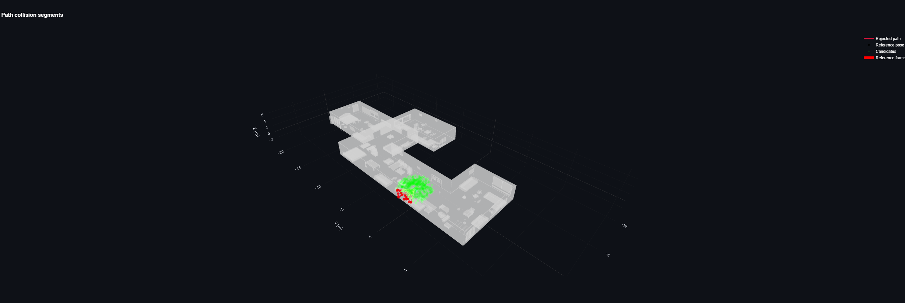

- TODO: candidate pose generation: only within free space and within confines of the room (based on SSL for training); based on predicted occupancy from EFM3D for eval
- Only allow query points that are reachable from last known pose (direct movement from this pose to candidate pose doesn't intersect witht the mesh)

## App Screenshots

Quick reference of all visuals currently in `docs/figures/app`.

