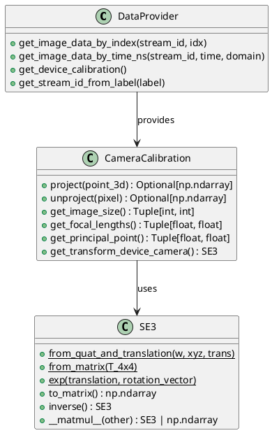

```{python}
# | echo: false
# | output: false
import sys
from pathlib import Path
import numpy as np

repo_root = Path.cwd().resolve().parents[2]

# Define data path
DATA_PATH = repo_root / ".data" / "semidense_samples" / "ase" / "ase_examples" / "0"
HAS_SAMPLE_DATA = DATA_PATH.exists()

trajectory = None
Ts_world_device = []
timestamps = np.array([])
points = np.empty((0, 3), dtype=np.float32)
entities = []

if HAS_SAMPLE_DATA:
    print(f"Using data from: {DATA_PATH}")
```

## Overview

**ProjectAria Tools** is a comprehensive Python library for working with Meta's Project Aria data captures. It provides functionality for:

- **Data Loading**: VRS files, ASE dataset, MPS outputs
- **Geometric Transforms**: SE3/SO3 transformations (Sophus)
- **Camera Calibration**: Projection, unprojection, distortion handling
- **Visualization**: Rerun-based 3D/2D plotting
- **Data Download**: CDN-based dataset management

This document covers all components essential for our **Next-Best-View (NBV)** project.

---

## 1. Core Architecture & Classes

**Key Packages:**

- **`core.sophus`**: SE3/SO3 transformation groups (rotation + translation)
- **`core.calibration`**: Camera intrinsics/extrinsics, projection/unprojection
- **`core.data_provider`**: VRS data loading interface
- **`projects.ase`**: ASE dataset readers and interpreters
- **`tools`**: High-level utilities (downloading, visualization)

---

## 2. Data Loading & Access

### 2.1 VRS Data Provider

**Purpose**: Load sensor data (images, IMU, etc.) from VRS files.

#### Core Classes & Methods

```{python}
#| eval: false
#| echo: true
# Note: VRS data provider requires actual VRS recording files
# For ASE dataset, we load images directly (see section 5.2)
from projectaria_tools.core import data_provider
from projectaria_tools.core.stream_id import StreamId
from projectaria_tools.core.sensor_data import TimeDomain, TimeQueryOptions

# Example usage (requires VRS file):
# provider = data_provider.create_vrs_data_provider("path/to/recording.vrs")
# print(f"Provider type: {type(provider)}")

# Get stream IDs
# rgb_stream_id = StreamId("214-1")
# slam_stream_id = provider.get_stream_id_from_label("camera-slam-left")
# print(f"RGB Stream ID: {rgb_stream_id}")
# print(f"SLAM Stream ID: {slam_stream_id}")

# Query by index
# image_data, record = provider.get_image_data_by_index(rgb_stream_id, frame_idx=0)
# image_array = image_data.to_numpy_array()
# print(f"Image shape: {image_array.shape}, dtype: {image_array.dtype}")
# print(f"Record timestamp: {record.capture_timestamp_ns} ns")

print("VRS provider section - requires VRS recording file")
print("See section 5.2 for ASE dataset loading with actual data")
```

**Important Stream IDs:**

- RGB: `"214-1"` or label `"camera-rgb"`
- SLAM Left: `"1201-1"` or label `"camera-slam-left"`
- SLAM Right: `"1201-2"` or label `"camera-slam-right"`
- Eye Tracking: `"211-1"` or label `"camera-eyetracking"`

---

### 2.2 ASE Dataset Loading

**Purpose**: Load Aria Synthetic Environments (ASE) data - trajectories, point clouds, scene entities.

#### ASE Readers

```{python}
#| echo: true
from projectaria_tools.projects.ase import readers

if not HAS_SAMPLE_DATA:
    print(f"Skipping ASE sample loading; data path not found: {DATA_PATH}")
else:
    # Load camera trajectory (6DoF poses)
    trajectory = readers.read_trajectory_file(str(DATA_PATH / "trajectory.csv"))
    Ts_world_device = trajectory["Ts_world_from_device"]  # List[SE3]
    timestamps = trajectory["timestamps"]  # np.ndarray
    print(f"Trajectory keys: {list(trajectory.keys())}")
    print(f"Number of poses: {len(Ts_world_device)}")
    print(f"Timestamps shape: {timestamps.shape}, dtype: {timestamps.dtype}")
    print(f"First pose (4x4 matrix):\n{Ts_world_device[0].to_matrix()}")

    # Load semi-dense point cloud
    points = readers.read_points_file(str(DATA_PATH / "semidense_points.csv.gz"))
    print(f"\nPoints shape: {points.shape}, dtype: {points.dtype}")
    print(f"Point coordinates range:")
    print(f"  X: [{points[:, 0].min():.2f}, {points[:, 0].max():.2f}]")
    print(f"  Y: [{points[:, 1].min():.2f}, {points[:, 1].max():.2f}]")
    print(f"  Z: [{points[:, 2].min():.2f}, {points[:, 2].max():.2f}]")

    # Load SceneScript language (ground truth entities)
    entities = readers.read_language_file(str(DATA_PATH / "ase_scene_language.txt"))
    print(f"\nNumber of entities: {len(entities)}")
    print("First 3 entities:")
    for i, (cmd, params) in enumerate(entities[:3]):
        print(f"  {i}: {cmd} - {list(params.keys())[:5]}")
```

**File Formats:**

- `trajectory.csv`: Frame-wise 6DoF poses (SE3 transforms)
- `semidense_points.csv.gz`: 3D points with uncertainty
- `ase_scene_language.txt`: SceneScript commands (entities, materials, etc.)

#### Entity Interpretation

```{python}
#| echo: true
from projectaria_tools.projects.ase.interpreter import language_to_bboxes

if not HAS_SAMPLE_DATA:
    print("Skipping entity interpretation; ASE sample data is not available.")
else:
    # Convert entities to 3D bounding boxes
    entity_boxes = language_to_bboxes(entities)
    print(f"Number of bounding boxes: {len(entity_boxes)}")

    # Each box contains:
    # - 'class': object category
    # - 'center': (3,) center position
    # - 'scale': (3,) dimensions
    # - 'rotation': (3, 3) rotation matrix
    if len(entity_boxes) > 0:
        print(f"\nFirst bounding box:")
        box = entity_boxes[0]
        print(f"  Class: {box['class']}")
        print(f"  Center: {box['center']}")
        print(f"  Scale: {box['scale']}")
        print(f"  Rotation shape: {box['rotation'].shape}")

        # Show statistics across all boxes
        classes = [b['class'] for b in entity_boxes]
        from collections import Counter
        print(f"\nObject class distribution:")
        for cls, count in Counter(classes).most_common(5):
            print(f"  {cls}: {count}")
```

---

### 2.3 MPS Data Loading

**MPS (Machine Perception Services)**: Pre-computed SLAM outputs (point clouds, trajectories).

```{python}
#| eval: false
#| echo: true
from projectaria_tools.core import mps
from projectaria_tools.core.mps.utils import filter_points_from_confidence

# Load global point cloud with confidence
points = mps.read_global_point_cloud("global_points.csv.gz")
print(f"Points shape: {points.shape}, dtype: {points.dtype}")
print(f"Available fields: {points.dtype.names}")
print(f"Position range X: [{points['px'].min():.2f}, {points['px'].max():.2f}]")
print(f"Confidence range: [{points['inv_dist_std'].min():.4f}, {points['inv_dist_std'].max():.4f}]")

# Filter by confidence threshold
high_conf_points = filter_points_from_confidence(points, min_inv_dist_std=0.001)
print(f"Filtered: {len(points)} → {len(high_conf_points)} points ({100*len(high_conf_points)/len(points):.1f}%)")
```

---

## 3. Geometric Transforms (Sophus)

**Purpose**: SE3 (rotation + translation) and SO3 (rotation) operations for coordinate frame transforms.

### 3.1 SE3: Transformation Group in 3D

#### Creating SE3 Transforms

```{python}
#| echo: true
from projectaria_tools.core.sophus import SE3
import numpy as np

# From quaternion + translation
quat_w = 1.0
quat_xyz = [0.0, 0.0, 0.0]
translation = [1.0, 2.0, 3.0]
T = SE3.from_quat_and_translation(quat_w, quat_xyz, translation)
print(f"SE3 from quat+trans:\n{T.to_matrix()}")

# From 4x4 matrix
T_matrix = np.eye(4)
T_matrix[:3, 3] = [1, 2, 3]
T = SE3.from_matrix(T_matrix)
print(f"\nSE3 from matrix:\n{T.to_matrix()}")

# From twist (rotation vector + translation)
rot_vec = [0, 0, 0]
trans_part = [1, 2, 3]
T = SE3.exp(trans_part, rot_vec)
print(f"\nSE3 from exp (twist):\n{T.to_matrix()}")
print(f"Translation part: {T.to_matrix()[:3, 3]}")
```

#### Using SE3 Transforms

```{python}
#| echo: true
# Convert to matrix
T_matrix = T.to_matrix()  # (4, 4) numpy array
T_matrix3x4 = T.to_matrix3x4()  # (3, 4) numpy array
print(f"4x4 matrix shape: {T_matrix.shape}")
print(f"3x4 matrix shape: {T_matrix3x4.shape}")

# Invert transform
T_inv = T.inverse()
identity_check = (T @ T_inv).to_matrix()
print(f"\nInverse check (should be identity):")
print(f"Max deviation from identity: {np.abs(identity_check - np.eye(4)).max():.2e}")

# Compose transforms
T_world_device = SE3.from_quat_and_translation(1.0, [0, 0, 0], [1, 0, 0])
T_device_camera = SE3.from_quat_and_translation(1.0, [0, 0, 0], [0, 0.1, 0])
T_world_camera = T_world_device @ T_device_camera
print(f"\nComposed transform:\n{T_world_camera.to_matrix()}")

# Transform points
points_3d = np.array([[0, 0, 10], [1, 1, 5]])  # (N, 3)
points_transformed = (T @ points_3d.T).T
print(f"\nOriginal points shape: {points_3d.shape}")
print(f"Transformed points shape: {points_transformed.shape}")
print(f"Transformed points:\n{points_transformed}")
```

#### Vectorized Operations

```{python}
#| echo: true
# Create batch of SE3 transforms
translations = [[1, 2, 3], [4, 5, 6], [7, 8, 9]]
rotations = [[0, 0, 0], [0.1, 0, 0], [0, 0.1, 0]]
T_batch = SE3.exp(translations, rotations)

print(f"Batch size: {len(T_batch)}")
print(f"First transform in batch:\n{T_batch[0].to_matrix()}")

# Apply each transform to a point
point = np.array([0, 0, 10])
print(f"\nOriginal point: {point}")
print(f"Transformed by each SE3 in batch:")
for i, T in enumerate(T_batch):
    transformed_pt = T @ point
    print(f"  T[{i}] @ point = {transformed_pt}")
```

### 3.2 SO3: Rotation Group in 3D

```{python}
#| echo: true
from projectaria_tools.core.sophus import SO3

# From rotation vector
rot_vec = [0, 0, np.pi/2]  # 90° around Z-axis
R = SO3.exp(rot_vec)
print(f"SO3 from rotation vector (90° around Z):\n{R.to_matrix()}")

# From quaternion (w, [x, y, z])
R = SO3.from_quat(1.0, [0, 0, 0])
print(f"\nSO3 from quaternion (identity):\n{R.to_matrix()}")

# From rotation matrix
R_matrix = np.eye(3)
R = SO3.from_matrix(R_matrix)
print(f"\nSO3 from matrix:\n{R.to_matrix()}")

# Apply to points
points_to_rotate = np.array([[1, 0, 0], [0, 1, 0]])
rotated = (R @ points_to_rotate.T).T
print(f"\nOriginal points:\n{points_to_rotate}")
print(f"Rotated points:\n{rotated}")
```

---

## 4. Camera Calibration & Projection

**Purpose**: Project 3D points to image pixels and unproject pixels to 3D rays.

### 4.1 Camera Calibration Object

```{python}
#| echo: true
from projectaria_tools.projects import ase

# Get ASE RGB camera calibration
camera_calib = ase.get_ase_rgb_calibration()
print(f"Camera calibration type: {type(camera_calib)}")
print(f"Camera model: {camera_calib.get_label()}")

# VRS provider example (requires VRS file):
# device_calib = provider.get_device_calibration()
# camera_calib = device_calib.get_camera_calib("camera-rgb")
# print(f"Available camera labels: {device_calib.get_camera_labels()}")
```

### 4.2 Camera Intrinsics

```{python}
#| echo: true
# Image dimensions
width, height = camera_calib.get_image_size()
print(f"Image size: {width} x {height}")

# Focal lengths
fx, fy = camera_calib.get_focal_lengths()
print(f"Focal lengths: fx={fx:.2f}, fy={fy:.2f}")

# Principal point
cx, cy = camera_calib.get_principal_point()
print(f"Principal point: cx={cx:.2f}, cy={cy:.2f}")

# Summary
print(f"\nIntrinsics summary:")
print(f"  Resolution: {width}x{height}")
print(f"  FOV (approx): {2 * np.arctan(width/(2*fx)) * 180/np.pi:.1f}° horizontal")
```

### 4.3 Projection (3D → 2D)

```{python}
#| echo: true
# Project 3D point in camera frame to pixel
point_in_camera = np.array([0, 0, 10])  # X, Y, Z
pixel = camera_calib.project(point_in_camera)

if pixel is not None:
    u, v = pixel  # Image coordinates
    print(f"Point {point_in_camera} projects to pixel ({u:.2f}, {v:.2f})")
    print(f"Pixel coordinates: u={u:.2f}, v={v:.2f}")
else:
    print("Point projects outside image bounds!")

# Test multiple points
test_points = np.array([[0, 0, 5], [1, 0, 5], [0, 1, 5], [2, 2, 10]])
print(f"\nProjecting {len(test_points)} test points:")
for i, pt in enumerate(test_points):
    px = camera_calib.project(pt)
    if px is not None:
        print(f"  Point {i}: {pt} → pixel [{px[0]:.1f}, {px[1]:.1f}]")
    else:
        print(f"  Point {i}: {pt} → outside image")
```

**⚠️ Coordinate Frame Convention:**

- Input point must be in **camera frame**, not device or world frame!
- Use SE3 transforms to convert: `point_camera = T_camera_world @ point_world`

### 4.4 Unprojection (2D → 3D Ray)

```{python}
#| echo: true
# Unproject pixel to 3D ray (bearing vector)
pixel = [100, 200]
ray = camera_calib.unproject(pixel)

if ray is not None:
    print(f"Pixel {pixel} → ray direction: {ray}")
    print(f"Ray magnitude (should be ~1.0): {np.linalg.norm(ray):.6f}")

    # To get 3D point at depth d:
    depth = 5.0  # meters
    point_3d = depth * ray
    print(f"3D point at depth {depth}m: {point_3d}")
else:
    print("Pixel outside valid image region!")
```

**Use Case**: Converting depth images to point clouds (see `ase_exploration.ipynb`).

### 4.5 Camera Extrinsics

```{python}
#| echo: true
# Device-to-camera transform
T_device_camera = camera_calib.get_transform_device_camera()
print(f"Device-to-camera transform:\n{T_device_camera.to_matrix()}")

if not HAS_SAMPLE_DATA:
    print("Skipping trajectory-dependent extrinsics example; ASE sample data is not available.")
else:
    # Use first pose from actual trajectory
    T_world_device = Ts_world_device[0]

    # Full transform chain: World → Device → Camera
    T_camera_world = (
        T_device_camera.inverse() @ T_world_device.inverse()
    )
    print(f"\nFull transform chain (camera-from-world):\n{T_camera_world.to_matrix()[:3, :]}")

    # Project world point to image
    point_world = np.array([1, 2, 10])
    point_camera = T_camera_world @ point_world
    pixel = camera_calib.project(point_camera)
    print(f"\nWorld point: {point_world}")
    print(f"Camera frame point: {point_camera}")
    if pixel is not None:
        print(f"Projected pixel: [{pixel[0]:.2f}, {pixel[1]:.2f}]")
    else:
        print("Point not visible in camera")
```

---

## 5. Critical Workflows for NBV

### 5.1 Depth Image → Point Cloud Conversion

**✅ Correct Method** (handles Aria's fisheye distortion):

```{python}
#| echo: true
def depth_to_pointcloud(depth_map, camera_calib, T_world_device, subsample=4):
    """
    Convert depth map to 3D point cloud using Aria's native camera model.

    Args:
        depth_map: (H, W) depth in millimeters
        camera_calib: Camera calibration object
        T_world_device: SE3 transform from device to world
        subsample: Downsample factor

    Returns:
        points_world: (N, 3) array in world coordinates
    """
    depth_m = depth_map.astype(np.float32) / 1000.0
    height, width = depth_map.shape
    print(f"Depth map: {depth_map.shape}, range [{depth_map.min()}-{depth_map.max()}] mm")

    # Get transforms
    T_device_camera = camera_calib.get_transform_device_camera()
    T_world_camera = T_world_device @ T_device_camera

    points_world = []
    valid_pixels = 0
    total_pixels = (height // subsample) * (width // subsample)

    for v in range(0, height, subsample):
        for u in range(0, width, subsample):
            # Unproject pixel to ray (handles fisheye distortion!)
            ray = camera_calib.unproject([u, v])

            if ray is not None:
                d = depth_m[v, u]
                if 0 < d <= 10.0:  # Valid depth range
                    # Point in camera frame
                    p_camera = d * ray
                    # Transform to world
                    p_world = T_world_camera @ p_camera
                    points_world.append(p_world)
                    valid_pixels += 1

    points_arr = np.array(points_world)
    print(f"Generated {len(points_arr)} points from {valid_pixels}/{total_pixels} valid pixels")
    if len(points_arr) > 0:
        print(f"Point cloud bounds: X[{points_arr[:, 0].min():.2f}, {points_arr[:, 0].max():.2f}], "
              f"Y[{points_arr[:, 1].min():.2f}, {points_arr[:, 1].max():.2f}], "
              f"Z[{points_arr[:, 2].min():.2f}, {points_arr[:, 2].max():.2f}]")
    return points_arr
```

**Why not Open3D's `create_from_depth_image()`?**

- Open3D assumes **pinhole camera model**
- Aria uses **fisheye/wide-angle** models (Kannala-Brandt)
- Using `camera_calib.unproject()` handles distortion correctly!

### 5.2 Loading ASE Scene Data

```{python}
#| echo: true
from PIL import Image

if not HAS_SAMPLE_DATA:
    print(f"Skipping ASE scene-loading example; data path not found: {DATA_PATH}")
else:
    print(f"Loading scene from: {DATA_PATH}")

    # Data already loaded in section 2.2, reuse it:
    # trajectory, Ts_world_device, timestamps, points, entities

    print(f"✓ Trajectory: {len(Ts_world_device)} poses")
    print(f"✓ Point cloud: {points.shape}")
    print(f"✓ Entities: {len(entities)}")

    # Get camera calibration
    width, height = camera_calib.get_image_size()
    print(f"✓ Camera: {width}x{height}")

    # Load depth/RGB images for frame 0
    frame_idx = 0
    frame_id = str(frame_idx).zfill(7)
    depth = np.array(Image.open(DATA_PATH / "depth" / f"depth{frame_id}.png"))
    rgb = np.array(Image.open(DATA_PATH / "rgb" / f"vignette{frame_id}.jpg"))
    print(f"✓ Frame {frame_idx}: RGB {rgb.shape}, Depth {depth.shape}")
    print(f"  Depth range: [{depth.min()}, {depth.max()}] mm")
    print(f"  RGB dtype: {rgb.dtype}, range: [{rgb.min()}, {rgb.max()}]")
```

### 5.3 Projecting 3D Points to Images

```{python}
#| echo: true
if not HAS_SAMPLE_DATA:
    print("Skipping point-projection example; ASE sample data is not available.")
else:
    # Get pose for this frame
    T_world_device_frame = Ts_world_device[frame_idx]
    print(f"Device pose at frame {frame_idx}:")
    print(f"  Translation: {T_world_device_frame.to_matrix()[:3, 3]}")

    # Transform chain
    T_device_camera = camera_calib.get_transform_device_camera()
    T_camera_world = T_device_camera.inverse() @ T_world_device_frame.inverse()

    # Project subset of points (all points would be too many)
    sample_indices = np.linspace(0, len(points)-1, 500, dtype=int)
    sampled_points = points[sample_indices]

    pixels_list = []
    visible_count = 0
    for point_world in sampled_points:
        point_camera = T_camera_world @ point_world
        pixel = camera_calib.project(point_camera)
        if pixel is not None:
            # Check if pixel is within image bounds
            if 0 <= pixel[0] < width and 0 <= pixel[1] < height:
                pixels_list.append(pixel)
                visible_count += 1

    pixels_arr = np.array(pixels_list) if pixels_list else np.array([]).reshape(0, 2)
    print(f"\nProjected {visible_count}/{len(sampled_points)} sampled points visible in frame")
    if len(pixels_arr) > 0:
        print(f"Pixel coordinates range: u[{pixels_arr[:, 0].min():.1f}, {pixels_arr[:, 0].max():.1f}], "
              f"v[{pixels_arr[:, 1].min():.1f}, {pixels_arr[:, 1].max():.1f}]")
```

---

## 6. Data Download & Management

### 6.1 Dataset Downloader

```{python}
#| eval: false
#| echo: true
from projectaria_tools.tools.dataset_downloader import (
    DatasetDownloader,
    DatasetDownloadStatusManager
)

# Initialize downloader
sequences = ["sequence_001", "sequence_002"]
data_types = ["trajectory", "depth", "rgb"]
downloader = DatasetDownloader(
    sequences=sequences,
    data_types_selected=data_types,
    overwrite=False
)
print(f"Configured downloader for {len(sequences)} sequences, {len(data_types)} data types")

# Download to folder
output_folder = ".data/ase_dataset"
print(f"Downloading to: {output_folder}")
downloader.download_data(output_folder)

# Track download status
status_manager = DatasetDownloadStatusManager()
status_manager.set_download_status("trajectory", True)
status_manager.to_json("download_status.json")
print(f"Download status saved to download_status.json")
```

---

## 7. Visualization with Rerun

```{python}
#| eval: false
#| echo: true
from projectaria_tools.tools.aria_rerun_viewer import AriaDataViewer

# Create viewer
viewer = AriaDataViewer()
viewer.set_device_calibration(device_calib)

# Plot images
viewer.plot_image(image_array, label="camera-rgb", device_timestamp_ns=timestamp)

# Plot 3D data
viewer.plot_vio_data(vio_data)
viewer.plot_device_extrinsics()
```

---

## 8. Key Classes Reference (UML)



---

## 9. Complete Example: Multi-View Point Cloud Fusion

```{python}
#| echo: true
if not HAS_SAMPLE_DATA:
    print("Skipping multi-view fusion example; ASE sample data is not available.")
else:
    print(f"Scene: {DATA_PATH}")
    print(f"Total frames: {len(Ts_world_device)}")

    # Select views to fuse (every 50th frame for speed)
    view_indices = [0, 50, 100, 150, 200]
    all_points_list = []

    for idx in view_indices:
        # Load depth
        frame_id = str(idx).zfill(7)
        depth_img = np.array(Image.open(DATA_PATH / "depth" / f"depth{frame_id}.png"))

        # Get pose
        T_world_device_view = Ts_world_device[idx]

        # Convert to point cloud
        pc = depth_to_pointcloud(
            depth_img, camera_calib, T_world_device_view, subsample=8
        )
        all_points_list.append(pc)
        print(f"  View {idx}: {len(pc):,} points")

    # Fuse all views
    fused_pc = np.vstack(all_points_list)
    print(f"\n✓ Fused point cloud: {len(fused_pc):,} points from {len(view_indices)} views")
    print(f"  Bounds: X[{fused_pc[:, 0].min():.2f}, {fused_pc[:, 0].max():.2f}], "
          f"Y[{fused_pc[:, 1].min():.2f}, {fused_pc[:, 1].max():.2f}], "
          f"Z[{fused_pc[:, 2].min():.2f}, {fused_pc[:, 2].max():.2f}]")
```

---

## 10. Summary: Essential Functions

### Data Loading
```{python}
#| eval: false
#| echo: true
# VRS data
provider = data_provider.create_vrs_data_provider(vrs_path)
image_data, record = provider.get_image_data_by_index(stream_id, idx)

# ASE data
trajectory = readers.read_trajectory_file(traj_csv)
points = readers.read_points_file(points_csv_gz)
entities = readers.read_language_file(language_txt)
```

### Transforms
```{python}
#| eval: false
#| echo: true
# SE3 creation
T = SE3.from_quat_and_translation(w, xyz, translation)
T = SE3.from_matrix(T_4x4)

# SE3 operations
T_inv = T.inverse()
T_composed = T1 @ T2
points_transformed = T @ points_3d
```

### Camera Operations
```{python}
#| eval: false
#| echo: true
# Projection
pixel = camera_calib.project(point_in_camera)

# Unprojection
ray = camera_calib.unproject(pixel)
point_3d = depth * ray

# Extrinsics
T_device_camera = camera_calib.get_transform_device_camera()
```

---

## 11. Reference Materials

**Official Tutorials:**

- `dataprovider_quickstart_tutorial.ipynb` - VRS data loading
- `sophus_quickstart_tutorial.ipynb` - SE3/SO3 transforms
- `ase_tutorial_notebook.ipynb` - ASE dataset loading

**Project Notebooks:**

- `notebooks/ase_exploration.ipynb` - Complete ASE workflow
- Shows depth→PC conversion, projection, trajectory plotting

**Key Files:**

- `projectaria_tools/core/sophus.pyi` - SE3/SO3 API
- `projectaria_tools/core/calibration.pyi` - Camera calibration API
- `projectaria_tools/projects/ase/readers.py` - ASE data loaders
- `projectaria_tools/projects/ase/interpreter.py` - Entity interpretation

---

## 12. Common Pitfalls & Best Practices

### ❌ Wrong: Using Open3D for Aria Depth
```{python}
#| eval: false
#| echo: true
# This assumes pinhole model - WRONG for Aria!
intrinsic = o3d.camera.PinholeCameraIntrinsic(width, height, fx, fy, cx, cy)
pcd = o3d.geometry.PointCloud.create_from_depth_image(depth, intrinsic)
```

### ✅ Correct: Using Aria's Unproject
```{python}
#| eval: false
#| echo: true
# Handles fisheye distortion correctly
ray = camera_calib.unproject([u, v])
point_3d = depth * ray
```

### ❌ Wrong: Forgetting Coordinate Frame Transforms
```{python}
#| eval: false
#| echo: true
# Point is in world frame, but project() expects camera frame!
pixel = camera_calib.project(point_world)  # WRONG
```

### ✅ Correct: Transform to Camera Frame First
```{python}
#| eval: false
#| echo: true
point_camera = T_camera_world @ point_world
pixel = camera_calib.project(point_camera)  # CORRECT
```

### Best Practices

1. **Always check projection results**: `if pixel is not None`
2. **Use vectorized SE3 operations** for batches
3. **Cache camera calibration**: Don't reload every frame
4. **Filter depth by range**: `0 < depth <= 10.0` (meters)
5. **Subsample for speed**: Use `subsample` parameter in depth→PC conversion

---

## Appendix: File Formats

### ASE Dataset Structure
```
scene_000/
├── trajectory.csv              # 6DoF poses
├── semidense_points.csv.gz     # 3D point cloud
├── semidense_observations.csv.gz  # Point visibility
├── ase_scene_language.txt      # SceneScript entities
├── object_instances_to_classes.json  # Instance mapping
├── rgb/
│   └── vignette0000000.jpg
├── depth/
│   └── depth0000000.png        # Depth in mm (uint16)
└── instances/
    └── instance0000000.png     # Instance IDs (uint16)
```

### CSV Formats

**trajectory.csv:**
```
timestamp_ns,qw,qx,qy,qz,tx,ty,tz
1000000,1.0,0.0,0.0,0.0,0.0,0.0,0.0
```

**semidense_points.csv.gz:**
```
uid,graph_uid,px_world,py_world,pz_world,inv_dist_std,dist_std
0,0,1.23,4.56,7.89,0.001,0.05
```

**semidense_observations.csv.gz:**
```
uid,frame_tracking_timestamp_us,camera_serial,u,v
0,1000,214-1,512.3,384.7
```

# Project Aria Tools Repository Structure

Important ProjectAria Tools paths:
```
external/projectaria_tools/examples/Gen1/python_notebooks
├── dataprovider_quickstart_tutorial.ipynb
├── mps_quickstart_tutorial.ipynb
├── sophus_quickstart_tutorial.ipynb
└── ticsync_tutorial.ipynb
```

```
external/projectaria_tools/projects/AriaSyntheticEnvironment
├── aria_synthetic_environments_downloader.py
├── python
│   ├── CalibrationProviderPyBind.h
│   ├── TestBindings.py
│   └── bindings.cpp
└── tutorial
    ├── ase_tutorial_notebook.ipynb
    └── code_snippets
        ├── constants.py #<Important>
        ├── interpreter.py #<Important>
        ├── plotters.py #<Important>
        └── readers.py #<Important>
```

```
╭─ ~/miniforge3/en/a/lib/python3.11/si/projectaria_tools/tools/dataset_downloader
╰─ tree .
.
├── __init__.py
├── dataset_download_status_manager.py
├── dataset_downloader.py
├── dataset_downloader_main.py
└── dataset_downloader_utils.py`
```

```
─ ~/miniforge3/envs/aria-nbv/lib/python3.11/site-packages/projectaria_tools
╰─ tree . -I "__pycache__" -P "*.pyi|*.py"
.
├── __init__.py
├── __init__.pyi
├── core
│   ├── __init__.py
│   ├── __init__.pyi
│   ├── calibration.py
│   ├── calibration.pyi #<Important>
│   ├── data_provider.py
│   ├── data_provider.pyi
│   ├── gen2_mp_csv_exporter.py
│   ├── gen2_mp_csv_exporter.pyi
│   ├── image.py
│   ├── image.pyi #<Important>
│   ├── mps
│   │   ├── __init__.py
│   │   ├── __init__.pyi
│   │   ├── hand_tracking.pyi
│   │   ├── utils.py
│   │   └── utils.pyi
│   ├── sensor_data.py
│   ├── sensor_data.pyi
│   ├── sophus.py
│   ├── sophus.pyi #<Important>
│   ├── stream_id.py
│   ├── stream_id.pyi
│   ├── vrs.py
│   ├── vrs.pyi
│   ├── xprs.py
│   └── xprs.pyi
├── projects
│   ├── __init__.py
│   ├── adt
│   │   ├── __init__.py
│   │   └── utils.py
│   ├── adt.pyi
│   ├── aea
│   │   └── __init__.py
│   ├── aea.pyi
│   ├── ase
│   │   ├── __init__.py
│   │   ├── interpreter.py
│   │   └── readers.py
│   ├── ase.pyi
│   └── dtc_objects
│       ├── __init__.py
│       ├── downloader_lib.py
│       └── downloader_main.py
├── tools
│   ├── __init__.py
│   ├── aria_rerun_viewer
│   │   ├── __init__.py
│   │   ├── aria_data_plotter.py
│   │   └── aria_rerun_viewer.py
│   ├── dataset_downloader
│   │   ├── __init__.py
│   │   ├── dataset_download_status_manager.py
│   │   ├── dataset_downloader.py
│   │   ├── dataset_downloader_main.py
│   │   └── dataset_downloader_utils.py
│   ├── gen2_mp_csv_exporter
│   │   ├── __init__.py
│   │   └── run_gen2_mp_csv_exporter.py
│   ├── viewer_mps
│   │   ├── __init__.py
│   │   ├── rerun_viewer_mps.py
│   │   └── viewer_mps.py
│   └── vrs_to_mp4
│       ├── __init__.py
│       ├── vrs_to_mp4.py
│       └── vrs_to_mp4_utils.py
└── utils
    ├── __init__.py
    ├── calibration_utils.py
    └── rerun_helpers.py
```
