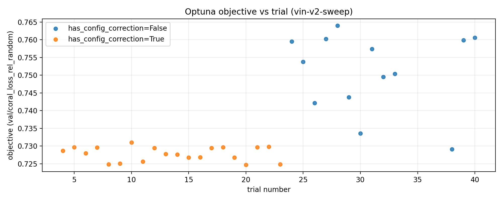
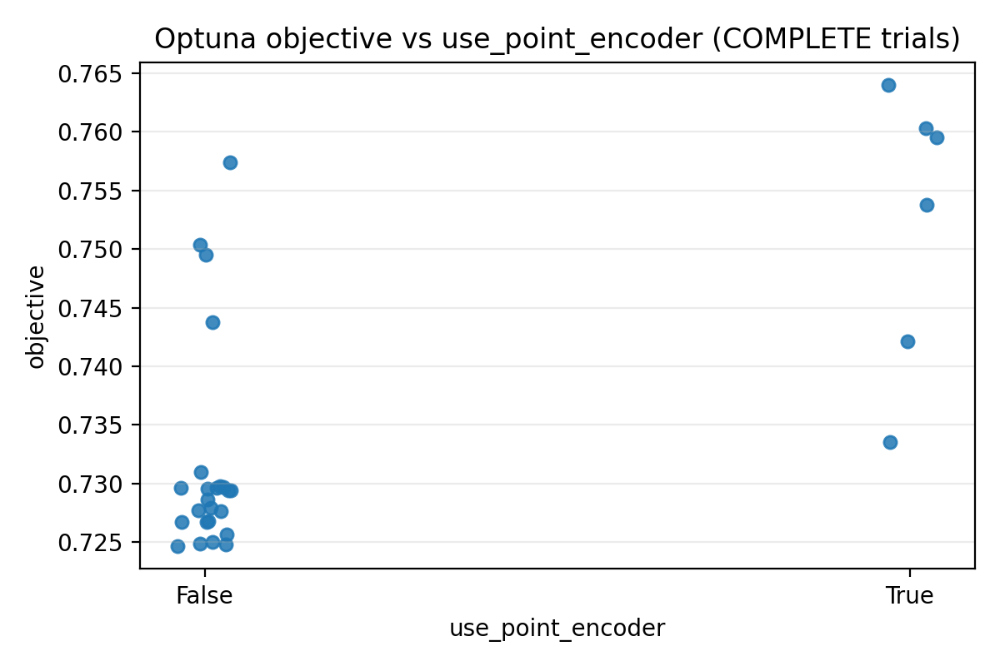
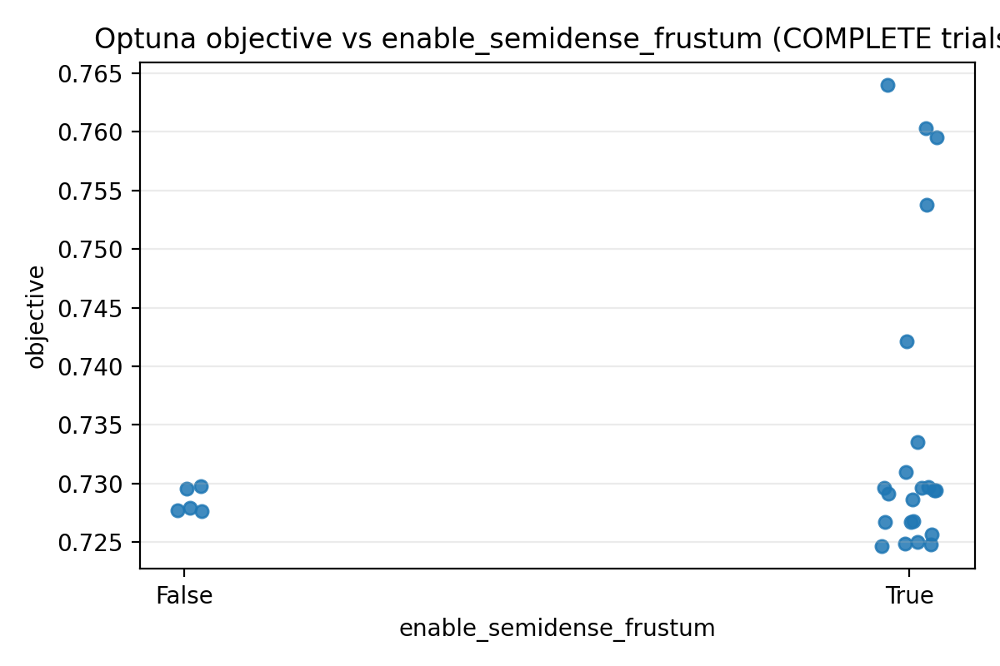
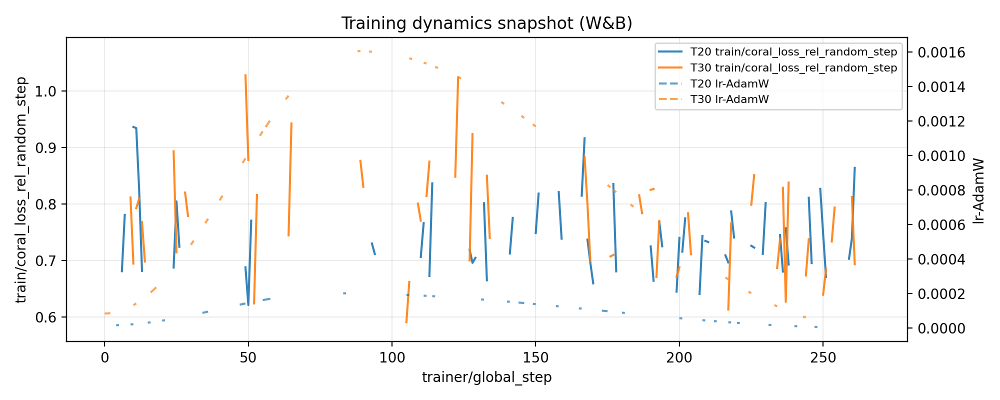

## Context

This note documents:

- what we learned from the existing Optuna study `vin-v2-sweep` stored in `.logs/optuna/vin-v2-sweep.db`,
- why the study results show a **regime shift** across trials,
- which hyperparameters we now treat as **fixed baseline**, and which ones we continue to **sweep** (architectural toggles),
- the concrete code changes that implement the updated search space.

The plots below are generated by `.codex/plot_optuna_vin_v2_2026-01-07.py` and saved in `docs/figures/vin_v2/`.

## What the existing sweep did (and why it is non-stationary)

The Optuna database contains multiple “phases” mixed in one study:

1. **Early trials** were effectively missing some suggested parameters (e.g. due to dependency gating and/or missing configs).
2. **Later trials** include additional suggested params (e.g. OneCycleLR params and head/field dims), changing both the
   optimization landscape and the meaning of Optuna importances.

3. A subset of trials includes a `config_correction` trial user attribute (written by the training code) indicating the
   runtime had to coerce certain options (most importantly: the PointNeXt encoder being forced off because its config was
   missing).

This is the primary explanation for the “regime shift”: trials are **not sampled from one stationary objective/config**,
so global Optuna importances are not reliable without filtering by phase.

### Optuna objective vs trial index



### Two key toggles (why the evidence is incomplete)

In the existing DB, `use_point_encoder=True` trials exist, but they come from a different configuration phase than the
best “corrected” trials, so comparing the distributions directly is misleading.



Semidense frustum features *do* show a weak positive trend in the corrected regime, but the evidence is still limited
because of the phase mixing.



### W&B snapshot (best corrected trial vs best point-encoder-on trial)

This highlights that the “point encoder on” trials we have in the DB behave differently, but the sweep phases were not
comparable (different suggested params + runtime corrections).



## Updated sweep strategy

Goal: spend the next ~10 trials primarily on **architectural evidence**, not on confounding continuous knobs like LR
schedules or head widths.

### Fixed (baseline) parameters

We now **fix** the following parameters (they can still be manually overridden in TOML, but are no longer Optuna-swept):

- MLP + field widths: `head_hidden_dim`, `head_num_layers`, `head_dropout`, `field_dim`, `field_gn_groups`
- OneCycleLR: `max_lr`, `div_factor`, `final_div_factor`, `pct_start`
- AdamW weight decay: `weight_decay`
- Trajectory encoder toggle: `use_traj_encoder` (kept **on** by default)
- Semidense projection/truncation sizes: `semidense_proj_grid_size`, `semidense_proj_max_points`, `semidense_frustum_max_points`

Rationale:

- These knobs introduce strong confounds, and the current study already mixed several scheduler/width regimes.
- For the next round, we want cleaner evidence on **which modules matter**.
- Width/schedule tuning can be done in a dedicated follow-up sweep once the architecture is locked.

### Swept (architectural) parameters

We keep sweeping the core architectural toggles:

- `use_point_encoder` (PointNeXt on/off)
- `enable_semidense_frustum` (frustum MHCA on/off)
- `semidense_visibility_embed` (visibility embedding on/off; only when frustum enabled)
- `semidense_frustum_mask_invalid` (mask invalid tokens on/off; only when frustum enabled)
- `semidense_include_obs_count` + `semidense_obs_count_norm` (obs count features + normalization)
- `use_voxel_valid_frac_feature` (append coverage features on/off)
- `use_voxel_valid_frac_gate` (voxel gate on/off)
- `global_pool_grid_size` (small discrete choice)

Crucially, the semidense frustum-related params are now conditioned on `enable_semidense_frustum` (instead of being
incorrectly gated on `use_point_encoder`), so Optuna can actually vary them in trials where the point encoder is off.

## Implementation

Search space + dependency fixes:

- `aria_nbv/aria_nbv/vin/experimental/model_v2.py`: simplify fixed knobs + fix `relies_on` for semidense params
- `aria_nbv/aria_nbv/lightning/optimizers.py`: fix OneCycle/WD knobs for architecture-focused sweeps

Baseline sweep config (kept compatible with the vin snippet cache + subset mode):

- `.configs/sweep_config.toml`

## Suggested next action

Run ~10 additional trials in the existing study:

```bash
uv run nbv-optuna --config-path ./.configs/sweep_config.toml
```

If we keep reusing the same Optuna study name, we should consider tagging new trials via Optuna `trial.set_user_attr`
(e.g. `sweep_phase="arch_toggles_2026-01-07"`) to keep analysis clean.
