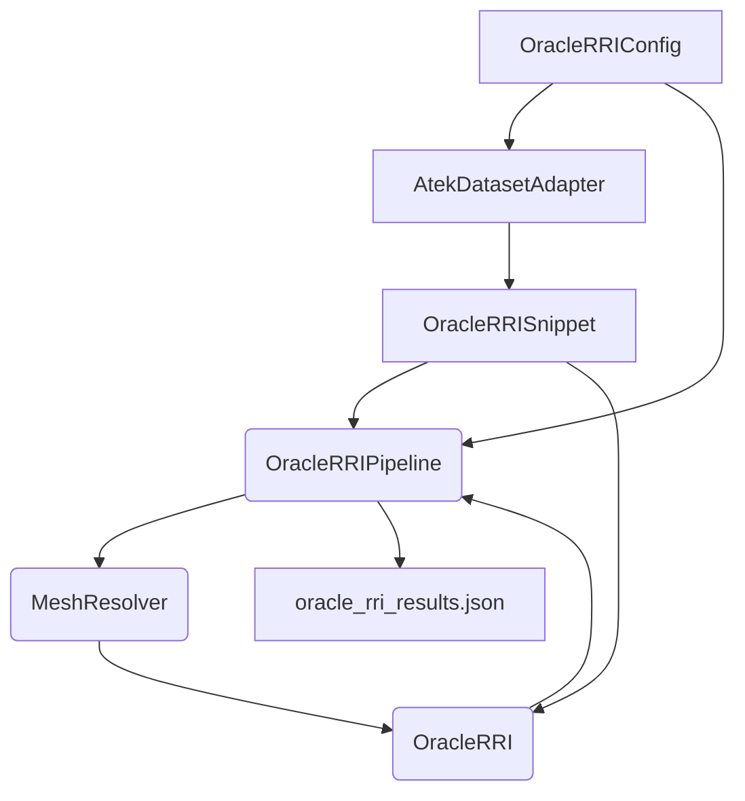

# Goal

Design a reusable oracle-RRI pipeline that plugs directly into the ASE/ATEK
WebDataset format, uses EFM3D utilities for geometry, and exposes a clean API
for evaluation and NBV research. The implementation lives in
`oracle_rri_pkg/oracle_rri` and leans on a **Facade + Adapter** pattern:

- **Facade** (`OracleRRIPipeline`) coordinates config, streaming, mesh lookup,
  and metric computation.
- **Adapter** (`AtekDatasetAdapter`) normalises raw WebDataset samples into
  `OracleRRISnippet` objects with per-frame point clouds.
- **Service** (`OracleRRI`) reuses the existing Chamfer-based oracle metric.

# Components

| Layer | Symbol | Responsibility | Key APIs |
| --- | --- | --- | --- |
| Configuration | `OracleRRIConfig` | Pydantic model bundling dataset paths, output dirs, device options. | `.dataset`, `.output_root`, `.device` |
| Data Adapter | `AtekDatasetAdapter` | Streams ATEK shards (via `load_atek_wds_dataset_as_efm`) and yields `OracleRRISnippet`. Handles variable-length point tensors. | `for snippet in adapter:` |
| Point Cloud Model | `OracleRRISnippet`, `FramePointCloud` | Dataclasses storing per-frame points, timestamps, rig poses, with helpers to aggregate early frames vs. candidate frames. | `.aggregate_until(idx)`, `.aggregate_subset(indices)` |
| Mesh Resolver | `MeshResolver` | Maps sequence names to extracted GT meshes (supports `scene_ply_<id>.ply`). | `.resolve(sequence_name)` |
| Oracle Metric | `OracleRRI` | Existing class computing Chamfer(P, GT) delta. | `.compute_rri(current, candidate)` |
| Pipeline Facade | `OracleRRIPipeline` | Binds everything: iterates snippets, resolves meshes, runs oracle, writes JSON summary. | `.run(initial_frames=1)`, `.compute_incremental_rris(snippet)` |

# Data Flow



# Usage Example

```python
from oracle_rri import OracleRRIConfig, OracleRRIPipeline

config = OracleRRIConfig()
pipeline = OracleRRIPipeline(config)
results = pipeline.run(initial_frames=2, max_candidates=5)
print(results[0])
```

The defaults expect the coordinated downloader to populate:

- WebDataset shards under `datasets/ase_eval_wds/`.
- Meshes under `datasets/ase_mesh/`.
- Manifest JSONs in `.data/aria_download_urls/` (see `docs/contents/ase_dataset.qmd`).

# Implementation Notes

- Pydantic validators ensure manifests exist and output directories are created
  on instantiation.
- Variable-length SLAM point clouds (`msdpd#points_world+stacked`) are sliced
  per frame using `msdpd#points_world_lengths` and packaged as `FramePointCloud`.
- Aggregation helpers keep tensors on the requested device before Chamfer
  evaluation, avoiding repetitive host ↔ device copies.
- Results are persisted as `oracle_rri_results.json` to support downstream
  analysis notebooks (`notebooks/ase_oracle_rri_exploration.ipynb`).

# Next Steps

- Extend `OracleRRIPipeline` with candidate selection policies (e.g. evaluate
  multiple permutations of frames) and integrate with NBV planners.
- Cache fused point clouds on disk to accelerate repeated oracle evaluations.
- Expose CLI commands (Typer) for batch processing once the pipeline stabilises.
