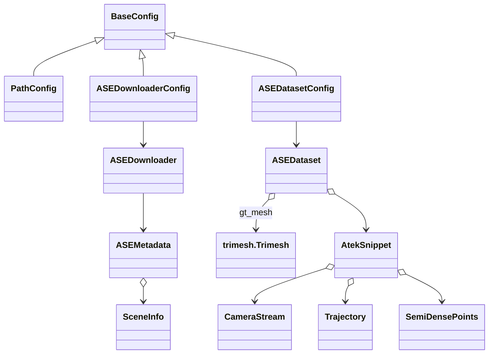

# Package Overview

- **Purpose**: Typed, PyTorch-friendly wrappers around ASE/ATEK data, mesh pairing, downloads, and visualization utilities used for the oracle RRI pipeline.
- **Structure**:
  - `configs/`, `config.py`, `utils/` – config + logging infrastructure.
  - `data/` – lightweight scene/snippet containers.
  - `data_handling/` – ATEK WebDataset loader, metadata resolver, downloader.
  - `analysis/` – debugging helpers (depth/point cloud).
  - `viz/` – mesh and distance visualisation.



# Core Modules & Classes

## Config & Logging
- **`utils.base_config.BaseConfig`**: Pydantic-powered factory base with TOML IO and `inspect()` rendering (Rich).
- **`configs.path_config.PathConfig`**: Singleton paths to data roots, ATEK/ASE URL manifests, mesh directories.
- **`utils.console.Console`**: Rich wrapper with prefixes and optional shared PL logger hook.

## Data Containers (`data/structures.py`)
- `FrameSlice`: timestamp + rig pose (3×4), points, std, extras.
- `SnippetSample`: sequence of `FrameSlice` with snippet id; iterates points.
- `SceneRecord`: scene id plus shard paths (+ optional mesh).

## Data Handling (`data_handling/`)

### Dataset loader (`dataset.py`)
```{mermaid}
classDiagram
    class ASEDatasetConfig{
      +tar_urls: list[str]
      +scene_to_mesh: dict[str,Path]
      +batch_size:int?
      +load_meshes: bool
      +mesh_simplify_ratio: float?
      +setup_target()->ASEDataset
    }
    class ASEDataset{
      -_atek_wds
      -_mesh_cache
      +__iter__()->ASESample
    }
    class AtekSnippet{
      +cameras: dict[CameraLabel,CameraStream]
      +trajectory: Trajectory?
      +semidense: SemiDensePoints?
      +gt_data: dict
      +to_flatten_dict()
    }
    class ASESample{
      +scene_id:str
      +snippet_id:str
      +atek:AtekSnippet
      +gt_mesh:trimesh.Trimesh?
      +to_efm_dict(include_mesh)
    }
    ASEDatasetConfig --> ASEDataset
    ASEDataset --> ASESample
    ASESample --> AtekSnippet
    AtekSnippet o--> CameraStream
    AtekSnippet o--> Trajectory
    AtekSnippet o--> SemiDensePoints
    ASESample --> trimesh.Trimesh
```

- **External dependencies used**:
  - `atek.data_loaders.load_atek_wds_dataset`, `select_and_remap_dict_keys` for WebDataset ingest.
  - `efm3d.aria.PoseTW`, `CameraTW` for typed geometry conversion (`to_camera_tw`).
  - `trimesh` for GT mesh loading/simplification.
- **Batch handling**: `_explode_batched_dict` splits WebDataset B-dim into per-sample dicts; `ase_collate` returns lists plus EFM-ready dicts.
- **Mesh pairing**: `scene_to_mesh` mapping + optional decimation + caching; tolerant when meshes absent unless `require_mesh=True`.
- **Key typing**: `CameraStream`, `Trajectory`, `SemiDensePoints` mirror ATEK dataclasses; preserve Aria frame (x-left, y-up, z-forward), `T_A_B` convention.
- **EFM remap**: `ASESample.to_efm_dict()` applies `EfmModelAdaptor.get_dict_key_mapping_all()` and can include `gt_mesh`.

### Metadata & Download
- **`metadata.ASEMetadata`**: parses `ase_mesh_download_urls.json` and `AriaSyntheticEnvironment_ATEK_download_urls.json` → `SceneInfo(scene_id, mesh_url, mesh_sha, snippet_ids)`.
- **`downloader.ASEDownloaderConfig/ASEDownloader`**: orchestrates mesh + WDS downloads (uses ATEK `download_atek_wds_sequences`, `requests` for meshes, SHA1 verification, unzip). CLI-friendly via `pydantic_settings`.

## Analysis
- **`analysis/depth_debugger.py`**: utilities to inspect depth/point clouds; useful for validating candidate sampling and fusion (see TODOs).

## Visualisation
- **`viz/mesh_viz.py`**: rendering helpers (Trimesh + matplotlib) for meshes and point clouds; wire into Streamlit dashboard per TODOs.

# How to Structure the Package Moving Forward

1. **Top-level configs**: keep `PathConfig` singleton and small, push task-specific knobs into `ASEDatasetConfig`, `ASEDownloaderConfig`, `OracleRRIConfig` (to be added for metrics/candidate sampling).
2. **Data-handling layer**: maintain pure data classes (`CameraStream`, `Trajectory`, `SemiDensePoints`) that stay ATEK/EFM-compatible; avoid side effects (no device moves).
3. **Processing layer** (new): add modules for
   - Candidate generation (`candidate/generator.py`),
   - Raycast depth rendering (`candidate/depth_renderer.py`, leveraging `efm3d.utils.ray` + `trimesh` intersections),
   - Point-cloud fusion (`fusion/pc_fusion.py`, reusing EFM3D `pointcloud` + `voxel` utils).
4. **Metrics layer**: `metrics/oracle_rri.py` wrapping ATEK + EFM3D mesh/PC distance (Chamfer, F-score) with `torchmetrics` API.
5. **Apps**: Streamlit UI in `apps/streamlit_nbv.py` calling viz + candidate + metrics with caching.

# External Library Hooks (per component)

- **Trimesh**: mesh IO, surface sampling, ray–mesh intersections; optional quadric decimation when loading GT meshes.
- **EFM3D**:
  - `PoseTW`, `CameraTW`: camera/pose typing + operations.
  - `utils.ray` (`ray_grid`, `transform_rays`, `ray_obb_intersection`) for candidate depth rendering.
  - `utils.pointcloud` (`dist_im_to_point_cloud_im`, `pointcloud_to_occupancy_snippet`) for depth → PC and occupancy.
- **ATEK**:
  - `load_atek_wds_dataset`, `process_wds_sample` for streaming shards.
  - Key mapping (`EfmModelAdaptor.get_dict_key_mapping_all`) when exporting to EFM schema.
  - Download helpers (`atek_data_store_download.download_atek_wds_sequences`) via `ASEDownloader`.

# Suggested Mermaid for planned processing layer

```{mermaid}
classDiagram
    class CandidateViewGenerator{
      +sample_poses(last_pose, strategy_cfg)->list[PoseTW]
    }
    class CandidatePointCloudGenerator{
      +render_depth(pose, mesh)->depth
      +to_point_cloud(depth, cam)->Tensor[N,3]
    }
    class PointCloudFusion{
      +merge(P_t, P_q)->P_fused
    }
    class OracleRRI{
      +chamfer_before_after(P_t, P_fused, mesh)->float
    }
    CandidateViewGenerator --> CandidatePointCloudGenerator
    CandidatePointCloudGenerator --> PointCloudFusion
    PointCloudFusion --> OracleRRI
```

Use this layout to guide module additions under `oracle_rri/` while keeping current data-handling and config patterns.
