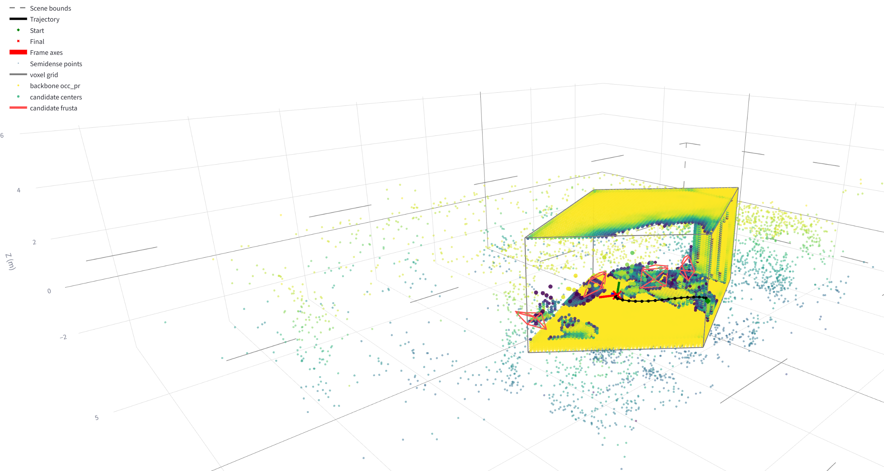
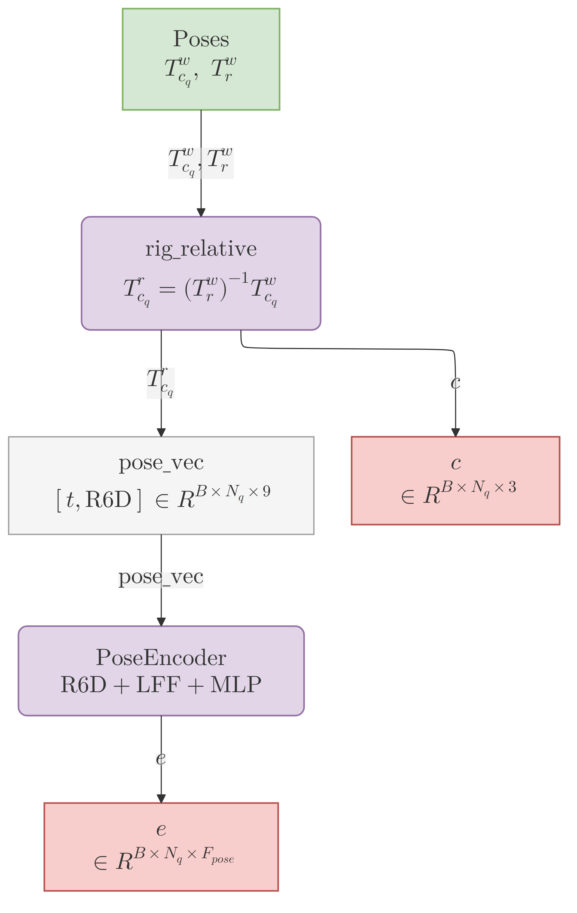
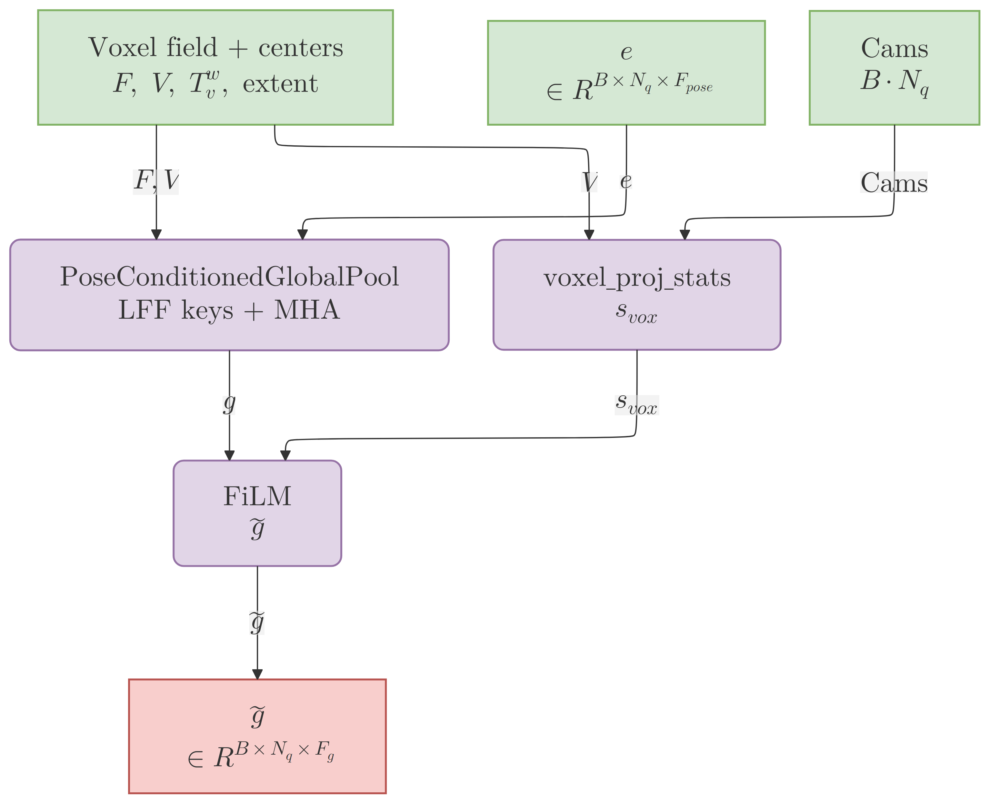
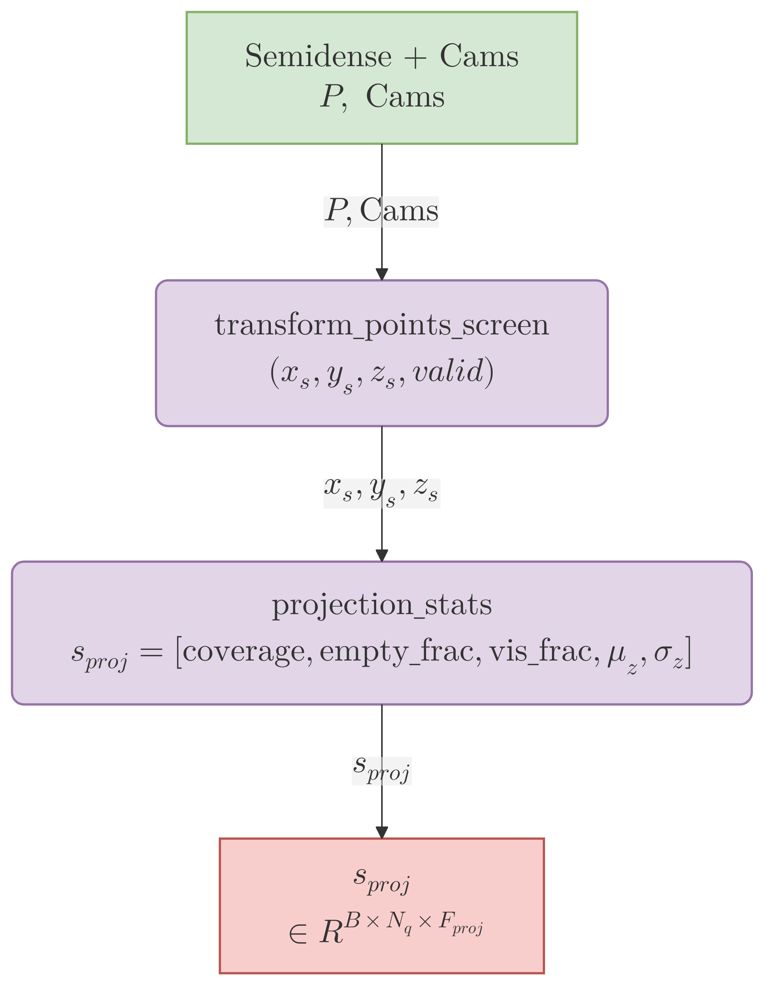
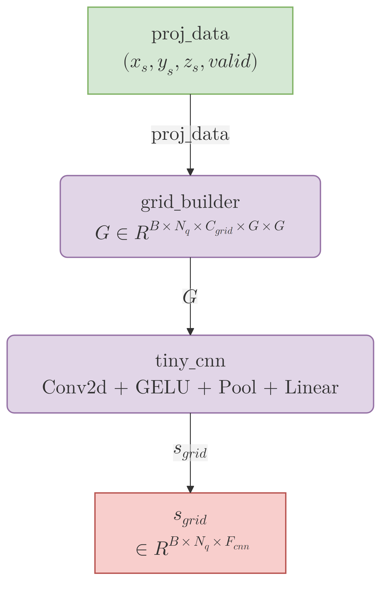
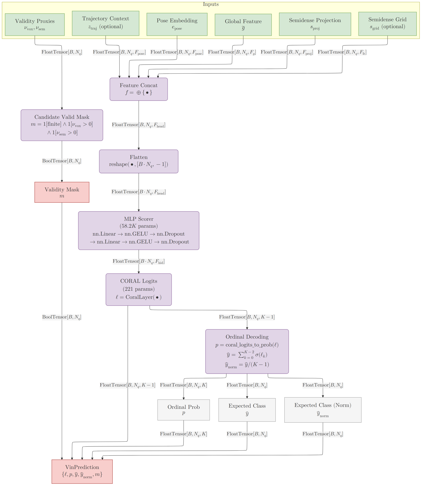

# Scope

This page documents the current `VinModelV3` implementation in
`aria_nbv/aria_nbv/vin/model_v3.py`. It focuses on the model that is
actually trained in the repo today: a frozen EVL backbone, explicit
view-conditioned geometry cues, and a compact CORAL head for ordinal
RRI prediction.

The page is intentionally not a model-history note. Older design branches are
omitted so this document stays aligned with the Typst paper, the current slide
deck, and the best-performing VINv3 run.

# What VINv3 Does

Given one egocentric snippet and a set of candidate next-view poses, VINv3
predicts per-candidate ordinal RRI scores so that ranking by the predicted
expected score approximates ranking by oracle RRI. The model keeps the EVL
backbone frozen and learns only the candidate scorer on top of compact voxel
evidence plus view-conditioned projection features.

The core design choice is to make candidate-specific evidence explicit instead
of relying on a purely global scene descriptor. VINv3 therefore combines three
signals:

- rig-relative candidate pose encoding
- global voxel context conditioned on the candidate pose
- screen-space projection statistics from semi-dense points and pooled voxel centers



# Model Contract

The current forward interface is:

```python
forward(
    efm: EfmSnippetView | VinSnippetView,
    candidate_poses_world_cam: PoseTW,
    reference_pose_world_rig: PoseTW,
    p3d_cameras: PerspectiveCameras,
    backbone_out: EvlBackboneOutput | None = None,
) -> VinPrediction
```

## Inputs

| Argument | Type | Meaning |
|---|---|---|
| `efm` | `EfmSnippetView | VinSnippetView` | Snippet state. `EfmSnippetView` can be converted on demand into a cache-ready `VinSnippetView`. |
| `candidate_poses_world_cam` | `PoseTW` | Candidate camera poses in the `world<-camera` convention. |
| `reference_pose_world_rig` | `PoseTW` | Reference rig pose for the snippet in the `world<-rig` convention. |
| `p3d_cameras` | `PerspectiveCameras` | Batched PyTorch3D cameras aligned with the candidate poses and used for all screen-space projections. |
| `backbone_out` | `EvlBackboneOutput | None` | Optional cached EVL outputs. Required when the call site already provides a `VinSnippetView` without raw EFM inputs. |

Two input contracts matter in practice:

- `VinSnippetView.points_world` is expected to provide at least
  `(x, y, z, 1/sigma_d, n_obs)` per semi-dense point.
- `p3d_cameras` must stay frame-consistent with the candidate poses, especially
  when any CW90 correction is applied upstream.

## Outputs

`VinPrediction` carries the tensors used by training, diagnostics, and ranking:

| Field | Meaning |
|---|---|
| `logits` | CORAL threshold logits for the ordinal RRI bins. |
| `prob` | Class probabilities recovered from the CORAL logits. |
| `expected` | Expected ordinal score in class units. |
| `expected_normalized` | Expected score normalized to `[0, 1]`; this is the main ranking proxy used by the training loop. |
| `candidate_valid` | Conservative validity heuristic based on finite poses, voxel support, and semi-dense visibility. |
| `voxel_valid_frac` | Per-candidate voxel support proxy sampled from the EVL evidence field. |
| `semidense_candidate_vis_frac` | Per-candidate visibility proxy derived from semi-dense point projection. |

# Implemented Architecture

VINv3 keeps a small, evidence-backed core and makes the optional trajectory
path explicit instead of hiding it inside the baseline description.

## 1. Frozen EVL Backbone and Compact Scene Field

The scorer consumes a frozen EVL backbone through `EvlBackboneOutput`. In the
current setup this is the EVL "heads" feature surface, not the heavy neck or
raw 2D artifacts. The model requires:

- `occ_pr`
- `occ_input`
- `counts`
- `cent_pr`
- `pts_world`
- `t_world_voxel`
- `voxel_extent`

From these tensors `VinModelV3` builds a compact voxel field:

- `counts_norm = log1p(counts) / log1p(max(counts))`
- `observed = 1[counts > 0]`
- `unknown = 1 - counts_norm`
- `free_input`, taken from the backbone when available or derived as `observed * (1 - occ_input)`
- `new_surface_prior = unknown * occ_pr`

`scene_field_channels` then selects which EVL and derived channels are actually
concatenated before projection through a `1x1x1 Conv3d + GroupNorm + GELU`
block. The class default is:

```python
["occ_pr", "occ_input", "counts_norm", "cent_pr", "free_input", "unknown", "new_surface_prior"]
```

This keeps the field compact while still encoding occupied evidence, coverage,
and a simple prior for unseen but likely occupied regions.

::: {layout-ncol=2}


:::

## 2. Pose Encoding in the Reference Rig Frame

Each candidate pose is re-expressed in the reference rig frame:

$$
T_{\mathrm{rig\_ref,cam}} = T_{\mathrm{world,rig\_ref}}^{-1} \; T_{\mathrm{world,cam}}
$$

The pose encoder then maps translation plus rotation-6D into a learned
embedding using R6D and Learnable Fourier Features. The output contract is:

- `pose_vec`: the explicit `(t, R6D)` representation
- `pose_enc`: the learned candidate embedding
- `candidate_center_rig_m`: candidate center in reference-rig meters

This rig-relative encoding is the stable pose parameterization used by the
current implementation.



## 3. Pose-Conditioned Global Pooling and Voxel-Projection FiLM

The projected voxel field is pooled onto a coarse `G x G x G` grid and turned
into voxel tokens. `PoseConditionedGlobalPool` uses the pose embedding as the
query and the pooled voxel tokens as keys and values, with positional keys
derived from pooled voxel centers in the reference rig frame.

In parallel, the pooled voxel centers are projected into each candidate view.
Those projections are summarized with the same five scalar statistics used by
the semi-dense branch:

- `coverage`
- `empty_frac`
- `semidense_candidate_vis_frac`
- `depth_mean`
- `depth_std`

For voxel centers these statistics use uniform weights, because pooled voxel
points do not carry per-point reliability metadata. A linear FiLM layer predicts
per-channel scale and bias terms and modulates the global feature with that
candidate-specific projection summary.



## 4. Semidense Scalar Projection Statistics

Semi-dense points are sampled once from the snippet and projected into each
candidate camera through the shared `PerspectiveCameras` path. A projected point
is valid only if it is finite, in front of the camera, and inside the image
bounds.

VINv3 reduces these projections to five scalar cues per candidate:

- `coverage`
- `empty_frac`
- `semidense_candidate_vis_frac`
- `depth_mean`
- `depth_std`

The visibility and depth moments are reliability-weighted. The weighting uses
two metadata channels already carried by `VinSnippetView.points_world`:

- `n_obs`, the semi-dense observation count
- `1/sigma_d`, the inverse depth-uncertainty proxy

This branch is the main lightweight replacement for heavier candidate frustum
attention experiments.



## 5. Semidense Projection-Grid CNN

Scalar projection statistics are augmented by a tiny CNN over a coarse
candidate-aligned screen grid. Valid projections are binned into
`G_sem x G_sem`, and each cell stores:

- occupancy
- depth mean
- depth standard deviation

The CNN encodes that grid into a compact feature vector that preserves coarse
view-plane structure without turning the model into an image encoder.



## 6. Optional Trajectory Context

`VinModelV3` can also encode the snippet rig trajectory in the same reference
rig frame and attend it with the candidate pose embeddings. This path is
optional:

- class default: disabled
- current best run: enabled

When active, the trajectory encoder produces per-frame pose encodings, and a
candidate-query attention block returns `traj_ctx`, which is appended to the
head input alongside the pose, global, and semi-dense features.

## 7. MLP + CORAL Head and the Candidate-Validity Heuristic

The final head input concatenates:

- `pose_enc`
- global voxel context after FiLM
- semi-dense scalar projection features
- optional semi-dense grid-CNN features
- optional trajectory context

That feature vector is passed through a shallow MLP and a `CoralLayer`. The
model outputs ordinal logits, class probabilities, the expected ordinal score,
and a normalized expected score used as the ranking proxy.

VINv3 also emits a conservative candidate-validity heuristic:

```python
candidate_valid = (
    pose_finite
    & (voxel_valid_frac > 0.0)
    & (semidense_candidate_vis_frac > 0.0)
)
```

This flag is diagnostic and can be useful for logging or analysis, but it is
not the primary model output.



# Best Current Instantiation

The architecture above describes the implementation surface of `VinModelV3`.
The current best checkpoint in the repo is the run `rtjvfyyp` / `v03-best`,
whose effective configuration is logged in the corresponding W&B artifacts.

| Setting | Value |
|---|---|
| run | `rtjvfyyp` / `v03-best` |
| `use_traj_encoder` | `true` |
| `scene_field_channels` | `["occ_pr", "occ_input", "counts_norm", "cent_pr", "free_input", "new_surface_prior"]` |
| `field_dim` | `24` |
| `global_pool_grid_size` | `5` |
| `head_hidden_dim` | `192` |
| `head_num_layers` | `2` |
| `head_dropout` | `0.0071317082333434145` |
| `semidense_cnn_enabled` | `true` |
| `semidense_cnn_channels` | `8` |
| `semidense_cnn_out_dim` | `16` |
| `semidense_proj_grid_size` | `12` |
| `semidense_proj_max_points` | `16384` |
| `num_classes` | `15` |
| `apply_cw90_correction` | `false` |

This best run still uses a frozen EVL backbone in heads mode. The main model
delta relative to the class defaults is that it enables trajectory context and
uses a slightly smaller scene-field channel subset by dropping `unknown` from
the selected channels.

Its training design is also compact: CORAL remains the primary ordinal
objective, a Huber auxiliary loss is applied to the CORAL-derived expected RRI
with an exponentially decayed weight, voxel-based coverage weighting is used as
an early curriculum and annealed away over training, and optimization uses
AdamW together with OneCycleLR.

# Design Decisions and Limits

- **Local EVL context:** the EVL voxel field is deliberately local, so some
  candidates fall partly outside the voxel extent. VINv3 compensates with the
  semi-dense projection branches rather than pretending the voxel field is
  globally complete.
- **Strict frame consistency:** CW90 correction is a real failure mode. If
  poses are corrected without correcting `p3d_cameras` to match, pose features
  and projection features drift apart.
- **Frozen backbone:** VINv3 is a scorer on top of a frozen EVL representation,
  not an end-to-end joint backbone-scoring model. That keeps the training
  surface small and the feature contract stable.
- **Conservative validity signal:** `candidate_valid` is meant as a reliability
  flag for diagnostics and optional filtering. The model still predicts scores
  for the full candidate set.

# References

- Paper architecture and training objective:
  `docs/typst/paper/sections/06-architecture.typ`,
  `docs/typst/paper/sections/07-training-objective.typ`
- Pose-frame consistency reference:
  `docs/typst/paper/sections/12f-appendix-pose-frames.typ`
- Slide deck using the same architecture figures:
  `docs/typst/slides/slides_4.typ`
- Oracle label pipeline:
  [RRI computation](rri_computation.qmd) and
  `aria_nbv/aria_nbv/pipelines/oracle_rri_labeler.py`
- Current VIN implementation surface:
  `aria_nbv/aria_nbv/vin/model_v3.py`,
  `aria_nbv/aria_nbv/vin/types.py`,
  `aria_nbv/aria_nbv/vin/backbone_evl.py`,
  `aria_nbv/aria_nbv/lightning/lit_module.py`
- Related literature summary:
  [VIN-NBV](../literature/vin_nbv.qmd)
