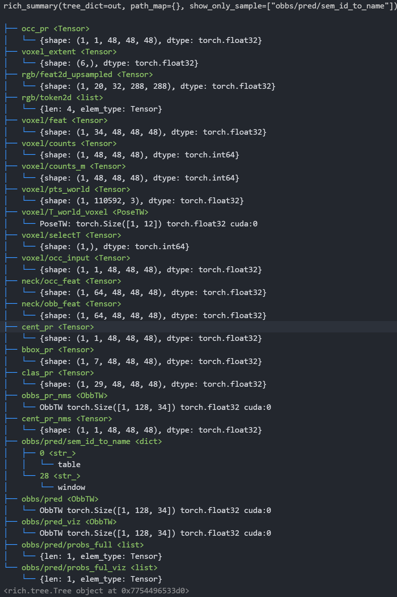
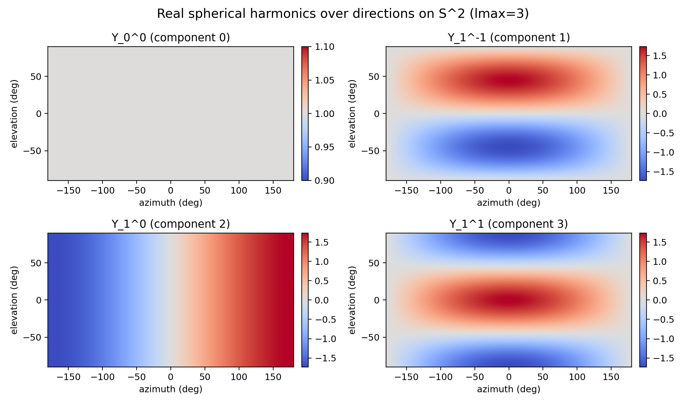
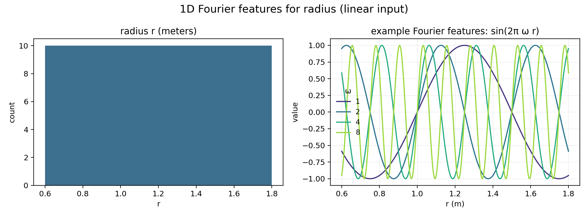
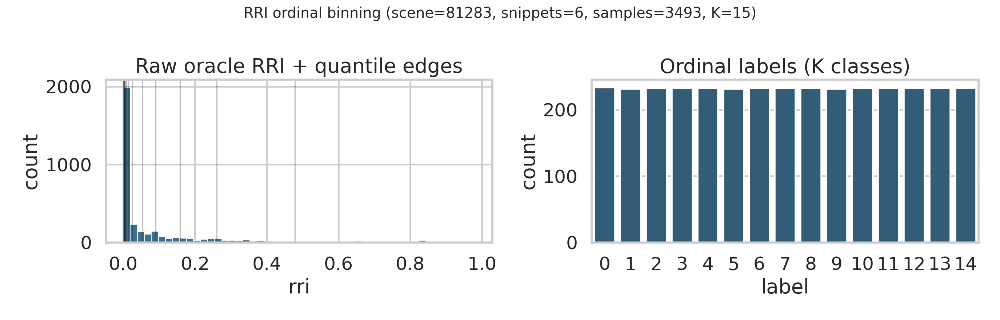
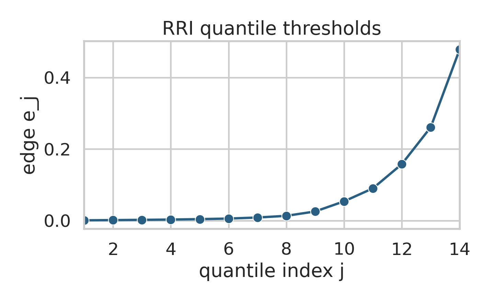

# Scope

This page documents the current **VIN** implementation in `oracle_rri/oracle_rri/vin/`: a lightweight **RRI predictor head** trained on top of a **frozen EVL backbone** (EFM3D). It replaces expensive oracle computations at inference time by predicting **Relative Reconstruction Improvement (RRI)** for a set of candidate poses.

References:

- Paper summary: [VIN-NBV](../literature/vin_nbv.qmd)
- EFM3D/EVL implementation map: [EFM3D Implementation Index](../ext-impl/efm3d_implementation.qmd)
- External EVL docs: [Project Aria Tools — EVL](https://facebookresearch.github.io/projectaria_tools/docs/open_models/evl)
- External code: [facebookresearch/efm3d](https://github.com/facebookresearch/efm3d)
- CORAL ordinal regression (implementation): [coral-pytorch](https://raschka-research-group.github.io/coral-pytorch/) ([GitHub](https://github.com/Raschka-research-group/coral-pytorch))
- Oracle label pipeline: [RRI computation](rri_computation.qmd) and `oracle_rri/oracle_rri/pipelines/oracle_rri_labeler.py`
- VIN implementation: `oracle_rri/oracle_rri/vin/model.py` (`VinModel`), `oracle_rri/oracle_rri/vin/model_v2.py` (`VinModelV2`), and `oracle_rri/oracle_rri/lightning/lit_module.py` (`VinLightningModule.summarize_vin`)

# Problem statement

Given:

- the current state encoded as a raw EFM snippet dict `efm: dict[str, Any]` (see `oracle_rri.data.EfmSnippetView.efm`), and
- a set of candidate next viewpoints as poses $T_{\text{world}\leftarrow\text{cam}_i}$ (`PoseTW`, **world←camera**) with $N$ candidates,

predict per-candidate scores $\widehat{\text{RRI}}(q_i)$ such that selecting $\arg\max_i \widehat{\text{RRI}}(q_i)$ approximates selecting $\arg\max_i \text{RRI}(q_i)$ computed by the oracle.

# EVL backbone recap

EVL (Egocentric Voxel Lifting) processes the snippet and produces a **voxel-aligned 3D representation**. Architecturally (simplified), it follows:

```{mermaid}
flowchart LR
    A["EFM snippet dict<br/>(images, poses, calib, semidense)"]
    A --> B["2D backbone<br/>(DinoV2 / video backbone)"]
    B --> C["Lifter<br/>(voxel grid + evidence<br/>+ T_world_voxel)"]
    C --> D["3D neck<br/>(feature refinement)"]
    D --> E["Heads<br/>(occupancy + OBB detection)"]
    C --> F["VIN head<br/>(ours)"]
    E --> F
    F --> G["CORAL logits<br/>(ordinal RRI bins)"]
```

For VIN we want a compact, information-rich scene embedding that is (a) available for every snippet, (b) stable across training/inference, and (c) cheap to query for many candidates. For the current **minimal VIN v0.1**, we therefore prioritize **low-dimensional head/evidence volumes** over heavy neck features.

The rich **3D neck feature volumes** can be exposed for ablations. In `external/efm3d/efm3d/model/evl.py`, they are created right before the occupancy / OBB heads:

- `out["neck/occ_feat"] = neck_feats1`
- `out["neck/obb_feat"] = neck_feats2`

Our stable “feature contract” is implemented by `oracle_rri/oracle_rri/vin/backbone_evl.py` (`EvlBackbone`). Minimal VIN uses:

- `occ_pr` (occupancy head output)
- `voxel/occ_input` (occupied evidence)
- `voxel/counts` (coverage)
- `voxel/T_world_voxel`, `voxel_extent` (coordinate contract)

`EvlBackbone` can optionally expose richer tensors (neck features, decoded OBBs) for future variants:

```
├── occ_pr <Tensor>
│   └── {shape: (1, 1, 48, 48, 48), dtype: torch.float32}
├── voxel_extent <Tensor>
│   └── {shape: (6,), dtype: torch.float32}
├── rgb/feat2d_upsampled <Tensor>
│   └── {shape: (1, 20, 32, 288, 288), dtype: torch.float32}
├── rgb/token2d <list>
│   └── {len: 4, elem_type: Tensor}
├── voxel/feat <Tensor>
│   └── {shape: (1, 34, 48, 48, 48), dtype: torch.float32}
├── voxel/counts <Tensor>
│   └── {shape: (1, 48, 48, 48), dtype: torch.int64}
├── voxel/counts_m <Tensor>
│   └── {shape: (1, 48, 48, 48), dtype: torch.int64}
├── voxel/pts_world <Tensor>
│   └── {shape: (1, 110592, 3), dtype: torch.float32}
├── voxel/T_world_voxel <PoseTW>
│   └── PoseTW: torch.Size([1, 12]) torch.float32 cuda:0
├── voxel/selectT <Tensor>
│   └── {shape: (1,), dtype: torch.int64}
├── voxel/occ_input <Tensor>
│   └── {shape: (1, 1, 48, 48, 48), dtype: torch.float32}
├── neck/occ_feat <Tensor>
│   └── {shape: (1, 64, 48, 48, 48), dtype: torch.float32}
├── neck/obb_feat <Tensor>
│   └── {shape: (1, 64, 48, 48, 48), dtype: torch.float32}
├── cent_pr <Tensor>
│   └── {shape: (1, 1, 48, 48, 48), dtype: torch.float32}
├── bbox_pr <Tensor>
│   └── {shape: (1, 7, 48, 48, 48), dtype: torch.float32}
├── clas_pr <Tensor>
│   └── {shape: (1, 29, 48, 48, 48), dtype: torch.float32}
├── obbs_pr_nms <ObbTW>
│   └── ObbTW torch.Size([1, 128, 34]) torch.float32 cuda:0
├── cent_pr_nms <Tensor>
│   └── {shape: (1, 1, 48, 48, 48), dtype: torch.float32}
├── obbs/pred/sem_id_to_name <dict>
│   ├── 0 <str_>
│   │   └── table
│   └── 28 <str_>
│       └── window
├── obbs/pred <ObbTW>
│   └── ObbTW torch.Size([1, 128, 34]) torch.float32 cuda:0
├── obbs/pred_viz <ObbTW>
│   └── ObbTW torch.Size([1, 128, 34]) torch.float32 cuda:0
├── obbs/pred/probs_full <list>
│   └── {len: 1, elem_type: Tensor}
└── obbs/pred/probs_ful_viz <list>
    └── {len: 1, elem_type: Tensor}
```



## Key-by-key explanation and “should VIN use it?”

### A) Core voxel geometry / coordinate contract

#### `voxel/T_world_voxel` — `PoseTW` (B, 12)

**What it is:** The pose of the voxel grid in world coordinates (**world←voxel**). The voxel grid is anchored to the **last frame** of the snippet and gravity-aligned (roll/pitch ≈ 0; yaw-only). ([GitHub][1])
**Use for VIN?** **Must-use.** You need it to map candidate-frustum 3D sample points (world) into voxel coordinates for trilinear sampling.

#### `voxel_extent` — `(6,)`

**What it is:** `[x_min, x_max, y_min, y_max, z_min, z_max]` defining the voxel grid’s metric bounds **in the voxel frame** (meters). EVL passes this around explicitly. ([GitHub][2])
**Use for VIN?** **Must-use.** Required to normalize voxel coordinates and implement valid masks for sampling.

**Debug note (common confusion):** the EVL voxel grid is intentionally **local and fixed-size** (default in our setup is a 4 m cube: `[-2, 2] × [0, 4] × [-2, 2]`). This means the voxel bounds can look *much smaller* than the snippet’s semi-dense cloud or crop bounds. That is expected: EVL only lifts a local volume anchored at `voxel/selectT` rather than the full scene. The size is configured in `external/efm3d/efm3d/config/evl_inf_desktop.yaml`. ([GitHub][3])

#### `voxel/pts_world` — `(B, D*H*W, 3)` (here 110592 = 48³)

**What it is:** The world coordinates of every voxel center (a flattened voxel grid). It’s generated from `voxel_extent` and `T_world_voxel`. ([GitHub][1])
**Use for VIN?** **Usually no.** It’s redundant (you can generate the same points on demand). Only useful for debugging/visualization or if you want a one-time precomputed voxel-center point cloud.

#### `voxel/selectT` — `(B,)` int

**What it is:** The selected time index used to anchor the voxel grid (by default `T-1`). ([GitHub][1])
**Use for VIN?** **No (training), yes (debug).** You typically only need `T_world_voxel` directly.

---

### B) Observation evidence injected into 3D (high value for NBV/RRI)

#### `voxel/counts` — `(B, D, H, W)` int64

**What it is:** For each voxel, how many snippet frames/streams produced a **valid projection** into the image during lifting. It is computed as a sum over valid projection masks. ([GitHub][1])
**Use for VIN?** **Yes (strongly recommended).** This is a direct proxy for *coverage / observation density* inside EVL’s voxel volume.

**Practical note (current VIN):** We normalize counts **per snippet** using the maximum count inside the voxel volume, either
linearly or with a `log1p` compression (default). Concretely, with $c(\mathbf{v}) \in \mathbb{N}$:

$$
c_{\max}=\max_{\mathbf{v}} c(\mathbf{v}),\qquad
\text{counts\_norm}(\mathbf{v})=
\begin{cases}
\dfrac{\log(1+c(\mathbf{v}))}{\log(1+c_{\max})} & \texttt{counts\_norm\_mode="log1p"}\\[6pt]
\dfrac{c(\mathbf{v})}{c_{\max}} & \texttt{counts\_norm\_mode="linear"}
\end{cases}
$$

#### `voxel/counts_m` — `(B, D, H, W)` int64

**What it is:** A “masked/debug” variant of the counts (EVL explicitly says it’s passed for debugging). ([GitHub][1])
**Use for VIN?** **No for learning**, unless you’ve verified it’s identical to what you want. Prefer `voxel/counts` + explicit masking logic in your VIN.

#### `voxel/occ_input` — `(B, 1, D, H, W)` float (mask)

**What it is:** A binary occupancy mask derived from the input 3D points (semi-dense/GT points in the batch): EVL voxelizes the point cloud and turns voxels with any points into `1.0`. ([GitHub][1])
**Use for VIN?** **Yes.** This is extremely aligned with the oracle’s “current reconstruction” (semi-dense points), and it helps predict where RRI can still improve.

#### `voxel/feat` — `(B, F, D, H, W)` (here F=34)

**What it is:** The raw lifted voxel feature volume **before** the neck. It is:

* lifted + aggregated 2D features (here 32 channels),
* concatenated with `point_masks` and `free_masks` (2 extra channels). ([GitHub][1])

**Use for VIN?**

**Not for minimal VIN v0.1.** It’s a fat tensor that’s less refined than the head outputs, and it adds semantics that we have not validated across EVL configs/checkpoints. We intentionally keep the current scorer head limited to `occ_pr`, `occ_input`, and `counts_norm`.

---

### C) 3D neck features (rich, but heavier)

#### `neck/occ_feat` — `(B, 64, D, H, W)`

**What it is:** The refined 3D feature volume right before the occupancy head. EVL stores it explicitly. ([GitHub][2])
**Use for VIN?** **Optional.** If you want “maximum information” from EVL, this is the most stable attachment point. But it’s heavier than head outputs.

If you use it: **compress channels** with a 1×1×1 conv (e.g., 64 → 16/32) before any pooling/sampling.

#### `neck/obb_feat` — `(B, 64, D, H, W)`

**What it is:** Refined 3D features right before the OBB detection head. ([GitHub][2])
**Use for VIN?** **Optional / future entity-aware.** For pure geometry-RRI, you can omit it initially.

---

### D) Occupancy head output (surface reconstruction head)

#### `occ_pr` — `(B, 1, D, H, W)` float32

**What it is:** The **occupancy prediction** after sigmoid: `occ_pr = sigmoid(occ_logits)`. ([GitHub][2]) In VIN we
also support treating `occ_pr` as logits via `VinModelConfig.occ_pr_is_logits` in case an EVL variant exposes logits.
**Use for VIN?** **Yes.** This is the single most sensible “head output” for an RRI predictor.

How to use:

* Global pooling (mean/max) for a snippet descriptor.
* Candidate-conditioned **frustum sampling** (sample voxels along candidate view rays) to estimate how much *unknown/occupied* structure lies ahead.

---

### E) OBB detection head raw grids (dense, per-voxel predictions)

These are the “dense detection maps” before decoding into box lists.

#### `cent_pr` — `(B, 1, D, H, W)`

**What it is:** Center probability map after sigmoid: `cent_pr = sigmoid(cent_logits)`. ([GitHub][2])
**Use for VIN?** **Maybe.** It encodes “objectness / box centers.”

* If your RRI is purely geometric, it’s optional.
* If you want an **object-biased NBV** later, it’s a nice dense cue.

#### `bbox_pr` — `(B, 7, D, H, W)`

**What it is:** Per-voxel bounding box parameters (EVL comment: `height, width, depth, offset_h, offset_w, offset_d, yaw`). It is post-processed with bounded transforms: sizes from sigmoid into `[bbox_min, bbox_max]`, offsets with tanh scaled by `offset_max`, yaw with tanh scaled by `yaw_max`. ([GitHub][2])
**Use for VIN?** **No for v0.1.** It’s harder to use correctly and tends to overcomplicate a minimal scorer. Keep it for entity-aware extensions if needed.

#### `clas_pr` — `(B, 29, D, H, W)`

**What it is:** Per-voxel semantic class probabilities via softmax over classes. ([GitHub][2])
**Use for VIN?** **No for geometry-only v0.1.**
For entity-aware NBV, you could use it, but you’ll likely prefer the decoded OBB list + class probs instead of this dense map.

---

### F) Decoded OBB outputs (post-process + NMS; token-like)

#### `obbs_pr_nms` — `ObbTW (B, K, 34)` (here K=128)

**What it is:** Top-K decoded predicted boxes (after NMS) in **voxel coordinates** (this is the output right after `voxel2obb(...); simple_nms3d(...)`). ([GitHub][2])
**Use for VIN?** **Future (entity-aware).** Useful if you want candidate scoring based on predicted objects, but not required for basic RRI prediction.

#### `cent_pr_nms` — `(B, 1, D, H, W)`

**What it is:** The center map after applying 3D NMS suppression. ([GitHub][2])
**Use for VIN?** **No.** Keep for debugging.

#### `obbs/pred` — `ObbTW (B, K, 34)`

**What it is:** Predicted OBBs transformed into **snippet coordinates** (EVL computes `T_snippet←voxel` and transforms the NMS boxes). ([GitHub][2])
**Use for VIN?** **Future (entity-aware).** This is the version you’d want if you need consistency with your snippet/rig reference frames.

#### `obbs/pred_viz` — `ObbTW (B, K, 34)`

**What it is:** A visualization-friendly variant (typically same boxes but potentially adjusted for plotting conventions). ([GitHub][2])
**Use for VIN?** **No.**

#### `obbs/pred/probs_full` — list length B of `Tensor`

**What it is:** Per-box full class probability vectors corresponding to decoded boxes (EVL stores them as a Python list per batch element). ([GitHub][2])
**Use for VIN?** **Future.** If you treat boxes as tokens, you’ll use these for semantic weighting.

#### `obbs/pred/sem_id_to_name` — dict

**What it is:** Class-id to name mapping for visualization/debug. ([GitHub][2])
**Use for VIN?** **No (not a feature).**

*(Your `probs_ful_viz` key looks like a typo in the printout; EVL stores a `probs_full` list — verify naming on your side.)* ([GitHub][2])

---

### G) 2D backbone artifacts (almost always “don’t use” for VIN)

#### `rgb/feat2d_upsampled` — `(B, T, C, H, W)` (here 1×20×32×288×288)

**What it is:** The upsampled 2D features used for lifting into voxels. EVL also returns these for visualization/debug. ([GitHub][1])
**Use for VIN?** **No.** Too heavy and breaks the “VIN purely on 3D voxel repr” principle.

#### `rgb/token2d` — list of tensors

**What it is:** Debug/visualization copies of 2D backbone outputs; EVL may detach and move these to CPU when needed (especially multi-layer features). ([GitHub][1])
**Use for VIN?** **No.** Risk of device mismatches + unnecessary memory.

---

## Concrete “what to use” recommendation for VIN v0.1 (head-centric, RRI-focused)

If you want a **minimal but inductive-bias-aligned** feature set:

### Use these voxel-aligned volumes (all sampleable in candidate frusta)

* `occ_pr` (1ch): predicted occupancy probability. ([GitHub][2])
* `voxel/occ_input` (1ch): observed occupied evidence from semi-dense points. ([GitHub][1])
* `counts_norm` (1ch): normalized observation coverage derived from `voxel/counts` (default: `log1p` normalization). ([GitHub][1])

Optional:

* `cent_pr` (1ch): objectness density cue. ([GitHub][2])

Optional VIN-only derived channels (available via `VinModelConfig.scene_field_channels`):

* `observed` (1ch): $\mathbb{1}[\text{counts}>0]$.
* `unknown` (1ch): $1-\text{observed}$.
* `new_surface_prior` (1ch): `unknown * occ_pr` (a simple “unobserved but likely occupied” prior).
* `free_input` (1ch): free-space evidence if present in the backbone output; otherwise a weak proxy derived from `counts` and `occ_input`.

### Plus the required coordinate contract

* `voxel/T_world_voxel`, `voxel_extent`. ([GitHub][1])

### Skip for now

* `bbox_pr`, `clas_pr`, decoded OBBs (unless you explicitly do entity-aware NBV). ([GitHub][2])
* all `rgb/*` artifacts. ([GitHub][1])

This gives you a **small $C_\text{in}$-channel 48³ grid** (default $C_\text{in}=3$) — extremely manageable — that
still captures the things RRI cares about: *occupied vs unknown + how well it’s been observed*.

---

## Why this aligns with RRI and your oracle pipeline

Your oracle RRI is ultimately measuring change in point↔mesh distances after adding candidate-view points. The EVL outputs above provide:

* **What’s already reconstructed**: `occ_input` (points). ([GitHub][1])
* **What EVL believes exists / surfaces**: `occ_pr`. ([GitHub][2])
* **Where the model had coverage**: `counts`. ([GitHub][1])

And all of these are in the same **gravity-aligned voxel frame**, so frustum sampling is straightforward and cheap. ([GitHub][1])

[1]: https://github.com/facebookresearch/efm3d/raw/main/efm3d/model/lifter.py "raw.githubusercontent.com"
[2]: https://github.com/facebookresearch/efm3d/raw/main/efm3d/model/evl.py "raw.githubusercontent.com"
[3]: https://github.com/facebookresearch/efm3d/raw/main/efm3d/config/evl_inf_desktop.yaml "raw.githubusercontent.com"
[3]: https://github.com/facebookresearch/efm3d/raw/main/efm3d/utils/voxel_sampling.py "raw.githubusercontent.com"

# Candidate pose parameterization (shell-aware descriptor in reference frame)

VIN-NBV conditions the score on the candidate viewpoint **relative to the current state**. For ASE/EFM snippets, we define:

- reference pose: $T_{\text{world}\leftarrow\text{ref}}$ (last rig pose in the snippet),
- candidate pose: $T_{\text{world}\leftarrow\text{cam}_i}$ for candidate $i$.

The relative pose in the reference rig frame is:

$$
T_{\text{ref}\leftarrow\text{cam}_i}
=
T_{\text{world}\leftarrow\text{ref}}^{-1}\;
T_{\text{world}\leftarrow\text{cam}_i}.
$$

## Training-time alignment with `OracleRriLabeler` (preferred)

When training from oracle labels, our label pipeline already provides all relevant pose variants:

- `oracle_rri_label_batch.depths.poses`: $T_{\text{world}\leftarrow\text{cam}}$ (world←camera, PoseTW)
- `oracle_rri_label_batch.depths.reference_pose`: $T_{\text{world}\leftarrow\text{ref}}$ (world←rig_ref, PoseTW)
- `oracle_rri_label_batch.depths.camera.T_camera_rig`: $T_{\text{cam}\leftarrow\text{ref}}$ (camera←rig_ref, PoseTW)

`VinModel` currently takes the world poses + reference pose and computes the relative pose internally:

$$
T_{\text{ref}\leftarrow\text{cam}}
=
T_{\text{world}\leftarrow\text{ref}}^{-1}\;
T_{\text{world}\leftarrow\text{cam}}.
$$

(Equivalently, if you only have $T_{\text{cam}\leftarrow\text{ref}}$ available, you can compute
$T_{\text{ref}\leftarrow\text{cam}} = T_{\text{cam}\leftarrow\text{ref}}^{-1}$.)

## Shell descriptor $(r,u,f,\text{scalars})$

Let $T_{\text{rig}\leftarrow\text{cam}} = (R_{\text{rig}\leftarrow\text{cam}}, t_{\text{rig}\leftarrow\text{cam}})$. We define:

- radius: $r = \lVert \mathbf{t} \rVert$,
- position direction: $\mathbf{u} = \mathbf{t} / (r + \varepsilon) \in \mathbb{S}^2$,
- forward direction: $\mathbf{f} = R_{\text{rig}\leftarrow\text{cam}}\;z_{\text{cam}} \in \mathbb{S}^2$, with $z_{\text{cam}}=(0,0,1)$ (LUF camera convention),
- simple scalar terms, e.g. $\langle \mathbf{f}, -\mathbf{u} \rangle$ (“looks back towards reference center”).

This descriptor matches our candidate sampling prior (shell around a reference pose).

# Pose encoding: Learnable Fourier Features (LFF) over the shell descriptor

VIN now encodes the shell descriptor $(u,f,r,\text{scalars})$ by concatenating
the components into a single vector

$$
x = [u, f, r, s] \in \mathbb{R}^8,
$$

and passing it through **Learnable Fourier Features** (LFF)
`oracle_rri/oracle_rri/vin/pose_encoding.py` (`LearnableFourierFeatures`)
[@LFF-li2021]. This replaces the previous SH-based encoder as the default in
`VinModel`.

### Pose encoding research notes (Dec 2025)

With LFF in place, we revisited the pose input. The current shell descriptor
$(u,f,r,s)$ is derived from multiple frame transforms and can be brittle to
convention mistakes; LFF can learn interactions directly if given a continuous
pose representation. We therefore recommend a simpler, continuous pose vector:

- **Recommended**: translation + 6D rotation.
  Let $t$ be the candidate translation in the reference rig frame and
  $R_{6d} \in \mathbb{R}^6$ be the first two columns of $R_{\text{rig}\leftarrow\text{cam}}$
  stacked into a vector (continuous rotation representation). This yields:
  $x = [t, R_{6d}] \in \mathbb{R}^9$.
  See [Zhou et al. (2019)](https://arxiv.org/abs/1812.07035) [@zhou2019continuity].
- **Scaling**: keep translation in meters, but normalize by a scene scale
  (e.g., 3 m) or learn per-group scaling before LFF to balance translation and
  rotation magnitudes.

**CPU-only synthetic sanity check.** We sampled random poses (translations in a
6 m cube, random rotations) and compared the Spearman correlation between a
combined pose distance

$$
d = \sqrt{\left(\\tfrac{\\theta}{\\pi}\\right)^2 + \\left(\\tfrac{\\lVert \\Delta t \\rVert}{3\\text{ m}}\\right)^2}
$$

and the L2 distance of several candidate encodings (per-dimension z-scored).

| Encoding | Spearman corr |
|---|---:|
| $[u, f, r, s]$ (current shell) | 0.50 |
| $[u, f, r]$ | 0.57 |
| $[t, R_{6d}]$ | 0.72 |
| $[u, \log r, R_{6d}]$ | 0.46 |
| $[t, q]$ (quat, canonical sign) | 0.71 |

**Takeaway:** $[t, R_{6d}]$ aligned best with the combined pose distance, while
the current shell descriptor lagged behind. This suggests a simpler encoding is
both **more stable** and **better aligned** with pose geometry when paired with
LFF.

### Proposed R6D extraction + learned scaling (PoseTW → LFF)

We propose to compute $R_{6d}$ directly from the `PoseTW` rotation matrix using
PyTorch3D’s `matrix_to_rotation_6d` / `rotation_6d_to_matrix` utilities (consistent
with [PyTorch3D transforms docs](https://pytorch3d.readthedocs.io/en/latest/modules/transforms.html)
[@pytorch3d-transforms]):

```python
from pytorch3d.transforms import matrix_to_rotation_6d

pose_rig_cam = pose_world_rig_ref.inverse()[:, None] @ pose_world_cam
t = pose_rig_cam.t           # (B, N, 3)
R = pose_rig_cam.R           # (B, N, 3, 3)
r6d = matrix_to_rotation_6d(R)  # (B, N, 6)
```

To balance translation vs rotation magnitudes under LFF, introduce **learned
per‑group scaling** (initialized to 1.0) before concatenation:

$$
x = [\\alpha_t \\cdot t,\; \\alpha_r \\cdot R_{6d}] \\in \\mathbb{R}^9,
\\qquad
\\alpha_t,\\alpha_r \\ge 0.
$$

In practice, parameterize $\alpha_t,\\alpha_r$ as `softplus(log_scale)` to keep
them positive, or store log‑scales directly and exponentiate.

> **Legacy note**: The original SH-based `ShellShPoseEncoder` remains available
> in `oracle_rri/oracle_rri/vin/spherical_encoding.py` for experimentation. The
> sections below describe that legacy encoder.

## A) Legacy direction encoding with **real spherical harmonics**

For each unit direction $d \in \mathbb{S}^2$ (here $u$ and $f$), we compute real spherical harmonics
$Y_{\ell m}(d)$ up to degree $L$ (basis functions on the sphere; see
[Wikipedia :: Spherical harmonic](https://en.wikipedia.org/wiki/Spherical_harmonic) [@SphericalHarmonic-Wikipedia-2025]).
We then project them with a tiny
MLP:

$$
\text{sh}(d)\in\mathbb{R}^{(L+1)^2},
\qquad
e_d = \text{MLP}(\text{sh}(d))\in\mathbb{R}^{d_\text{sh}}.
$$

Implementation details:

- e3nn call: `e3nn.o3.spherical_harmonics(o3.Irreps.spherical_harmonics(lmax), d, normalize=True, normalization=...)`.
- Default config (`ShellShPoseEncoderConfig`): `lmax=2` so $(L+1)^2=9$, and each direction is projected to
  `sh_out_dim=16` with `Linear(9→16) → GELU → Linear(16→16)`.
- The `normalization` flag controls SH scaling (`"component"` or `"norm"`); see the
  [e3nn docs](https://docs.e3nn.org/en/stable/api/o3/o3_sh.html) [@e3nn-SphericalHarmonics-2025].

## B) Legacy radius encoding with **1D Fourier features**

Spherical harmonics live on $\mathbb{S}^2$, so they are not the right basis for the scalar radius $r\in\mathbb{R}_+$.
We instead use **learnable Fourier features** (see
[*Learnable Fourier Features for Multi-Dimensional Spatial Positional Encoding* (NeurIPS 2021)](https://arxiv.org/abs/2106.02795)
[@LFF-li2021]).

For a scalar input $s\in\mathbb{R}$ and learnable frequencies $B\in\mathbb{R}^{F\times 1}$:

$$
\phi(s) = \big[s,\;\sin(2\pi B s),\;\cos(2\pi B s)\big]\in\mathbb{R}^{1+2F}.
$$

In the legacy `ShellShPoseEncoder`:

- default is **not** log-radius (`radius_log_input=False`), i.e. $s=r$; optionally use $s=\log(r+\varepsilon)$.
- default frequencies: `radius_num_frequencies=6`, `radius_include_input=True` so $\phi(s)\in\mathbb{R}^{13}$.
- the Fourier features are projected to `radius_out_dim=16` with `Linear(13→16) → GELU → Linear(16→16)`.

## C) Legacy scalar pose terms

We currently include the alignment scalar $s=\langle f,-u\rangle$ (one value per candidate) and project it with a small
MLP: `Linear(1→32) → GELU → Linear(32→16)` (`scalar_out_dim=16`).

## D) Legacy encoding visualizations (actual)

::: {#fig-vin-sh-fourier layout-ncol=2}



Actual encoding plots generated with `oracle_rri.vin.plotting.build_vin_encoding_figures` using the legacy
`ShellShPoseEncoderConfig` (lmax=2, 6 frequencies, linear radius input) on a sample snippet.
:::

## Legacy output dimensionality (default)

With defaults (`16` dims each for $u,f,r,s$) we get:

$$
\text{pose\_enc}(u,f,r,s)\in\mathbb{R}^{64}.
$$

# VIN head (v0.1 architecture)

`oracle_rri/oracle_rri/vin/model.py` (`VinModel`) implements a lightweight scorer head on top of a frozen EVL backbone:

1. Run frozen EVL once on the snippet to get low-dimensional head/evidence volumes + voxel grid pose (`EvlBackbone`).
2. Build a **voxel-aligned scene field** with `scene_field_channels` (default: `["occ_pr", "occ_input", "counts_norm"]`).
3. Project the field with a **1×1×1 Conv3d + GroupNorm + GELU** (default: `C_in=3 → field_dim=16`).
4. Compute a **global context token** via pose-conditioned attention pooling over a coarse voxel grid
   (optional; `use_global_pool=True`, `global_pool_mode="attn"` by default; mean/mean+max are available).
5. Encode the **voxel grid pose** (`voxel/T_world_voxel`) in the *reference rig frame* using the same
   `LearnableFourierFeatures` pose encoder. This is a global token shared by all candidates
   (`use_voxel_pose_encoding=True` by default).
6. For each candidate:
   - pose token: `LearnableFourierFeatures([u,f,r,s])` → `pose_enc` (default: 64 dims),
   - local token: sample **K = grid_size² × len(depths)** frustum points in world coordinates (default: `4²×4=64`),
     sample the voxel field there, then pool with an **unknown-token mean** (or masked mean) → `local_feat` (default: 16 dims).
7. Concatenate `[pose_enc, global_feat?, voxel_pose_enc?, local_feat, valid_frac?]` and score with
   `VinScorerHead` (MLP + CORAL logits). `valid_frac` exposes frustum coverage so low-coverage candidates can still
   score highly when they reveal unknown surfaces.

# VIN head (v0.2 simplified architecture)

`oracle_rri/oracle_rri/vin/model_v2.py` (`VinModelV2`) keeps only the most promising components and removes
architecture toggles while exposing a **configurable pose encoder** via a discriminated union.

1. **Pose encoding (reference frame, configurable).**
   We compute the relative pose
   $T_{\text{rig}\leftarrow\text{cam}} = T_{\text{world}\leftarrow\text{rig}}^{-1} T_{\text{world}\leftarrow\text{cam}}$
   and then encode it with the selected pose encoder:
   - **Default (`r6d_lff`)**: $x=[t/s_t,\; \mathrm{r6d}(R)/s_r] \in \mathbb{R}^9$, where $\mathrm{r6d}$ is the 6D
     rotation representation (first two columns of $R$) [@zhou2019continuity]. The per-group scales $(s_t,s_r)$ are
     **learned** to balance translation vs. rotation before the LFF encoder (see PyTorch3D transforms
     [@pytorch3d-transforms]).
   - **Optional (`shell_lff`, `shell_sh`)**: shell descriptors $(u,f,r,s)$ with forward direction only. These ignore
     roll about the forward axis, which is acceptable when roll jitter is small; use `r6d_lff` if roll matters.
2. **Scene field (fixed channels).**
   We always use `["occ_pr", "cent_pr", "counts_norm", "occ_input", "free_input", "new_surface_prior"]` to emphasize
   occupancy, centerness, coverage, and unknown‑but‑occupied voxels. Derived channels use **soft** counts‐based
   weights (no hard thresholds), then project with `1×1×1 Conv3d + GroupNorm + GELU`.
3. **Global context (pose-conditioned attention).**
   A coarse voxel grid is pooled and attended by the pose embeddings. Keys are augmented with an **LFF positional
   encoding over XYZ voxel centers** derived from `voxel/pts_world` (normalized voxel coordinates) before attention.
4. **No frustum sampling (for now).**
   The v2 head **does not** query local frustum tokens; it relies on pose + voxel-pose + global context only.
5. **CORAL head.**
   We concatenate `[pose_enc, global_feat]` and score with the CORAL head.
6. **Frame correction (cw90).**
   If candidates/poses were rotated by `rotate_yaw_cw90` in the labeler, the model **undoes** the rotation on
   the input poses (no camera rebuild is needed in v2).

## VIN internal architecture (current, with tensor shapes)

Shapes below match the current `VinLightningModule.summarize_vin()` output for a typical oracle batch with `B=1`,
`N=32` candidates, EVL voxel grid resolution `48³`, and VIN defaults (`grid_size=4`, `depths_m=[0.5,1,2,3]`).
When `use_voxel_pose_encoding=True`, the concatenated feature dimension increases by `E_pose` (default +64).

```{mermaid}
flowchart TD
    subgraph In["Inputs"]
        efm["EFM snippet dict<br/>(unbatched: T×...)"]
        cand["candidate_poses_world_cam<br/>PoseTW(B,N,12)<br/>(example: 1×32×12)"]
        ref["reference_pose_world_rig<br/>PoseTW(B,12)"]
        p3d["p3d_cameras<br/>PerspectiveCameras(B*N)"]
    end

    subgraph Frozen["Frozen EVL backbone"]
        evl["EvlBackbone.forward(efm)"]
        out["EvlBackboneOutput<br/>occ_pr: (B,1,48,48,48)<br/>occ_input: (B,1,48,48,48)<br/>counts: (B,48,48,48)<br/>T_world_voxel: PoseTW(B,12)<br/>voxel_extent: (B,6)"]
    end

    subgraph VIN["Trainable VIN head (~14.6k params)"]
        field_in["scene_field<br/>field_in: (B,C_in,48,48,48)<br/>C_in=len(scene_field_channels)=3"]
        proj["field_proj<br/>1×1×1 Conv3d + GN + GELU<br/>field: (B,16,48,48,48)"]
        gpool["global_pool (attn / mean / mean+max)<br/>global_feat: (B,N,C_global)"]

        rel["relative pose<br/>T_rig_ref_cam = T_world_rig_ref^{-1} T_world_cam"]
        posefeat["t: (B,N,3)<br/>r: (B,N,1)<br/>u: (B,N,3)<br/>f: (B,N,3)<br/>s=<f,-u>: (B,N,1)"]
        poseenc["LearnableFourierFeatures<br/>pose_enc: (B,N,64)"]

        frustum["frustum points (world)<br/>grid_size=4, depths=[0.5,1,2,3] m<br/>K=64 points_world: (B,N,K,3)"]
        sample["sample_voxel_field<br/>tokens: (B,N,K,16)<br/>token_valid: (B,N,K)"]
        lpool["pool over K<br/>unknown-token mean or masked mean<br/>local_feat: (B,N,16)"]
        cvalid["candidate_valid<br/>(B,N) from mean(token_valid)"]

        concat["concat feats<br/>[pose_enc, global_feat, local_feat, valid_frac, voxel_pose_enc?]<br/>feats: (B,N,C_feat)"]
        head["VinScorerHead<br/>MLP(96→128) + CORAL(K=15)<br/>logits: (B,N,14)"]
        prob["coral_logits_to_prob<br/>prob: (B,N,15)"]
        exp["expected = Σ σ(logit_k)<br/>expected, expected_norm: (B,N)"]
    end

    efm --> evl --> out
    out --> field_in --> proj --> gpool --> concat
    ref --> rel
    cand --> rel --> posefeat --> poseenc --> concat
    p3d --> frustum --> sample
    proj --> sample
    out --> sample --> lpool --> concat
    sample --> cvalid --> concat
    concat --> head --> prob
    head --> exp
```

## Scene field construction (math, current)

`VinModel` builds a compact voxel-aligned tensor field $F(\mathbf{v})\in\mathbb{R}^{C_\text{in}}$ from EVL outputs
(`_build_scene_field(...)` in `oracle_rri/oracle_rri/vin/model.py`). With default channels:

- occupancy prior: $F_1=\text{occ\_pr}(\mathbf{v})\in[0,1]$,
- occupied evidence: $F_2=\text{occ\_input}(\mathbf{v})\in\{0,1\}$,
- coverage: $F_3=\text{counts\_norm}(\mathbf{v})\in[0,1]$ (see formula above).

For ablations/variants we also support:

- `observed`: $\mathbb{1}[\text{counts}>0]$,
- `unknown`: $1-\mathbb{1}[\text{counts}>0]$,
- `new_surface_prior`: $(1-\mathbb{1}[\text{counts}>0])\cdot \text{occ\_pr}$,
- `free_input`: EVL free-space evidence if available; otherwise a weak proxy derived from `counts` and `occ_input`.

The field is projected to `field_dim` channels (default `16`) by a 1×1×1 convolution + GroupNorm + GELU.

## Candidate-conditioned voxel query (implemented)

We implement a **frustum point query** that is intentionally aligned with our depth renderer:

### 1) Sampling query points in front of the camera

We choose a small image-plane grid (`frustum_grid_size=g`) and a list of metric depths
`frustum_depths_m=[d_1,\dots,d_M]`. This gives $K=g^2M$ query points per candidate.

The points are constructed in the **same NDC convention** used by the depth backprojection code and unprojected via
PyTorch3D `PerspectiveCameras.unproject_points(..., from_ndc=True, world_coordinates=True)` (see
[PyTorch3D :: Cameras](https://pytorch3d.readthedocs.io/en/latest/modules/renderer/cameras.html) [@PyTorch3D-Cameras-2025]).

Practical note: our helper follows the “screen-space → NDC” mapping used by the renderer/backprojector (including the
sign convention +X left, +Y up).

### 2) Mapping world points into the EVL voxel grid

EVL provides the voxel grid pose $T_{\text{world}\leftarrow\text{voxel}}$ and its metric extent
`voxel_extent=[x_min,x_max,y_min,y_max,z_min,z_max]` in the voxel frame.

We invert the pose and transform the frustum points:

$$
\mathbf{p}_\text{voxel} = T_{\text{voxel}\leftarrow\text{world}}\,\mathbf{p}_\text{world},
\qquad
T_{\text{voxel}\leftarrow\text{world}} = T_{\text{world}\leftarrow\text{voxel}}^{-1}.
$$

Then we map metric voxel coordinates to **voxel-index coordinates** (per axis):

$$
i_x = \frac{x-x_{\min}}{\Delta x},\quad
i_y = \frac{y-y_{\min}}{\Delta y},\quad
i_z = \frac{z-z_{\min}}{\Delta z},
$$

with $(\Delta x,\Delta y,\Delta z)=\left(\frac{x_{\max}-x_{\min}}{W},\frac{y_{\max}-y_{\min}}{H},\frac{z_{\max}-z_{\min}}{D}\right)$.
This corresponds exactly to `efm3d.utils.voxel_sampling.pc_to_vox`. The actual trilinear sampling is delegated to
`efm3d.utils.voxel_sampling.sample_voxels` (internally `torch.nn.functional.grid_sample`, `align_corners=False`,
`padding_mode="border"`). ([GitHub][3])

### 3) Pooling and candidate validity

We sample the projected scene field at those voxel-index coordinates, producing frustum tokens
`tokens (B,N,K,C_out)` and a boolean in-bounds mask `token_valid (B,N,K)`.

We then compute the candidate-local token via a masked mean:

$$
\text{local\_feat}=\frac{\sum_k \mathbb{1}[\text{valid}_k]\;\mathbf{t}_k}{\sum_k \mathbb{1}[\text{valid}_k] + \varepsilon}.
$$

Candidate validity is derived from the **fraction** of frustum samples that fall inside the voxel grid, controlled by
`VinModelConfig.candidate_min_valid_frac` (default: 0.2) so we avoid admitting candidates with only a handful of
in-bounds samples.

# Training objective (VIN-NBV style): CORAL ordinal regression

VIN-NBV reports that directly regressing RRI is difficult; it discretizes RRI into ordinal bins and trains with CORAL.

We follow the same structure:

1. **Oracle labels**: for each snippet, generate candidates and compute oracle RRI using `OracleRriLabeler` (candidate → render depth → backproject PCs → mesh distance → RRI).
2. **Binning (current implementation)**: convert oracle RRI values to ordinal labels $y\in\{0,\dots,K-1\}$ using
   `oracle_rri/oracle_rri/vin/rri_binning.py` (`RriOrdinalBinner`).

   We fit $K-1$ **empirical quantiles** (equal-mass bins) on a stream of oracle RRIs and store the edges
   $\mathbf{e}=(e_1,\dots,e_{K-1})$.

   **Implementation details (`RriOrdinalBinner.fit_from_iterable`)**:

   - Accumulates RRI chunks on CPU; ignores non-finite values.
   - Computes quantiles at $q_j = j/K$ via `torch.quantile`.
   - If edges collapse (duplicate quantiles), falls back to uniform edges between
     the observed min/max (or `[-1,1]` as a last resort).
   - Supports resumable fitting by saving `.pt` fit data and exporting the final binner as JSON.

   Then for an RRI value $r$ the label is computed via `torch.bucketize`:

   $$
   y(r)=\sum_{j=1}^{K-1}\mathbb{1}[r \ge e_j].
   $$

   Practical notes:

   - Fit data can be saved/resumed (`.pt` state with RRI chunks) and the fitted binner is saved as JSON (`num_classes`,
     `edges`).
   - If quantile edges collapse (degenerate quantiles), we fall back to uniform edges between the observed min/max (or
     `[-1,1]` as a last resort).

3. **Loss (CORAL)**: we use CORAL (*Rank consistent ordinal regression*, see
   [arXiv :: 1901.07884](https://arxiv.org/abs/1901.07884) [@CORAL-cao2019] and
   [coral-pytorch](https://raschka-research-group.github.io/coral-pytorch/) [@coral-pytorch-2025]).

   CORAL represents a K-class ordinal label $y\in\{0,\dots,K-1\}$ via $K-1$ binary “levels”:

   $$
   \text{level}_k(y)=\mathbb{1}[y>k],\qquad k=0,\dots,K-2,
   $$

   and predicts logits $\ell_k$ for each threshold. The loss is the sum of binary cross-entropies over thresholds
   (see `oracle_rri/oracle_rri/vin/coral.py`).

   Explicitly:

   $$
   \\mathcal{L}_{\\text{CORAL}}
   =\\sum_{k=0}^{K-2}
   \\left[-\\text{level}_k\\log\\sigma(\\ell_k)
   -(1-\\text{level}_k)\\log(1-\\sigma(\\ell_k))\\right].
   $$

   **Random-classifier baseline.** If logits are zero (uninformative classifier), then
   $p_k=\sigma(\ell_k)=0.5$ for all thresholds. The BCE for each level is $\log 2$,
   so the expected CORAL loss is:

   $$
   \mathbb{E}[\mathcal{L}_{\text{CORAL}}]
   =(K-1)\log 2.
   $$

   For our default $K=15$, this gives $14\log 2 \approx 9.70$, which is a useful sanity
   check when interpreting training curves. The Lightning module logs
   `coral_loss_rel_random = coral_loss / ((K-1)\log 2)` alongside the raw loss, plus
   a candidate-level `top3_accuracy` metric for ordinal classification.

4. **Binning diagnostics (plots).** The script `oracle_rri/scripts/plot_vin_binning.py`
   generates the RRI histogram with quantile edges and a dedicated edge plot (Seaborn):

::: {#fig-vin-rri-binning layout-nrow=2}


:::

At inference time we use the expected ordinal value (normalized to $[0,1]$) as the candidate score. With
$p_k=\sigma(\ell_k)=\mathbb{P}(y>k)$:

$$
\mathbb{E}[y]=\sum_{k=0}^{K-2} p_k,\qquad \mathbb{E}[y]_\text{norm}=\frac{\mathbb{E}[y]}{K-1}.
$$

# Minimal training script

End-to-end training/evaluation lives in the Lightning experiment stack (`oracle_rri/oracle_rri/lightning/`), exposed as
the console script `nbv-train` (see `oracle_rri/pyproject.toml`). Convenience wrappers exist in `oracle_rri/scripts/`
(e.g. `summarize_vin.py`, `train_vin_lightning.py`).

The pipeline does:

- load a real ASE snippet (local ATEK shards + meshes),
- run `OracleRriLabeler` online to produce labels,
- fit a binner (few snippets),
- train the head (EVL frozen) for a small number of steps.

Example:

```bash
cd oracle_rri
uv run nbv-train --run-mode summarize-vin
uv run nbv-train --run-mode plot-vin-encodings
uv run nbv-train --run-mode train
```

# Implementation map

VIN code lives in `oracle_rri/oracle_rri/vin/`:

- `backbone_evl.py`: `EvlBackbone` wrapper that consumes raw EFM dicts and returns a small typed `EvlBackboneOutput` (head outputs by default; optional neck outputs for ablations).
- `pose_encoding.py`: `LearnableFourierFeatures` (default; learnable Fourier + MLP over $[u,f,r,s]$).
- `pose_encoders.py`: pose-encoder variants for VIN v2 (discriminated union config, R6D LFF or shell-based LFF/SH).
- `spherical_encoding.py`: `ShellShPoseEncoder` (legacy; e3nn SH for $u,f$ + 1D Fourier for radius).
- `pose_encoding.py`: Learnable Fourier features baseline modules (as per Learnable Fourier Features, NeurIPS 2021).
- `model.py`: `VinModel` (pose encoding + scene-field querying + pose-conditioned global pooling + frustum sampling + CORAL).
- `coral.py`: CORAL layer + loss and probability utilities (via `coral-pytorch`).
- `rri_binning.py`: RRI→ordinal binning (`RriOrdinalBinner`).

# Known gaps / next steps (tracked in `todos.qmd`)

- add ranking metrics (Spearman, top-$k$ recall) to the training loop,
- version bin thresholds by candidate generator config + EVL ckpt id,
- run ablations: occ-only vs occ+obb, $L=2$ vs $L=3$, query depths/rays.
