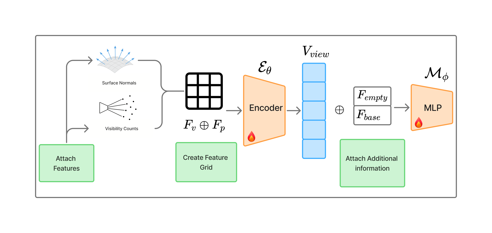

## VIN-NBV: Quality-Driven Candidate Ranking {#vin-nbv}

**Primary source.** [VIN-NBV: A View Introspection Network for Next-Best-View Selection](https://arxiv.org/abs/2505.06219) [@VIN-NBV-frahm2025].

**Local source.** [`main.tex`](../../literature/tex-src/arXiv-VIN-NBV/main.tex), [`sec/3_methods.tex`](../../literature/tex-src/arXiv-VIN-NBV/sec/3_methods.tex), and [`sec/4_experiments.tex`](../../literature/tex-src/arXiv-VIN-NBV/sec/4_experiments.tex).

**Related ARIA-NBV pages.** [RRI theory](../theory/rri_theory.qmd), [VIN model API](../../reference/vin.model_v3.qmd), and [RL planning](rl_planning.qmd).

{#fig-vin-arch width=80%}

### Core contribution

VIN-NBV is the closest objective match for ARIA-NBV because it treats  selection as reconstruction-quality ranking rather than coverage maximization. The paper defines  for a query view and trains a  to predict an ordinal RRI label for candidate views before acquiring them [@VIN-NBV-frahm2025].

For a current reconstruction $\mathcal{P}_{\mathrm{base}}$, a candidate observation $\mathcal{P}_{q}$, and ground-truth geometry $\mathcal{P}_{\mathrm{GT}}$, the paper's utility is:

$$
\mathrm{RRI}(q)
=
\frac{
  \mathrm{CD}(\mathcal{P}_{\mathrm{base}}, \mathcal{P}_{\mathrm{GT}})
  -
  \mathrm{CD}(\mathcal{P}_{\mathrm{base}}\cup\mathcal{P}_{q}, \mathcal{P}_{\mathrm{GT}})
}{
  \mathrm{CD}(\mathcal{P}_{\mathrm{base}}, \mathcal{P}_{\mathrm{GT}})
}.
$$

The paper then bins stage-normalized RRI values into 15 ordered classes and trains with CORAL ordinal classification. At inference, sampled candidate views are projected against the current reconstruction, scored by the learned VIN, and selected greedily.

### Verified paper signals

| signal | source-backed detail | ARIA-NBV relevance |
|---|---|---|
| Quality target | RRI compares Chamfer distance before and after adding a candidate view. GT is needed only for oracle label generation and evaluation. | Direct basis for scene-level  and . |
| Candidate ranking | VIN-NBV samples candidate views and chooses the one with the largest predicted RRI. | Matches ARIA-NBV's current one-step candidate-ranking system. |
| Feature design | Candidate-conditioned projections use current point cloud evidence, normals, visibility count, depth, and an empty-pixel coverage feature $F_{\mathrm{empty}}$. | Supports semi-dense projection features and EVL evidence channels as interpretable scorer inputs. |
| Training target | Direct RRI regression is unstable; the paper uses stage-normalized, clipped, binned ordinal labels with CORAL. | Justifies ARIA-NBV's ordinal baseline and diagnostics for bins, calibration, and stage dependence. |
| Reported comparison | The paper reports large quality gains over coverage and RL baselines in its object-centric setting, with caveats about reproduced baselines and dataset mismatch. | Use as motivation, not as direct evidence that ARIA-NBV will outperform scene-level or target-aware baselines. |

### ARIA-NBV adoption

- **Adopt as thesis-core method:** ,  labels, ordinal RRI prediction, and greedy candidate ranking.
- **Adapt for ARIA-NBV:** replace object-centric dense RGB-D reconstruction with  snippets, semi-dense  evidence,  features, validity masks, and target crops.
- **Extend carefully:** target-specific utility should use the same before/after reconstruction-quality logic, but with evaluation restricted to a GT  or matched target crop.

For an entity or target $e$, the ARIA-NBV analogue is:

$$
\mathrm{RRI}_e(q)
=
\frac{
  d(P_t^e, M_{\mathrm{GT}}^e)
  -
  d((P_t\cup P_q)^e, M_{\mathrm{GT}}^e)
}{
  d(P_t^e, M_{\mathrm{GT}}^e) + \varepsilon
}.
$$

### Do not adopt

- Do not claim that imitation learning is generally more effective than RL; VIN-NBV supports a quality-driven ranking baseline, not a universal algorithm comparison.
- Do not transfer object-centric benchmark numbers directly to egocentric indoor ASE scenes.
- Do not treat invalid or infeasible candidates as low RRI. ARIA-NBV needs hard  handling and explicit invalid-reason labels.
- Do not rely only on one-step greedy RRI once the thesis claims non-myopic target-conditioned planning.

### Open risks / caveats

- RRI distributions are stage-dependent; static bins can miscalibrate early vs. late acquisition.
- Greedy ranking is intentionally myopic and can undervalue setup actions that expose later target views.
- ARIA-NBV uses semi-dense Aria-style evidence rather than dense object RGB-D, so projection statistics and oracle labels require separate validation.
