<!-- All TODO points must be listed as `- [ ]` or `- [x]`. If an issue has been resolved, it should be marked as `- [x]` followed with *how* it was resolved on the next line. i.e:
```
- [x] Implement `OracleRRI` with point-cloud–to–mesh distance (Chamfer components).
  - Consider mesh-to-distance-field acceleration and room-level cropping to avoid unrelated geometry.

    > **Done**: Just crop the mesh to a bounding box that contains both the semi-dense SLAM PC and all candidate PCs with some margin.
```

Initial considerations and conceptual notes should be the first section of each grouping, followed by the action items and issues together with the elaborations on how they manifested and how they were resolved. Don't remove any items or notes, just reorder and refactor for clarity.

-->


## Master Thesis

- find self-supervided objective for NBV pre-training
- what would i render if i went to a candidate view?
-

# Overview

This page consolidates all open tasks, questions, and references for the ASE/ATEK + EFM3D NBV project. Nothing has been removed; items are reorganized for clarity.

# Open Questions & Constraints

- **ASE single trajectory**: Each scene has one prerecorded egocentric path; no arbitrary novel viewpoints.
  - For 100 validation scenes, GT meshes exist (EFM3D release) → usable for oracle RRI.
  - For other scenes, EFM3D-predicted meshes act as pseudo-GT.
- **Depth**: ASE depth maps are GT.
- **Sparse SLAM PC**: Non-GT point clouds are semi-dense; need a strategy to compare candidate-view point clouds against provided SLAM PCs.
- **Action space**: Start with discrete candidate selection (VIN-NBV style). Later: continuous pose generation (GenNBV) with collision-free sampling using free-space voxels.
  - Future work: learn to generate continuous poses directly, whose fitness can than be quantified using the RRI predictor; here we can also consider the free space voxels that are used in EFM3D to avoid collisions.
  - Rendering tech debt: PyTorch3D path currently returns NDC z-buffer; needs metric depth conversion (or switch to non-NDC rasterisation with znear/zfar) before we can rely on hit-ratio diagnostics.
- *Candidate Generation*:
  - Does it make sense to filter out all invalid candidates (i.e. those that collide with the mesh, are to close to it or don't have a straight line of sight from the reference pose)? Wouldn't it make more sense to include them with strong penalties in the loss function?
  - Allow directions in the opposite direction of the reference pose - which are likely to see completly new areas of the scene, and thus yield a high RRI; but this movement is less likely in a real-world scenario as the user would have to turn around completely to look in that direction.
  - Should we allow any roll angle for now (i.e. one less feature to encode for the VIN)?
- *CORAL*:
  - The ordinal tresholds need to be known apriori and depend upon the distribution of RRI values in the training data and hence our CanidateGeneration settings.

# VIN v2 architecture alignment (from review)

## Initial considerations

- Semidense projection **is** part of the official VIN v2 architecture; documentation should reflect the per-candidate projection features and where they enter the head.
- FiLM usage in VIN v2 is now documented as an **optional conditioning** mechanism; keep or remove based on ablations.

## Action items

- [x] **Fix `VinPrediction` field mismatch**: `candidate_valid` / `valid_frac` are passed by v1/v1_SH/pipeline but missing from `vin/types.py::VinPrediction`. Align the dataclass with all call sites and update any dependent docs.
  - **Done**: Added `candidate_valid` + `valid_frac` to `VinPrediction` and updated `VinModelV2` to populate them.
- [x] **Validate `scene_field_channels` against constructed aux map** in `VinModelV2._build_field_bundle` so configs that include `observed`, `free_input`, or `new_surface_prior` don’t silently break. Either implement these channels or disallow them with a clear error.
  - **Done**: Implemented derived channels and raised a `ValueError` for unknown entries.
- [x] **Fix `counts_norm` normalization clamp** in `VinModelV2._build_field_bundle` so the ratio is clamped to `[0,1]` (currently the denominator is clamped, which can allow values > 1).
  - **Done**: Clamp is applied to the ratio after `log1p` normalization.
- [x] **Fix key/value separation in `PoseConditionedGlobalPool`**: positional embeddings should affect **keys only**, not values. Ensure the attention call uses separate `keys` and `values` tensors.
  - **Done**: Split K/V tensors and added a residual + LN + MLP block for stability.
- [x] **Doc/code alignment for VIN v2**:
  - **Done**: Updated `docs/contents/impl/vin_nbv.qmd` to include semidense projection + MHCA frustum features, trajectory context, and current default `scene_field_channels`.
- [x] **Add tests**:
  - **Done**: Added unit tests for `counts_norm` range, `scene_field_channels` validation, and K/V separation; added integration checks on a real snippet for semidense projection + frustum features.
- [ ] **Explore learnable per-channel gates/thresholds** for scene-field channels (e.g., suppress low-confidence `cent_pr`).
- [ ] **Explore learnable CORAL bin shifts** (e.g., trainable bin centers or offsets).
- [ ] **Prototype RGB/DINOv2 view-plane features** aligned to candidate poses.
- [ ] **Candidate-relative positional encoding** for global attention keys (rig → candidate frame).
- [ ] **Stage-aware features or binning** to reduce early/late reconstruction bias.

# Highest Priority

## Training

- [x] Create checkpoint on Ctrl+C exit during training loop.

### Lightning

- [ ] Add `torchmetrics.Accuracy` to the LitModule (oracle_rri/oracle_rri/lightning/lit_module.py)
- [ ] What other metrics should we log?

### DatamModule
- [ ] Make the `OracleRriLabeler` compatible with `data_module.num_workers > 0`


## Metrics

- [x] Implement `OracleRRI` with point-cloud–to–mesh distance (Chamfer components).
  - Consider mesh-to-distance-field acceleration and room-level cropping to avoid unrelated geometry.

    > **Done**: Just crop the mesh to a bounding box that contains both the semi-dense SLAM PC and all candidate PCs.

- [ ] Provide theory and conceptual brakedown of `oracle_rri/oracle_rri/rri_metrics/metrics.py`::`chamfer_point_mesh_batched` in `docs/typst/slides/slides_3.typ`. The current contents of the file serves as a template - it was copied from `slides_2.typ` which was our second presentation. Maintain the general style. And use `get-library-docs "/websites/typst_app"` to retrieve typst documentation for the different commands that you might need.
  - [ ] Provide formulas for the different loss components that we use in ``oracle_rri/oracle_rri/rri_metrics/metrics.py``::`chamfer_point_mesh_batched`.

# Candidate View Generation & Sampling

## Current status

- Candidate center sampling (azimuth/elevation/radius caps) and rule-based pruning are implemented in `oracle_rri/oracle_rri/pose_generation/`.
- [x] `align_to_gravity=True` stabilises the sampling shell when the reference pose has strong roll/pitch.

  > **Done**: `CandidateViewGeneratorConfig.align_to_gravity` uses a gravity-aligned sampling pose (yaw preserved, pitch/roll removed).

## Remaining issues (candidate poses)

- [x] Make view-direction jitter (azimuth/elevation/roll) transparent and correctly interpretable in diagnostics.
  > **Done**: Streamlit diagnostics now report jitter deltas in the same LUF yaw/pitch/roll convention used for sampling.

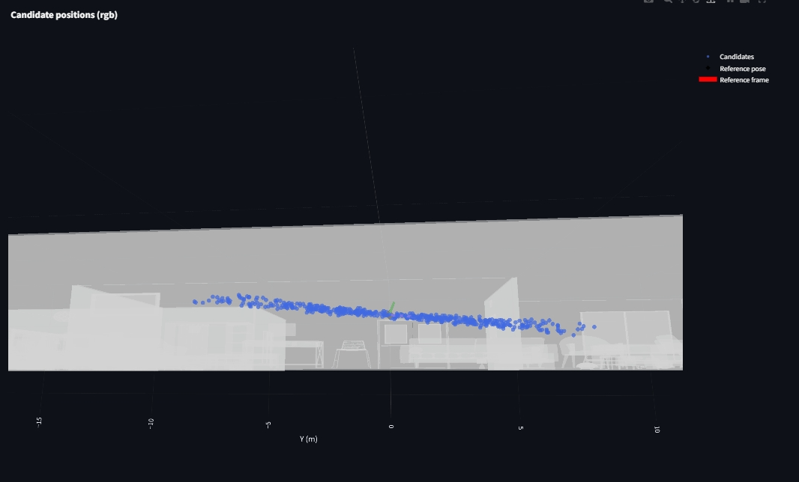

- [x] Make view-direction jitter controls interpretable:
  - `view_max_azimuth_deg` / `view_max_elevation_deg` should be reported as *local* yaw/pitch about the candidate camera’s +Y/+X axes (LUF).
  - `view_roll_jitter_deg` should be reported as twist around the sampled forward axis (LUF +Z).
  - The Streamlit diagnostics should plot these **same** quantities for `view_dirs_delta` (not `PoseTW.to_ypr`, which uses a different axis convention).
- [x] Euler diagnostics are currently easy to misinterpret:
  - ZYX Euler / `PoseTW.to_ypr` components do **not** correspond 1:1 to our *view azimuth/elevation/roll* knobs.
  - Some components can become identically ~0 for roll-free poses (by construction), which can look like “a bug” when it is really a decomposition choice.

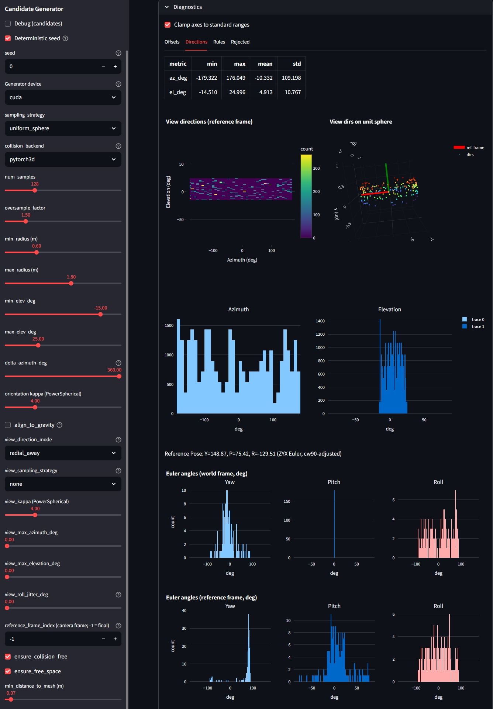

- [x] Plot of the candidate positions in the 3D plot around the reference pose in world-coordinates shows candidate poses living in a y-z torus around the x axis of the reference pose. This is related to `rotate_yaw_cw90`. The displayed reference axes are correctly rotated for visualization, but the candidate points are not! When plotted in the reference frame they look correct and build a torus around the y axis (for `delta_azimuth_deg=360`)

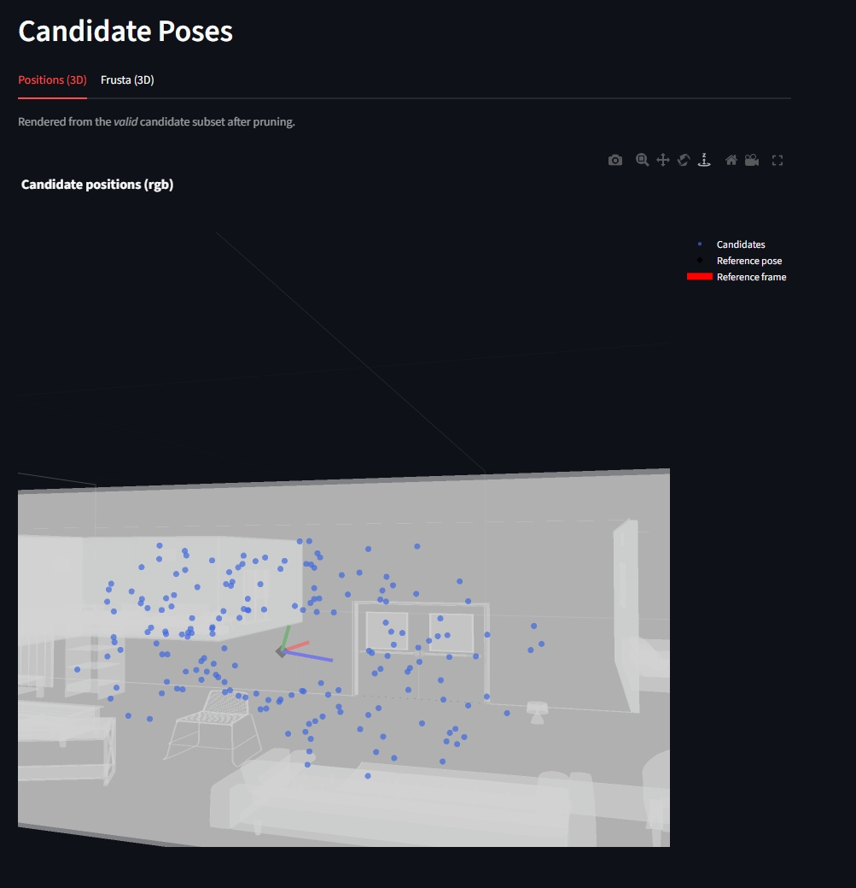
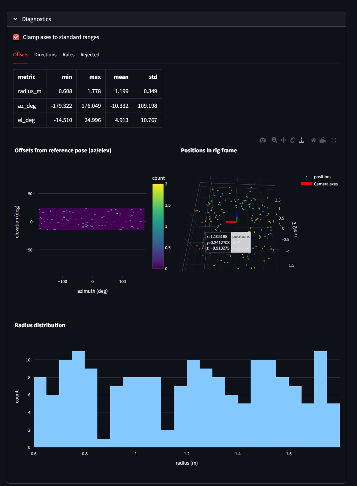

  > **Done**: Applied `rotate_yaw_cw90` to the reference pose before generating candidate poses around it.

- [x] When setting `view_dir_jitter` (roll jitter) to a non-zero value, the candidate frusta plot looked “incorrectly rotated” (often perceived as an azimuth/elevation swap).

  **Root cause**: After we made `rotate_yaw_cw90(reference_pose)` part of the *physical* candidate-generation pipeline (rig-basis correction), the candidate frusta plot still applied `rotate_yaw_cw90` again for display. Since `rotate_yaw_cw90` is a **90° twist about the local +Z/forward axis** (i.e. a roll), this adds a constant extra roll offset on top of the random roll jitter, making the “up” axis cue swap with “left” once jitter is enabled.

  > **Done**: Candidate plots now default to `display_rotate=False` and `render_candidates_page` explicitly disables the extra display rotation for frusta + reference axes, so the plotted frusta match the physical pipeline.

::: {#fig-rpy-hists layout-ncol=2}

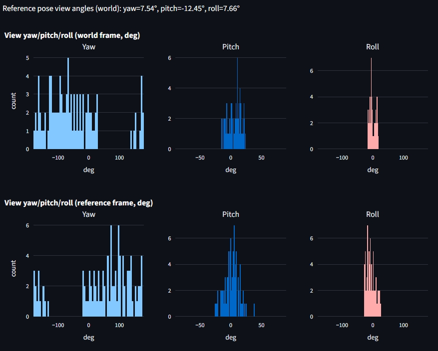

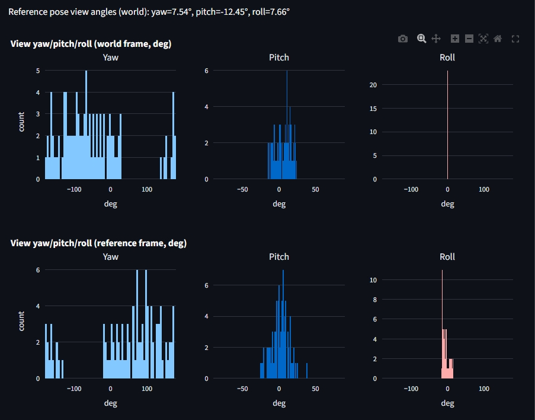
:::

The candidate frusta diagram is now consistent with the physical pipeline (no extra display twist on top of the already-corrected reference pose):

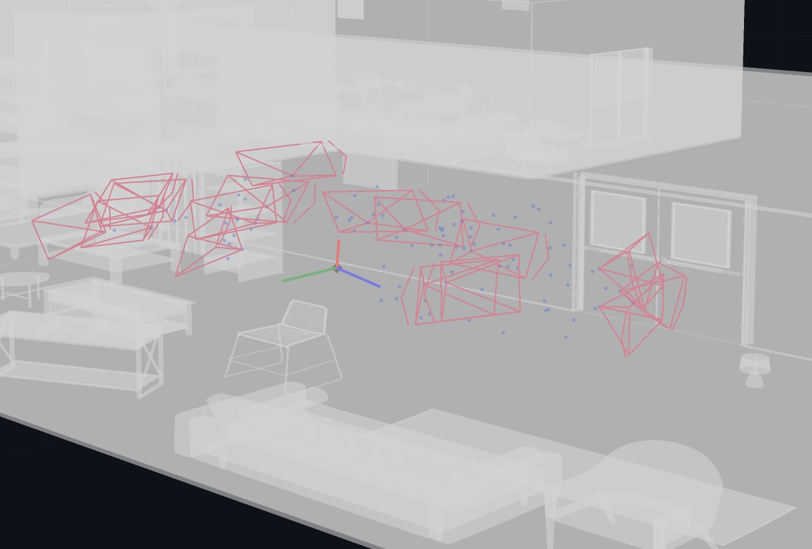

  > **Done**: The mismatch was a plotting-only double-application of `rotate_yaw_cw90`.

**Previous Considerations:**

- Implement `CandidateViewGenerator` and auxiliary modules in `oracle_rri/oracle_rri/pose_generation` that generate `N` candidate SE(3) poses (roll-free base orientation) around the latest camera position in the trajectory. Must generate poses of type `PoseTW` (`external/efm3d/efm3d/aria/pose.py`).
  - Strategies: uniform over half-sphere with min/max radius & elevation, free-space only, room-bounded (SSL for train, occupancy for eval).
  - Collision check: segment from last pose to candidate must not intersect mesh/voxels.
  - Modular strategy selection via enums/config that allows easy extension and combination of strategies / sampling rules.
- The view direction generation in our pose_generation did not work as expected when selecting a `view_sampling_strategy` (e.g. `uniform_sphere` or `forward_powerspherical`). The `view_direction_mode`-based deterministic generation, however, worked (reliably pointing away/towards the reference).
  - We want to generate random deviations from deterministic view directions by adding *bounded* jitter.
  - This should be configurable via `view_max_azimuth_deg` and `view_max_elevation_deg` (preferred over a single `view_max_angle_deg`).
  - We also want minimal deviations from a perfectly roll-free base frame, controlled via `view_roll_jitter_deg`.

The PositionalSampling now works as expected and I tried fixing the directional sampling, but I'm still having some issues here!

- In our current version, we don't get any points or even the frame axes in ` plot_position_sphere(offsets_ref, title="Offsets on unit sphere", show_axes=True)`. This worked in our previous version! What is causing this? Why did it work previously but, not anymore?
- provide interpretations of the roll, pitch, yaw diagrams in the differen frames!
- the pitch histogram in the world-frame doesn't make sense to me - should't it be covering pretty much the entire range as we have a torus around the reference pose?
- always keep in mind that the project aria frames have to be transofmed using `rotate_yaw_cw90` when being displayed!

# Rasterized Rendering to Generate Candidate Point Clouds

- We now implement candidate rendering + backprojection fully in `oracle_rri/oracle_rri/rendering`:
  - `CandidateDepthRenderer` (PyTorch3D rasteriser) renders metric z-depth maps from the GT mesh for candidate poses.
  - `build_candidate_pointclouds` (`CandidatePointClouds`) backprojects depths into world-frame point clouds and fuses them with the semi-dense SLAM point cloud.

The `CandidateDepthRenderer.render(...)` yields a `CandidateDepths` dataclass:

- `depths`: `Tensor['C','H','W']` metric z-depth (metres) in the camera frame (+Z forward).
  - PyTorch3D returns `z=-1` for miss pixels (no face hit).
- `depths_valid_mask`: `Tensor['C','H','W']` boolean validity mask:
  - `pix_to_face >= 0` and `znear < depth < zfar` (see `CandidateDepthRenderer`).
- `poses`: `PoseTW` world←camera extrinsics for each rendered candidate.
- `reference_pose`: `PoseTW` world←reference (rig) pose around which candidates are defined.
- `candidate_indices`: indices into the *full* candidate list (keeps UI ordering stable after filtering).
- `camera`: `CameraTW` intrinsics used for rendering (optionally downscaled via `resolution_scale`).
- `p3d_cameras`: matching `PerspectiveCameras` used for rendering and unprojection.

## Action Items

- [x] Candidate PCs now align with the GT mesh (PoseTW↔PyTorch3D extrinsics fixed).
- [x] Candidate PCs now match the rendered frusta (pixel-center→NDC backprojection fixed).
- [x] Depth histograms no longer mislead (miss pixels are masked via `depths_valid_mask`).
- [x] Reference axes in the frusta plot match the Aria UI convention (`rotate_yaw_cw90` applied for display only).
- [x] Implement `DepthToPointCloud` module: for each candidate pose's depth map, backproject to point cloud $\mathcal{P}_{\mathbf{q}}$ in the global frame, using the known camera paramaters from ASE and and then fuse semi-dense SLAM PC $\mathcal{P}_t$ with candidate-view PC $\mathcal{P}_{\mathbf{q}}$ → $\mathcal{P}_{t \cup \mathbf{q}}$.
- [x] Backprojection implementation: `oracle_rri/oracle_rri/rendering/candidate_pointclouds.py`::{`build_candidate_pointclouds`, `_backproject_depths_p3d_batch`} and `oracle_rri/oracle_rri/rendering/unproject.py`::`backproject_depth_with_p3d`.

## Previously observed issues

   - Cameras solely looking at a blank wall will have high RRI, as semi-dense point clouds will not have many points in these areas. However, this does not make sense as these views should receive a high mesh to point cloud distance - completeness. Also, these views sometimes manage to "look through" the walls and render points that are behind the wall.
   - Some poses looking towards walls, that are quite close to the candidate pose, will yield dpeth maps and point clouds that don't correspond to what would be expected from the GT mesh and the given pose.
   - All backprojected points seem to lie on one side of the refernece pose - in front of it. All candidate views that look in another direction yield rendered dpeth maps that are either invalid or backproject into the same area in front of the reference pose, even though their pose doesn't correspond to that area. Candidates that naturally look in the direction of the reference pose seem to work fine.

  > A potential reason for this issue might be that Project Aria while using LUF, has a contention that relies on a cw 90 degree rotation about the z-axis of the camera frame before displaying or rendering objects in any camera frame. We previously applied `rotate_yaw_cw90` [^1] during visualization only. But lately incorporated it into the candidate generation - i.e. applied it to the reference pose before generating candidate poses around it.

[^1]:
```py
def rotate_yaw_cw90(pose_world_cam: PoseTW) -> PoseTW:
    """Visual-only 90° clockwise yaw about +Z to match Aria UI convention.

    Use this **only for plotting/rendering to screen** (e.g. Plotly axes, image
    overlays). Keep core geometry, sampling, and rendering in the physical Aria
    LUF frame without this rotation.
    """
    c, s = np.cos(np.pi / 2), np.sin(np.pi / 2)
    r_roll = torch.tensor(
        [[c, -s, 0.0], [s, c, 0.0], [0.0, 0.0, 1.0]],
        device=pose_world_cam.R.device,
        dtype=pose_world_cam.R.dtype,
    )
    return PoseTW.from_Rt(pose_world_cam.R @ r_roll, pose_world_cam.t)
```

The following image illustrates how all candidate poses' backprojected point clouds lie in front of the reference pose - also in front of generally all poses in the trajectory. Eventhough, some of the candidate frusta should look in the opposite direction (approx. negative y world) the backprojected points still lie in front of the reference pose.

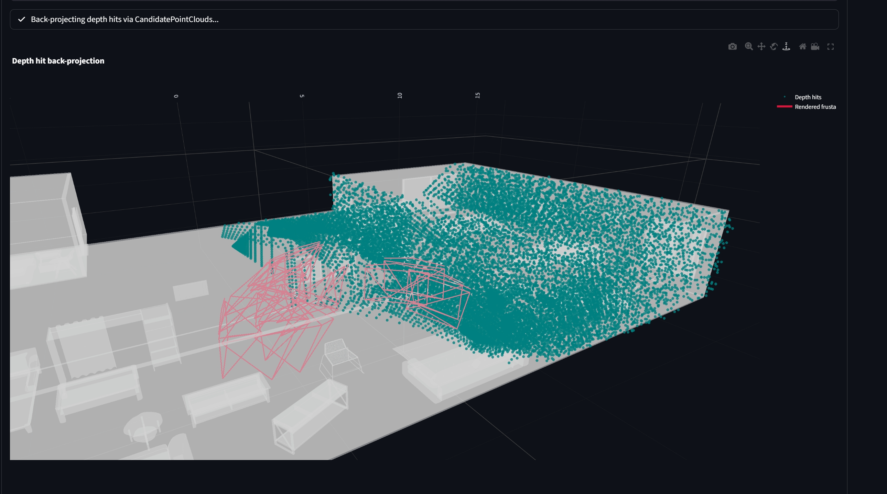

The backprojected point cloud doesn't correspond to the visualized candidate pose frustum! The following two figures illustate the same candidate pose that looks to the right of the reference pose - away from it - towards the wall, being relatively close to it.

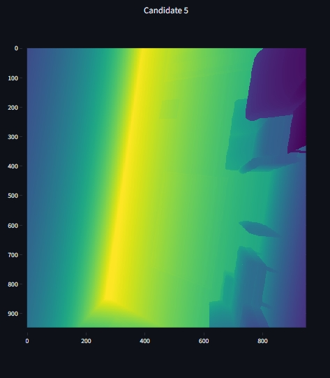

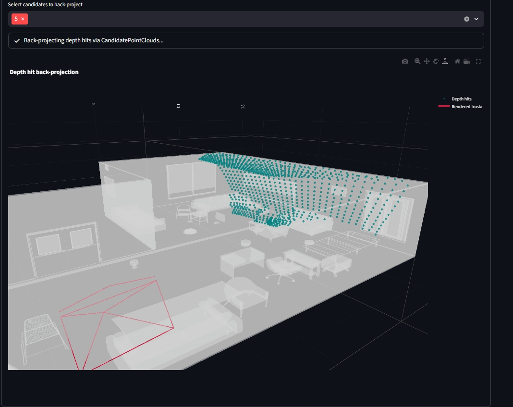

Another candidate pose that is looking up and away from the general view direction of the reference pose, backprojects points that lie in front of the reference pose - similar to all other candidate poses, and also backprojects points that lie on the other side of the wall. The depth histograms of these invalid poses often show a peak at depth = -1, indicating no hits! Futhermore, while it rendered the floor, ceiling and one wall, it did not render the objects in the room.

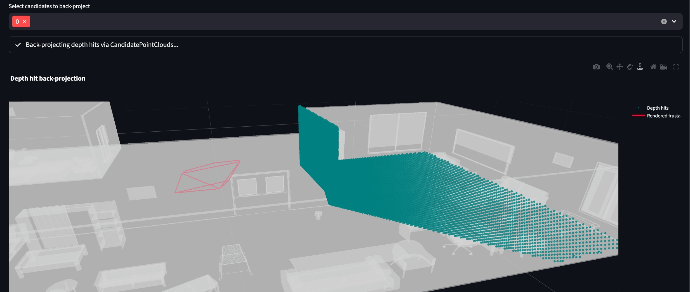

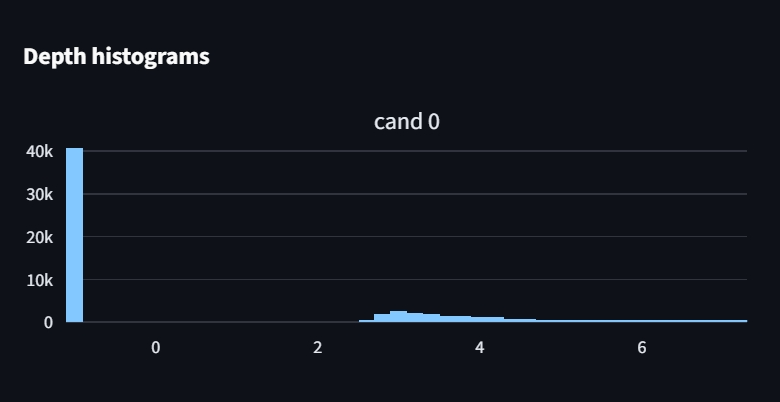

The following backprojection stems from a candidate pose that was looking in the same approximate direction as the reference pose - towards postivie y world. Here the backprojected point cloud seems to correpsond to the displayed candidate pose frustum.

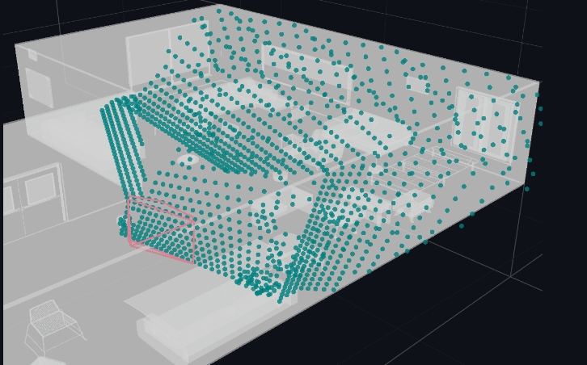

While poses 26 and 27 seem to have valid depth maps and backprojected point clouds, their depth-histograms also show a significant amount of -1 depth values, indicating no hits for many pixels which is unexpected given the valid looking depth maps. This might imply that the order of our candidate poses, depth maps or backprojected pointclouds is mismatched somewhere in the pipeline.

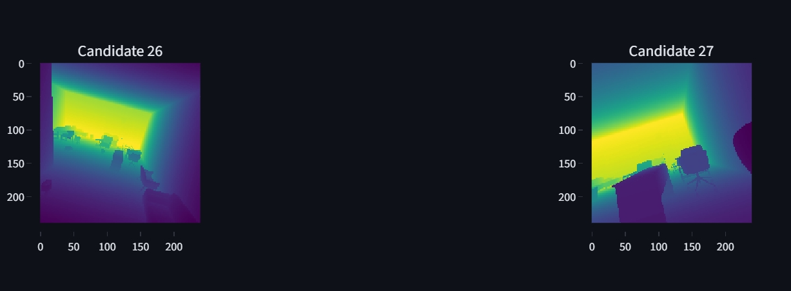

::: {#fig-depth-hsits layout-ncol=2}

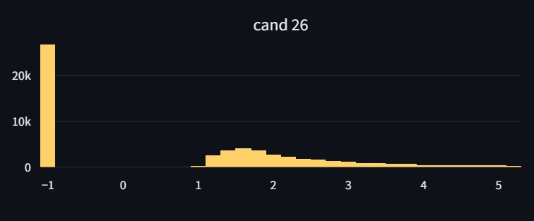

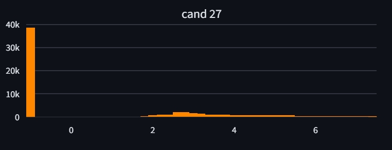
:::

**Resolution (what was wrong, and what we changed):**

- The "frusta vs. backprojected points don’t match" symptom was caused by two coordinate-convention bugs:
  - **PoseTW ↔ PyTorch3D extrinsics mismatch**: `PoseTW` uses a column-vector convention; PyTorch3D camera transforms use row vectors.
    - **Fix**: construct `PerspectiveCameras(R=poses.inverse().R.transpose(-1,-2), T=poses.inverse().t)` so the renderer/unprojection uses the same world→camera mapping as `PoseTW`.
  - **Wrong unprojection coordinate space**: we were feeding raster pixel indices directly to `unproject_points(..., from_ndc=False)`.
    - **Fix**: convert pixel centers `(x+0.5, y+0.5)` to PyTorch3D NDC using min-side scaling and call `unproject_points(..., from_ndc=True)`.
- The "large spike at depth=-1" in histograms is expected for miss pixels in PyTorch3D’s z-buffer.
  - **Fix**: always use `depths_valid_mask` when computing hit ratios / histograms and when backprojecting.
- The "look-through-walls / points behind walls" artefact was a consequence of the same projection/backprojection convention mismatch above, not a mesh/raycasting bug.
  - **Fix**: after the extrinsics + NDC-unprojection fixes, candidate PCs align with the GT mesh.
- The "blank wall has high RRI" observation is not (necessarily) a rendering bug.
  - **Status**: still an open *oracle/metric design* question if we want the oracle to reflect semi-dense SLAM failure modes on low-texture surfaces. With GT depth, newly observed wall surfaces can legitimately reduce mesh distances even if real semi-dense reconstruction would not add points there.
- `rotate_yaw_cw90` is **visual-only** and must not be applied to the physical geometry used for rendering/backprojection.
  - **Fix**: keep all rendering/backprojection in the physical Aria LUF frame; apply `rotate_yaw_cw90` only in plotting (e.g. reference axes in the frusta plot).

## Visualization (Streamlit)

The Streamlit app is our “glass box” for validating the oracle RRI pipeline end-to-end (data → candidates → renders →
candidate point clouds → RRI) and for debugging caching / coordinate-frame issues.

**Current implementation (refactored app):**

- Entrypoint: `uv run nbv-st` → `oracle_rri/oracle_rri/streamlit_app.py`
- Package: `oracle_rri/oracle_rri/app/`
  - `app.py`: page wiring + run/refresh controls + navigation
  - `state.py`: typed `AppState` stored in `st.session_state`
  - `controller.py`: stage orchestration + typed caches (no `st.cache_*`)
  - `ui.py`: layout + widget helpers
  - `panels/`: plotting-only page renderers (UI + plots only)
- Shared compute pipeline: `OracleRriLabeler` (`oracle_rri/oracle_rri/pipelines/oracle_rri_labeler.py`) used by the RRI
  page and reusable for training/CLI.

### Non-issues / Requirements Checklist

- [x] Interactive visualization of: candidates → depth renders → backprojected candidate PCs → oracle RRI.
- [x] Unified pages for pipeline stages: `Data`, `Candidate Poses`, `Candidate Renders`, `RRI`.
- [x] Efficient caching with correct refresh semantics (no stale stage reuse when configs or sample index changes).
- [x] Strong typing for cached results (single `AppState`; no untyped `st.cache_*` blobs).
- [x] Candidate selection reproducible via a deterministic sampling seed (`CandidateViewGeneratorConfig.seed`).
- [x] Plot options live directly above the plots they affect (not in the sidebar).
- [x] Per-page `Diagnostics` expander with tabs (no nested expanders/status blocks).

### Issues & Resolutions (historical)

#### Issue: Dashboard was opaque and hard to reuse for training/CLI

- **What was wrong:** The legacy app in `oracle_rri/oracle_rri/dashboard/` mixed UI, caching, and compute; this made the
  data-flow hard to reason about and prevented reusing the exact same code path for online label generation.

- **Fix:** Rebuilt the app in `oracle_rri/oracle_rri/app/` with explicit separation of concerns:
  - orchestration in `PipelineController`,
  - compute in `OracleRriLabeler` (`oracle_rri/oracle_rri/pipelines/oracle_rri_labeler.py`),
  - plotting-only page functions in `panels/`,
  - typed session state (`AppState`) instead of “untyped cache blobs”.

#### Issue: “Run ALL” / “Run / refresh …” didn’t actually recompute (cached results reused)

- **What was wrong:** “Refresh” UI controls were not correctly invalidating downstream stages, so reruns reused stale
  results (especially when switching configs or sample indices).

- **Fix:** Added explicit, typed stage caches keyed by `(cfg_sig, sample_key, ...)` and a `force=True` path for refresh
  buttons in `PipelineController` (`oracle_rri/oracle_rri/app/controller.py`).

#### Issue: Candidate Renders showed the wrong number of candidates

- **What was wrong:** The depth renderer oversampled candidates for robustness and the UI displayed the oversampled
  batch instead of the requested `max_candidates`.

- **Fix:** `CandidateDepthRenderer` now caps the final batch to `max_candidates_final` and keeps indices stable via
  `CandidateDepths.candidate_indices` (render subset indices into the full candidate list).

#### Issue: Candidate Renders still asked to build CandidatePointClouds (even after running the RRI page)

- **What was wrong:** Depth rendering and depth-hit point cloud construction were treated as two unrelated “stages” in
  the UI, so running RRI didn’t guarantee the Candidate Renders page had the `CandidatePointClouds` ready.

- **Fix:** The app now treats the “renders” stage as `(depth_batch + candidate_pcs)`:
  - `PipelineController.get_renders()` computes and caches both in one stage,
  - the RRI page uses the same pipeline (`OracleRriLabeler`) so the computed PCs are shared.

#### Issue: UI clutter / nested expanders / nested status blocks

- **What was wrong:** Nested containers made it hard to find the relevant controls and also led to confusing “where am I
  in the pipeline?” moments.

- **Fix:** Each page now has a single `Diagnostics` expander with tabs (no nested expanders) and plot options live
  directly above the plots they affect.

#### Issue: Rendering/backprojection mismatches were hard to debug (frusta ≠ depth-hit PCs)

- **What was wrong:** Candidate frusta, rendered depth maps, and backprojected point clouds did not align due to pose and
  pixel/NDC convention mismatches.

- **Fix:** Corrected PoseTW↔PyTorch3D extrinsics handling + NDC unprojection and ensured `depths_valid_mask` is respected.
  The full symptom screenshots + fixes are documented above in “Candidate View Generation & Sampling - DONE”.

#### Issue: Startup noise (duplicate config logs + Streamlit/WebDataset warnings)

- **What was wrong:** Noisy logs and warnings obscured actionable debugging output:
  - `AseEfmDatasetConfig` printed shard-resolution logs multiple times (Pydantic validators run repeatedly in Streamlit).
  - Streamlit warned about `use_container_width` deprecation.
  - WebDataset emitted a `torch.load(weights_only=...)` FutureWarning.
  - `uv run ...` warned about `extra-build-dependencies` being experimental.
- **Fix:**
  - moved dataset “resolved shards” logging from validators → `AseEfmDatasetConfig.setup_target()`,
  - replaced `use_container_width=True` with `width="stretch"` in `st.plotly_chart(...)`,
  - filtered the WebDataset `torch.load` warning in `AseEfmDataset.__init__`,
  - enabled `tool.uv.preview = true` in `oracle_rri/pyproject.toml`.

## Data Handling

- Link ASE ATEK shards and GT meshes to raw ASE; resolve scene_id/snippet_id mapping.
- Wrap ATEK dataset/downloader to expose:
  - easy ASE ATEK WDS access + GT meshes,
  - metadata file combining scene↔snippet mapping,
  - download of metadata without full payload,
  - selection of ATEK snippets based on available GT meshes (`ase_mesh_download_urls.json`).
- Download all dataset variants (ATEK, raw ASE, meshes) for scenes with GT.

### Offline Dataset

- [ ] Cache `VinOracleBatch`:
  ```py
  efm_snippet_view: EfmSnippetView | None # save efm_snippet_view.efm (dict of tensors)
  """Optional typed snippet view (None when loading from cache)."""
  candidate_poses_world_cam: PoseTW
  reference_pose_world_rig: PoseTW
  rri: Tensor
  pm_dist_before: Tensor
  pm_dist_after: Tensor
  pm_acc_before: Tensor
  pm_comp_before: Tensor
  pm_acc_after: Tensor
  pm_comp_after: Tensor
  p3d_cameras: PerspectiveCameras
  scene_id: str
  snippet_id: str
  backbone_out: EvlBackboneOutput # dict of tensors from EVL backbone!
  ```
  - save the enitre output of the EVL backbone instead of EvlBackboneOutput so that we can avoid recomputation if we decide to use different features anywhere down the line.
  -  dict full OracleRriLabeler results to an offline dataset for fast parallel reading to support multiple workers in the dataloader. Carry a full OracleRriLabelerConfig snapshot but exclude large path lists (e.g. tar URLs / mesh maps).
  - the metadata should carry all configuration settings

  > **Done**: Added `oracle_rri/data/offline_cache.py` with cache writer/reader, config snapshots (sans tar_urls/scene_to_mesh), and `OracleRriCacheDataset` integration in `VinDataModule`.

- [ ] Add option to compute new offline samples to [projects.scripts]! Ensure that it works correctly - that we can also switch easily in the datamodule - usage of concat dataset (offline -> online, switch from offline to offline extended with online when option to generate new offlines samples  is set in config. here we need to specify: per epoch (for both train and valied): how many new offline samples should be generated.

- [ ] Offline cache metadata currently tracks a single config snapshot even if the cache directory contains samples from multiple runs/configs (samples embed the `config_hash` in their filenames, and append-time checks prevent mismatches, but load-time does not validate or filter).
  - We **do not** want to invalidate samples from other configs (treat them as augmentation), but we need an easy way to *identify* which cached samples belong to which config so we can drop subsets later.
  - Add lightweight bookkeeping (e.g., store `config_hash` per index entry or a summary map `config_hash -> {count, labeler_signature, backbone_signature, include_*}`) plus a small CLI/summary helper.

## ViewIntrospectionNetwork

Goal: Learn a **View Introspection Network (VIN)** that predicts per-candidate **RRI** from (i) frozen **EVL** scene features and (ii) a **shell-aware pose descriptor** computed in the **reference frame**. VIN is trained standalone using oracle labels from `oracle_rri/oracle_rri/pipelines/oracle_rri_labeler.py`.

### External References (implementation sources)

- EFM3D / EVL codebase: [facebookresearch/efm3d](https://github.com/facebookresearch/efm3d)
- VIN-NBV paper (objective + ordinal setup): [VIN-NBV arXiv](https://arxiv.org/abs/2505.06219)
- e3nn spherical harmonics (use this for pose encoding): [e3nn documentation](https://docs.e3nn.org/) and [e3nn GitHub](https://github.com/e3nn/e3nn)
- CORAL ordinal regression:
  - [coral-pytorch](https://github.com/Raschka-research-group/coral-pytorch)
  - CORAL paper (background): [arXiv:1901.07884](https://arxiv.org/abs/1901.07884)
- (Optional) volumetric sampling primitive: `torch.nn.functional.grid_sample` (3D) — use for voxel/frustum querying

Internal references:

- EVL/EFM3D overview: `docs/contents/literature/efm3d.qmd`
- VIN-NBV notes: `docs/contents/literature/vin_nbv.qmd`
- EFM3D symbol index: `docs/contents/ext-impl/efm3d_symbol_index.qmd`
- EFM3D impl overview: `docs/contents/ext-impl/efm3d_implementation.qmd`
- Oracle pipeline + metric design: `docs/contents/impl/rri_computation.qmd`
- Label pipeline implementation: `oracle_rri/oracle_rri/pipelines/oracle_rri_labeler.py`

### Recent Analysis & Debugging
```py
import wandb
    api = wandb.Api()
    run = api.run("/traenslenzor/aria-nbv/runs/<RUN_ID>") # e.g. "m3wwhhgv"
Show history data:

print(run.history())
```
**m3wwhhgv**:
  - Loss sits near the CORAL "uninformed" baseline (mean ~8.9 for K=15) -> little learning signal. (`.codex/vin_nbv_run_m3wwhhgv_analysis.md`)
  - `pred_rri_mean` is **ordinal expected** in [0,1], not metric RRI; plotting it against `rri_mean` is misleading.
  - Loss correlates with higher `rri_mean` (corr ~0.74): high-improvement batches are hardest.
  - ~30% candidates masked on average (`voxel_valid_fraction` ~0.70) + frequent "0 candidates" warnings.
  - Likely error sources: occ_pr logits mismatch, frustum FOV clamp + shallow depths, voxel frame mismatch, mean-only global pool, feature scale imbalance. (`.codex/vin_model_error_sources.md`)
  - Description of issues encountered in this training run: `.codex/vin_nbv_run_m3wwhhgv_analysis.md`
  - Identified potential error sources based on the above analysis `.codex/vin_model_error_sources.md`

**hiiqoirw**:
  - Config: LFF-only pose encoding (no SH), `scene_field_channels=["occ_pr"]`, global_pool=attn, unknown_token=True.
  - Loss mean **9.37** (random CORAL baseline ~9.7) with minimal improvement over the run (early 9.23 -> late 9.18).
  - `pred_rri_mean_step` collapses to a narrow band **0.605-0.633** (std ~0.008); corr(pred_rri_mean, rri_mean) ~0.0.
  - `voxel_valid_fraction` mean **0.38** (low); `candidate_valid_fraction` mean **0.71**. Local features likely dominated by unknown token; valid-frac weighting reduces gradients.
  - Loss vs `rri_mean` correlation is **-0.46**: easier on high-RRI batches, weak on low-RRI discrimination (consistent with occ_pr-only signal).

### Action Items (summary checklist)

- [x] Implement a VIN model (RRI predictor) in `oracle_rri/oracle_rri/vin` on top of the EFM3D ([EFM3D](../contents/literature/efm3d.qmd)) / EVL backbone (frozen).
  - Input:
    - raw `efm_snippet_view.efm: efm: dict[str, Any]` as input to EVL backbone
    - candidate poses `PoseTW` (N candidates) as input to the view scorer head together with scene features from EVL as well as other potential candidate features.
    - choose suitable positional encoding for the candidate poses - i.e. learnable spherical harmonics encoding or learnable fourier features.
    - the candidate poses should be relative to the reference poses rig position and orientation.
    - loss and training objective same as in [VIN-NBV](../contents/literature/vin_nbv.qmd)
    - start with an implementation proposal of the model architecture and training procedure in `docs/contents/impl/vin_nbv.qmd`.
    - For this do a comprehensive review of the EVL architecture to understand how to best integrate the view scorer head on top of it. Consider that we have a [simple script to infer EVL](../../oracle_rri/scripts/run_efm3d_on_ase.py). Another good starting point is our [EFM3D symbol index](../contents/ext-impl/efm3d_symbol_index.qmd) and [EFM3D implementation overview](../contents/ext-impl/efm3d_implementation.qmd).

    > **Done**: Implemented VIN package code in `oracle_rri/oracle_rri/vin/` (frozen EVL + CORAL head), shell+SH pose encoding via `e3nn` **plus 1D Fourier features for the radius**, and a Lightning-based training pipeline (`oracle_rri/oracle_rri/lightning/` + `nbv-train` / `nbv-fit-binner`) that uses `OracleRriLabeler`. Documented the architecture + training procedure in `docs/contents/impl/vin_nbv.qmd`.

- [ ] Add an explicit **frame-consistency** check for VIN inputs: if candidate generation applies `rotate_yaw_cw90` to the reference pose, ensure the **same** rotated reference pose is passed to VIN along with candidate poses and `p3d_cameras`. `backbone_out` stays in the world frame; only candidate/ref/camera must share the rotated basis.
  - *All* poses coming from the OracleRriLabeler have been rotated by 90 deg cw about their foward axis to allow correct candidate generation in the world frame. However, the poses produced by the EVL do not have this rotation applied.!
  - Poses with cw90 deg yaw: `candidate_poses_world_cam: PoseTW`, `reference_pose_world_rig: PoseTW`, extrinsics in `p3d_cameras: PerspectiveCameras`.

- [ ] Add a different kind of leaned embedding for all points from semi-dence PC depending on their visibility from candidate pose
- [ ] Add feature to the semi-dense: number of (historic) cameras in the efm snippet that saw this specific point.


### Feature Inventory (what VIN consumes)

#### EVL Features (frozen backbone outputs)

Use EVL as a frozen feature extractor on the raw `efm: dict[str, Any]`.

Currently used by `VinModel` (via `EvlBackboneConfig.features_mode="heads"`):

- `occ_pr` (occupancy prediction volume; B×1×D×H×W, logits or probabilities depending on config)
- `voxel/occ_input` (occupied evidence from input points; B×1×D×H×W)
- `voxel/counts` (observation counts; B×D×H×W, used for `counts_norm` / `observed` / `unknown`)
- `voxel/T_world_voxel` (PoseTW) + `voxel_extent` (bounds) for WORLD↔VOXEL mapping

Optional (available via `EvlBackboneConfig.features_mode in {"neck","both"}`; not consumed by `VinModel` yet):

- `neck/occ_feat` (high-dim geometry/context volume; B×C×D×H×W)
- `neck/obb_feat` (high-dim semantic/context volume; B×C×D×H×W)

Processing strategy (current implementation in `oracle_rri/oracle_rri/vin/experimental/model.py`):

- **Channel compression**: `Conv3d(1×1×1) + GroupNorm + GELU` → `field_dim` (default: 16)
- **Global pooling**: `mean(DHW)` (optional via `use_global_pool=True`)
- **Candidate-conditioned query** (required):
  - build **K frustum points** in WORLD by unprojecting a `frustum_grid_size×frustum_grid_size` pixel grid at fixed `frustum_depths_m` using PyTorch3D `PerspectiveCameras.unproject_points(..., from_ndc=True)`
  - sample voxel features at these WORLD points via EFM3D `pc_to_vox` + `sample_voxels`
  - aggregate with masked-mean pooling; candidates are masked out if too few samples fall inside the voxel grid (`candidate_min_valid_frac`)

#### Candidate Pose Descriptors (computed in reference frame)

**Source of truth (current VIN I/O contract):**

- `candidate_poses_world_cam: PoseTW` (world←camera) and `reference_pose_world_rig: PoseTW` (world←rig_reference)
  from `OracleRriLabelBatch.depths` (used in `oracle_rri/oracle_rri/lightning/lit_datamodule.py`).

Descriptor construction:

1. Convert to the reference rig frame:
   - `T_rigref_camera = inverse(T_world_rigref) @ T_world_camera`
   - `t = T_rigref_camera.t ∈ R^3` (camera center in reference frame)
2. Shell parameters:
   - radius `r = ||t||`
   - position direction `u = t / (r + eps) ∈ S^2`
3. View direction parameters (camera forward in reference frame):
   - choose camera-forward axis `z_cam = (0,0,1)` (Aria depth convention is +Z forward)
   - `f = normalize(T_rigref_camera.R @ z_cam) ∈ S^2`
4. Minimal scalar inductive biases:
   - `r` (optionally `log(r + eps)` via `ShellShPoseEncoderConfig.radius_log_input`)
   - `dot(f, -u)`  (looking back towards reference center)
   - optionally `dot(f, u)` (looking outward)

Encoding (must use e3nn):

- `Y_u = SH_L(u)` and `Y_f = SH_L(f)` via `e3nn.o3.spherical_harmonics` with small degree `L ∈ {2,3}`
- Pose embedding:
  - `E_u = Proj(Y_u)` and `E_f = Proj(Y_f)` (small MLP/linear stacks)
  - `E_r = Proj(FF(r))` (or `FF(log(r+eps))` if `radius_log_input=True`)
  - `E_scal = MLP([dot(f,-u), ...])`
  - `E_pose = [E_u || E_f || E_r || E_scal]`

### Action Items (from scratch, end-to-end)

#### 1 EVL feature extractor wrapper (frozen, VIN-facing)

- [x] Implement `oracle_rri/oracle_rri/vin/backbone_evl.py` as a clean adapter:
  - load EVL via Hydra YAML + checkpoint (strict load from `checkpoint["state_dict"]`)
  - run `torch.no_grad()` + `eval()` and optionally freeze params (`EvlBackboneConfig.freeze=True`)
  - robust `batchify` handling (incl. TensorWrapper images)
  - output `EvlBackboneOutput` with (optional) neck features (`occ_feat`, `obb_feat`), head/evidence volumes (`occ_pr`, `occ_input`, `counts`), and voxel pose (`t_world_voxel`, `voxel_extent`)
- [ ] Add config knobs for checkpoint formats (`strict_load`, `state_dict_key` fallback, `weights_only` fallback)

Acceptance criteria:

- EVL forward runs on `EfmSnippetView.efm` produced by `AseEfmDataset` without manual preprocessing.

#### 2 VIN feature processing (voxel compression + global + candidate query)

- [x] Implement voxel channel compression:
  - `field_proj = LazyConv3d(1×1×1) + GroupNorm + GELU` → `field_dim`
- [x] Implement global context descriptor:
  - `global = mean(DHW)` (optional via `use_global_pool=True`)
- [x] Implement candidate-conditioned query descriptor:
  - build K frustum points by unprojecting a `frustum_grid_size×frustum_grid_size` grid at fixed `frustum_depths_m` (PyTorch3D `PerspectiveCameras.unproject_points(..., from_ndc=True)`)
  - sample voxel features at these WORLD points via EFM3D `pc_to_vox` + `sample_voxels`
  - pool with masked mean across K points
- [x] Ensure strict validity masking:
  - invalid query points do not contribute to pooling
  - candidates are masked out via `candidate_min_valid_frac`

#### 3 Candidate pose descriptor module (shell-aware, SH encoded)

- [x] Implement the shell-aware pose descriptor (`r, u, f, scalars`) in the reference rig frame.

  > **Done**: Implemented in `oracle_rri/oracle_rri/vin/experimental/model.py` by consuming `reference_pose_world_rig` (world←rig) and `candidate_poses_world_cam` (world←cam), forming $T_{\mathrm{rig}\leftarrow\mathrm{cam}}$, and computing $(r, u, f, \mathrm{scalars})$ in the reference rig frame.

- [x] Implement `ShellShPoseEncoder` in `oracle_rri/oracle_rri/vin/spherical_encoding.py`:
  - uses `e3nn.o3.spherical_harmonics` for `u` and `f`
  - no `so3log`
  - outputs `E_pose` per candidate

  > **Done**: Implemented as `oracle_rri/oracle_rri/vin/spherical_encoding.py` (`ShellShPoseEncoder` + config) using `e3nn.o3.spherical_harmonics`, with **1D Fourier features** for the radius (`r` by default; optionally $\log(r+\varepsilon)$ via config).

#### 4 VIN scorer head architecture (minimal MLP + CORAL)

- [x] Implement `VinModel` (frozen EVL + trainable head):
  - inputs:
    - `efm: dict[str, Any]`
    - `candidate_poses_world_cam: PoseTW` (from labeler outputs)
    - `reference_pose_world_rig: PoseTW` (from labeler outputs)
    - `p3d_cameras: PerspectiveCameras` (aligned with `candidate_poses_world_cam`)
  - internal:
    - extract EVL head/evidence volumes once per snippet (`occ_pr`, `occ_input`, `counts`)
    - compute per-candidate: `E_pose`, `E_global`, `E_query`
    - final MLP (2 layers, e.g. 256 hidden) → CORAL logits (K-1)
  - outputs:
    - logits, expected score (normalized), candidate_valid mask

  > **Done**: Implemented in `oracle_rri/oracle_rri/vin/experimental/model.py` with shell+SH pose encoding, a minimal voxel field (`occ_pr`, `occ_input`, `counts_norm`), mean-pooled global context, masked-mean frustum sampling for candidates using PyTorch3D `PerspectiveCameras`, and CORAL logits/expected score outputs.

- [x] Implement `VinPrediction` dataclass (logits, scores, masks)

  > **Done**: Implemented in `oracle_rri/oracle_rri/vin/types.py`.

#### 5 Training data generation (must use OracleRriLabeler)

- [x] Implement an online VIN training dataset wrapper using oracle labels:
  - `oracle_rri/oracle_rri/lightning/lit_datamodule.py` (`VinOracleIterableDataset` + `VinDataModule`)
  - iterates `AseEfmDataset`, runs `OracleRriLabeler.run(sample)`, and yields `VinOracleBatch` (efm, poses, p3d_cameras, oracle RRI + point↔mesh diagnostics)
- [x] Add CLI entry points (installed via `oracle_rri/pyproject.toml`):
  - `nbv-fit-binner` (fit + save `rri_binner.json`)
  - `nbv-train` (train/val/test; can also run `--fit-binner-only`)
  - `nbv-train --run-mode summarize-vin` / `nbv-train --run-mode plot-vin-encodings` (diagnostic summaries/plots on real oracle batches)
  - (dev convenience) `oracle_rri/scripts/train_vin_lightning.py`
- [ ] Add evaluation helpers (rank correlation + top-k recall; can be logged in Lightning or as a standalone script)

#### 6 CORAL loss + bin thresholds (stable + easy)

- [x] Implement RRI→ordinal binning:
  - Fit bin thresholds **globally** on training RRIs
  - Use **quantile edges** so bins have ~equal mass
  - Save binner to JSON (`num_classes` + `edges`) and reference it via `VinLightningModuleConfig.binner_path`

  > **Done**: Implemented `oracle_rri/oracle_rri/vin/rri_binning.py` (`RriOrdinalBinner.fit_from_iterable/transform/save/load`) and wired it into the Lightning CLI (`nbv-fit-binner` / `nbv-train --fit-binner-only`).

- [x] Apply CORAL:
  - `logits: (N, K-1)`
  - `labels: (N,)` integer ordinal class
  - mask invalid candidates (`candidate_valid` ∧ `finite(rri)`)

  > **Done**: Implemented `oracle_rri/oracle_rri/vin/coral.py` using `coral-pytorch` and trained with `coral_loss` in `oracle_rri/oracle_rri/lightning/lit_module.py`.

- [ ] Log metrics:
  - Spearman rank correlation between predicted score and oracle RRI
  - top-1 / top-k recall of best oracle view

#### 7 Tests (must be real-data integration, not mocks)

- [ ] Unit tests:
  - pose descriptor correctness from (`reference_pose_world_rig`, `candidate_poses_world_cam`) (r>0, ||u||≈1, ||f||≈1, finite SH)
  - SH output dimension = (L+1)^2 for chosen L
  - voxel query pooling shapes + masking behavior


#### 8 Documentation (implementation proposal)

- [ ] Write `docs/contents/impl/vin_nbv.qmd`:
  - [x] clear I/O contract and tensor shapes
  - [x] EVL feature taps to use
  - [x] exact pose descriptor formulas $(r,u,f,\mathrm{scalars})$ and SH encoding (`e3nn`)
  - [ ] candidate voxel-frustum query method (K points + pooling)
  - [ ] CORAL loss + how thresholds are fitted/saved/versioned
  - [ ] minimal ablations (occ only vs occ+obb; L=2 vs L=3; query depth/rays)

  > **Done**: Wrote the initial proposal and implementation notes in `docs/contents/impl/vin_nbv.qmd` (EVL interface, shell+SH descriptor, CORAL objective, and a minimal training loop example). Remaining doc items are the frustum query method + threshold versioning + ablations.


## Misc

- Extend candidate generation to continuous policy conditioned on fused occupancy / OBB prior

# Notes on Implementation Approach

- Use enums/configs to compose candidate sampling rules; keep modules orthogonal (generation, filtering, scoring).
- Prefer streaming + caching in visualization to avoid recomputation.
- Keep tests close to metrics and candidate generation (test-driven as per agent instruction).
