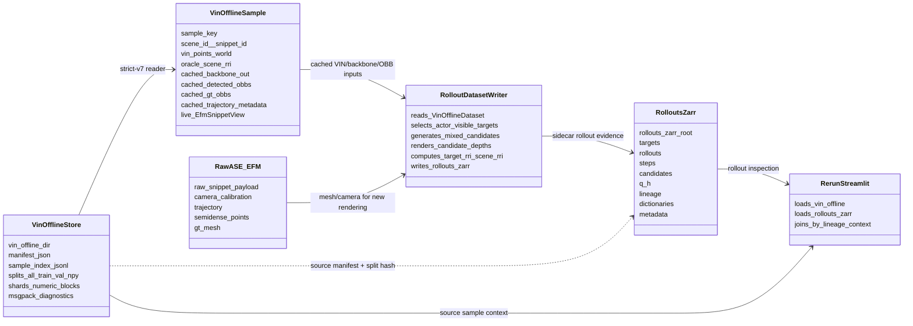

```mermaid
classDiagram
  direction LR

  class VinOfflineStore {
    vin_offline_dir
    manifest_json
    sample_index_jsonl
    splits_all_train_val_npy
    shards_numeric_blocks
    msgpack_diagnostics
  }

  class VinOfflineSample {
    sample_key
    scene_id__snippet_id
    vin_points_world
    oracle_scene_rri
    cached_backbone_out
    cached_detected_obbs
    cached_gt_obbs
    cached_trajectory_metadata
    live_EfmSnippetView
  }

  class RawASE_EFM {
    raw_snippet_payload
    camera_calibration
    trajectory
    semidense_points
    gt_mesh
  }

  class RolloutDatasetWriter {
    reads_VinOfflineDataset
    selects_actor_visible_targets
    generates_mixed_candidates
    renders_candidate_depths
    computes_target_rri_scene_rri
    writes_rollouts_zarr
  }

  class RolloutsZarr {
    rollouts_zarr_root
    targets
    rollouts
    steps
    candidates
    q_h
    lineage
    dictionaries
    metadata
  }

  class RerunStreamlit {
    loads_vin_offline
    loads_rollouts_zarr
    joins_by_lineage_context
  }

  VinOfflineStore --> VinOfflineSample : strict-v7 reader
  VinOfflineSample --> RolloutDatasetWriter : cached VIN/backbone/OBB inputs
  RawASE_EFM --> RolloutDatasetWriter : mesh/camera for new rendering
  RolloutDatasetWriter --> RolloutsZarr : sidecar rollout evidence
  VinOfflineStore ..> RolloutsZarr : source manifest + split hash
  RolloutsZarr --> RerunStreamlit : rollout inspection
  VinOfflineStore --> RerunStreamlit : source sample context
```