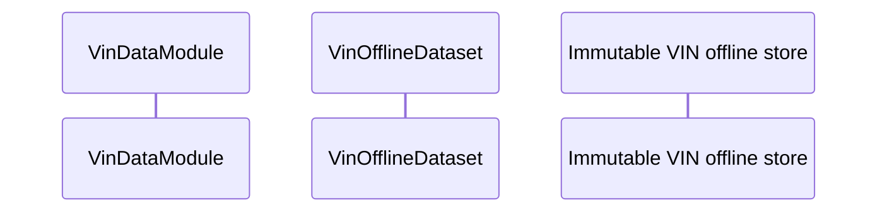

# ARIA-NBV Mermaid diagram style guide

This guide defines the thesis-wide visual language for Mermaid diagrams in ARIA-NBV. The goal is not merely pretty figures; the goal is a stable diagram grammar that matches the Typst notation, survives Codex edits, and renders consistently in Typst/Markdown pipelines.

## 1. Global principles

1. Use Mermaid for versioned, technical diagrams that belong in the repository.
2. Use one diagram for one conceptual view: data flow, training loop, model component, rollout interaction, or storage layout.
3. Never invent mathematical symbols inside Mermaid. Every symbol in a math label must come from `docs/typst/shared/symbols/*.typ`, `docs/typst/shared/equations/*.typ`, or an explicitly added new Typst symbol.
4. Keep labels compact. Prefer a bold title plus one to three math/code lines.
5. Prefer SVG export for thesis figures; PNG is only for previews.

## 2. Preferred flowchart frontmatter

Use this as the default for ARIA-NBV technical flowcharts with math labels:

```mermaid
---
config:
  theme: base
  htmlLabels: true
  flowchart:
    htmlLabels: true
    nodeSpacing: 20
    rankSpacing: 32
    curve: basis
  layout: elk
  themeVariables:
    background: "#ffffff"
    fontFamily: "Inter, DejaVu Sans, Arial, sans-serif"
    fontSize: "18px"
    primaryTextColor: "#1f2937"
    lineColor: "#64748b"
  themeCSS: |
    .nodeLabel { font-size: 18px; }
    .edgeLabel { font-size: 16px; }
    .cluster-label { font-size: 18px; font-weight: 700; }
---
flowchart TB
```

Use `flowchart TB` for model pipelines and training data flows. Use `flowchart LR` for broad architecture/configuration compositions.

## 3. Node classes

Use these four semantic node classes across all ARIA-NBV flowcharts:

```mermaid
classDef input fill:#D5E8D4,stroke:#82B366,stroke-width:1.5px,rx:0,ry:0;
classDef output fill:#F8CECC,stroke:#B85450,stroke-width:1.5px,rx:0,ry:0;
classDef compute fill:#E1D5E7,stroke:#9673A6,stroke-width:1.5px,rx:8,ry:8;
classDef data fill:#F5F5F5,stroke:#9E9E9E,stroke-width:1.2px,rx:0,ry:0;
```

Semantic meaning:

- `input`: observations, candidate camera sets, current trajectory, external user/system input.
- `compute`: learned modules, projections, encoders, loss heads, selection policies.
- `data`: immutable stores, manifests, tensor blocks, cached diagnostics, persistent memory.
- `output`: NBV action, predicted scores, final feature vector, batch object, thesis result.

## 4. Cluster styling

Use rounded cluster hulls sparingly. Clusters are useful for stores, model branches, losses, and runtime subsystems.

```mermaid
style Scene fill:#f1fff6,stroke:#97ddb5,stroke-width:2px,rx:12,ry:12
style Model fill:#f0fbff,stroke:#8fd0ff,stroke-width:2px,rx:12,ry:12
style Store fill:#f7f3ff,stroke:#cdb2ff,stroke-width:2px,rx:12,ry:12
style Aux fill:#ffffff,stroke:#cbd5e1,stroke-width:1.5px,rx:12,ry:12
```

Do not link to parent and nested subgraphs simultaneously. Link to internal nodes instead.

## 5. Math label pattern

Use one quoted Mermaid label containing a KaTeX block:

```mermaid
PoseEmb["$$\begin{array}{c}\textbf{Pose Embedding}\\\mathbf{E}_{q}\end{array}$$"]
```

Rules:

- Use `\begin{array}{c} ... \end{array}` for multiline labels.
- Use `\textbf{...}` for human-readable node title.
- Use `\texttt{...}` for code names and tensor types.
- Use `\mathrm{...}` for textual subscripts: `F_{\mathrm{pose}}`, `\mathrm{RRI}`.
- Use canonical symbols from `references/aria_symbol_map.yaml`.
- Avoid raw `<br/>` in math labels. Use LaTeX line breaks `\\`.
- Quote every math edge label: `-->|"$$...$$"|`.

## 6. Tensor-shape edge labels

Use compact, typed edge labels:

```mermaid
Input -->|"$$\texttt{FloatTensor}[B,N_q,F_{\mathrm{pose}}]$$"| Module
```

Use canonical shape symbols from `symb.shape`: `B`, `N_q`, `T`, `P`, `C_{\mathrm{sem}}`, `G_{\mathrm{sem}}`, `F_{\mathrm{pose}}`, `F_{\mathrm{proj}}`, `F_{\mathrm{cnn}}`.

## 7. Sequence diagrams

Use sequence diagrams for temporal interaction protocols: serving, app orchestration, dataset loading, supervisor/session/file flows.

Default pattern:



Guidelines:

- Use `autonumber` for training/serving protocols unless the numbering visually clutters a publication figure.
- Keep participants short but semantically named.
- Use `Note over ...` for caching, polling, optional diagnostics, and async details.
- Avoid heavy math in sequence messages; reserve math for flowcharts/model diagrams.

## 8. Common canonical substitutions

Older diagrams may contain useful visual structure but non-canonical symbols. Prefer these substitutions before final thesis export:

| Older label | Canonical ARIA-NBV label |
|---|---|
| `\mathbf{e}_{\mathrm{pose}}` | `\mathbf{E}_{q}` |
| `\mathbf{z}_{\mathrm{traj}}` | `\mathbf{c}_{\mathrm{traj}}` |
| `\mathbf{P}_{\mathrm{sem}}` | `\boldsymbol{\mathcal{P}}^{\mathrm{semi}}` |
| `\mathbf{T}^{w}_{r}(t)` | `\mathbf{T}^{w}_{\mathrm{rig}}(t)` if referring to the logged rig trajectory |
| ad hoc `RRI_total` text | `\mathrm{RRI}_{\mathrm{total}}` |

## 9. Validation checklist

Before committing a Mermaid thesis figure:

- Frontmatter begins on line 1 if present.
- Flowcharts with math use `htmlLabels: true` and `layout: elk`.
- Nodes use semantic classes: `input`, `compute`, `data`, `output`.
- Symbols are canonical or have been added to the Typst symbol repository.
- Edge tensor shapes use `\texttt{...}` and canonical shape symbols.
- No node ID uses reserved words such as `end`, `class`, `style`, `default`.
- Special characters in labels are quoted.
- `scripts/aria_mermaid_lint.py` passes.
- `mmdc` render succeeds locally, preferably to SVG with a white background.

## 10. Figure naming

Use stable, semantic names:

- `vin_pose_encoder.mmd`
- `vin_semidense_projection.mmd`
- `vin_semidense_grid_cnn.mmd`
- `vin_offline_store_training.mmd`
- `oracle_rri_pipeline.mmd`
- `entity_aware_nbv_rollout.mmd`

Avoid names tied to temporary implementation details unless the figure documents that implementation.
